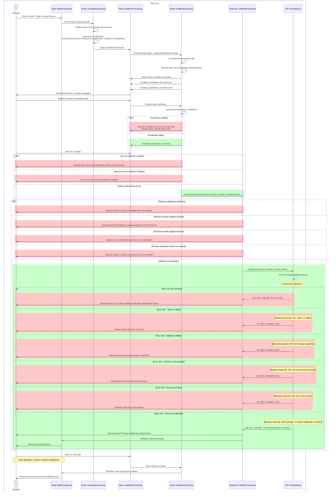
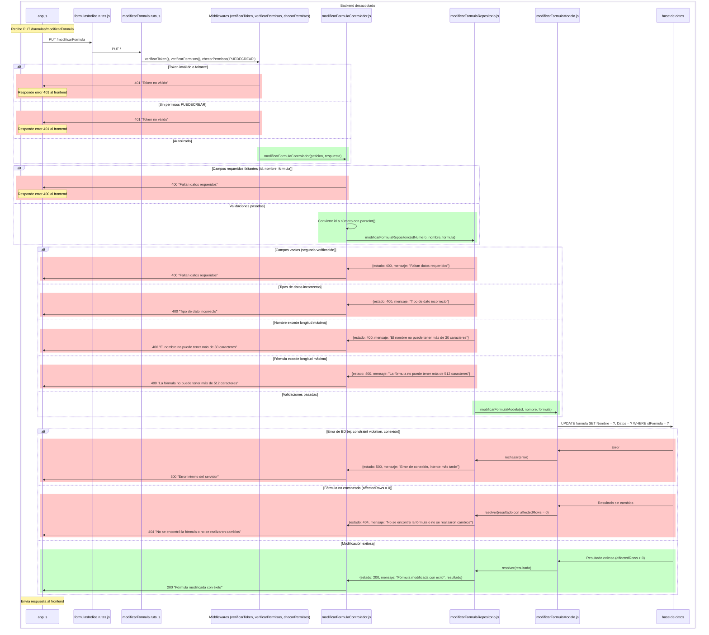
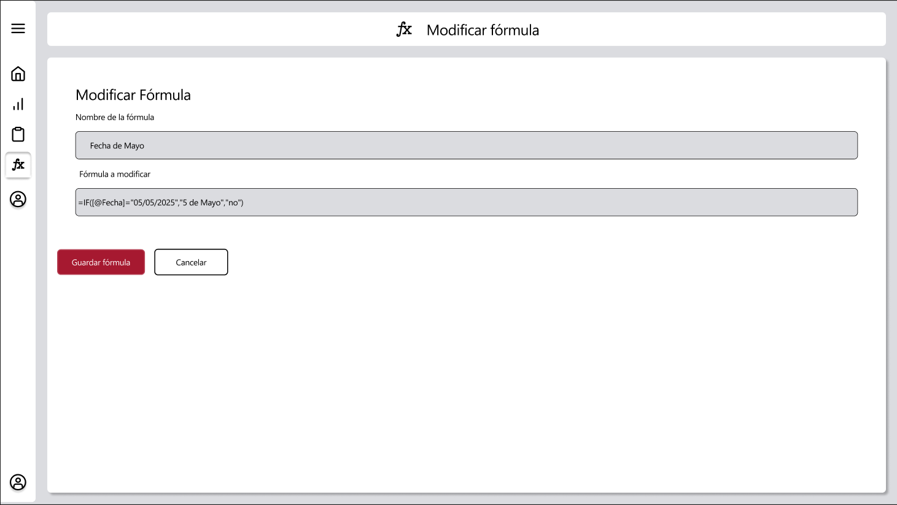

# RF28: Modificar fórmula

### Historia de Usuario

Yo como usuario quiero modificar la fórmula en el sistema para ajustar los cálculos según nuevos requerimientos.

  **Criterios de Aceptación:**
  - Las fórmulas se modificarán cambiando el texto de la fórmula en sí
  - El sistema debe permitir modificar la fórmula sin afectar los cálculos previos.
  - Los cambios deben reflejarse en los reportes generados.
  - Debe haber una alerta en caso de cualquier error y al momento de modificar una fórmula de forma exitosa
  - Una vez se modifica la fórmula se debe regresar a la vista de consultar fórmulas
  - Debe haber un límite de caracteres de 30 para el nombre de la fórmula
  - Debe haber un límite de caracteres de 512 para la fórmula

---

### Diagrama de Secuencia

#### Frontend

#### Diagrama de secuencia - Backend Desacoplado

---

### Mockup

> *Descripción*: El mockup representa la interfaz del sistema donde el usuario puede modificar una fórmula. Muestra los campos de edición y los botones de acción disponibles.

---

### Pruebas Unitarias

[Pruebas](https://docs.google.com/spreadsheets/d/1W-JW32dTsfI22-Yl5LydMhiu-oXHH_xo3hWvK6FHeLw/edit?gid=1593713986#gid=1593713986)

---

### Pull Request
[https://github.com/CodeAnd-Co/App-Local-TracTech/pull/85](https://github.com/CodeAnd-Co/App-Local-TracTech/pull/85)

[https://github.com/CodeAnd-Co/Backend-Desacoplado-TracTech/pull/39](https://github.com/CodeAnd-Co/Backend-Desacoplado-TracTech/pull/39)

---

| **Tipo de Versión** | **Descripción**              | **Fecha**  | **Colaborador**          |
| ------------------- | ---------------------------- | ---------- | ------------------------ |
| **1.0**             | Creación del requisito       | 6/3/2025   | Antonio Landeros         |
| **2.0**             | Ordenar las RFs              | 1/6/2025   | Mauricio Anguiano          |
| **2.1**             | Mejoras de diagrama de secuencia y descripción             | 1/6/2025   | Juan Carlos Calderon          |   