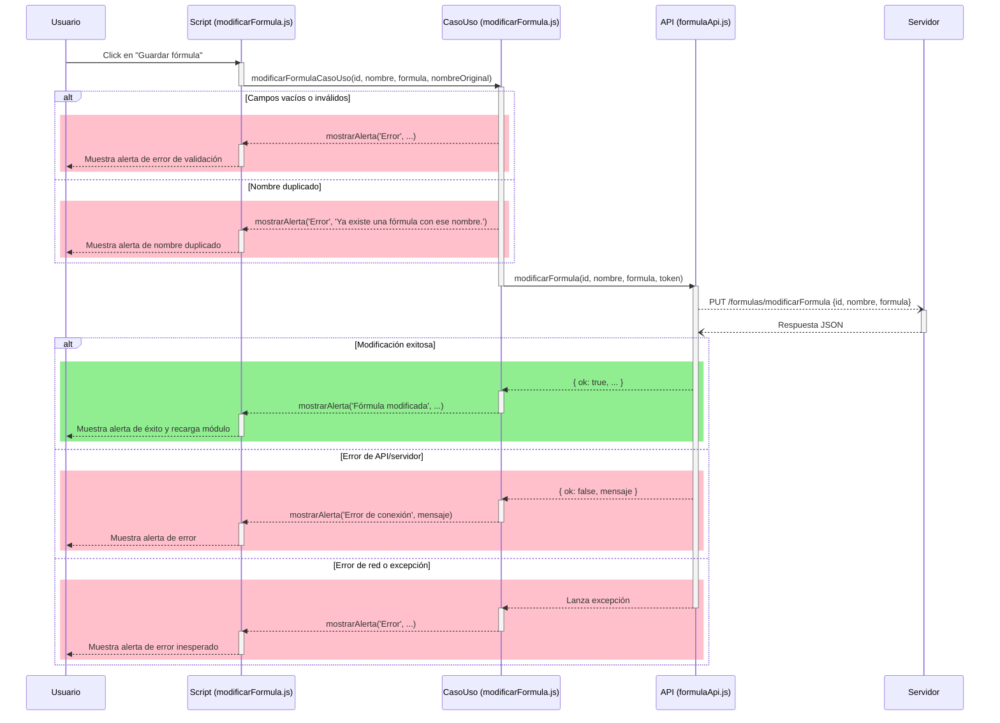
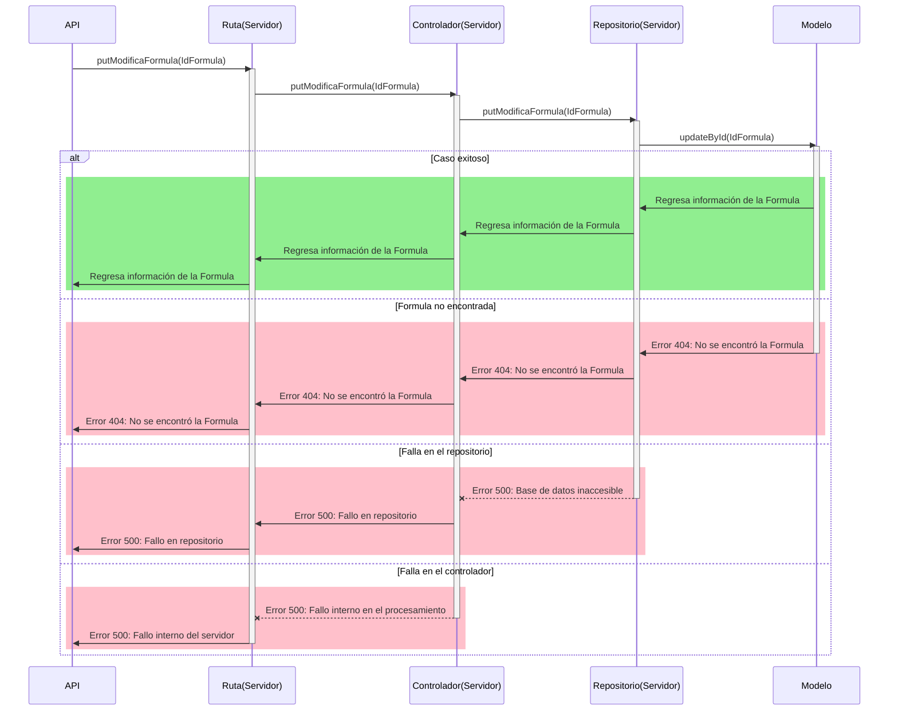

# RF28: Modificar fórmula

### Historia de Usuario

Yo como usuario quiero modificar la fórmula en el sistema para ajustar los cálculos según nuevos requerimientos.

  **Criterios de Aceptación:**
  - El sistema debe permitir modificar la fórmula sin afectar los cálculos previos.
  - Los cambios deben reflejarse en los reportes generados.

---

### Diagrama de Secuencia

#### Frontend

#### Backend

---

### Mockup

![Mockup]

> *Descripción*: El mockup representa la interfaz del sistema donde el usuario puede modificar una fórmula. Muestra los campos de edición y los botones de acción disponibles.

---

### Pruebas Unitarias

[Pruebas](https://docs.google.com/spreadsheets/d/1W-JW32dTsfI22-Yl5LydMhiu-oXHH_xo3hWvK6FHeLw/edit?gid=1593713986#gid=1593713986)

---

### Pull Request
[https://github.com/CodeAnd-Co/App-Local-TracTech/pull/85](https://github.com/CodeAnd-Co/App-Local-TracTech/pull/85)
