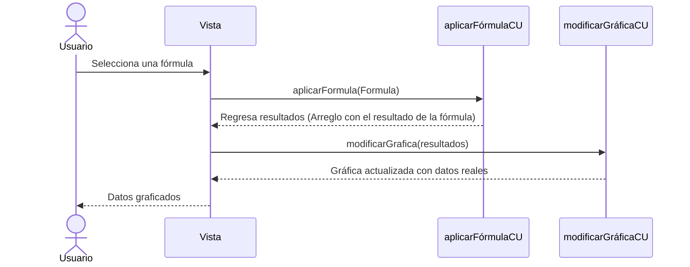
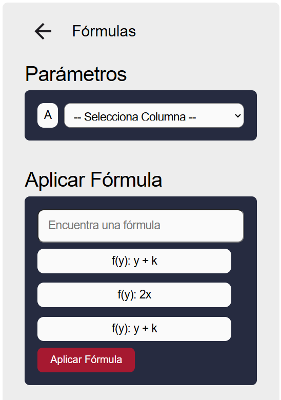

# RF29: Usuario carga fórmula.

### Historia de Usuario

Yo como usuario quiero cargar una fórmula guardada para ser más rápido al generar mis gráficas y reportes.

  **Precondiciones:**
  - Debe haber fórmulas guardadas en la base de datos.
  - Ya se hizo la consulta de las fórmulas en la base de datos y se muestran en un menú desplegable.
  - El tipo de dato de la fórmula es un string. 

  **Criterios de Aceptación:**
  - La fórmula se selecciona desde un menú desplegable en el que se muestran todas las fórmulas.
  - La fórmula se aplica en la gráfica y muestra el resultado del cálculo. 
  - La fórmula se ve reflejada en la gráfica dentro del reporte.
  - Se debe mostrar un mensaje de error si:
    - El archivo no contiene la columna que utiliza la fórmula.
    - El archivo no contiene datos.
    - El resultado de la fórmula lanza un error.
  - Se debe incluir una barra de búsqueda para mantener ese apartado más organizado.
    - La barra de búsqueda debe:
      - No mostrar resultados si no hay ninguna fórmula escrita o debe mostrar todos las fórmulas y a partir de lo buscado filtrarlas.
      - Hacer búsquedas de acuerdo al nombre de la fórmula.
  - Se debe incluir una selección de la columna por si sola.
  
---

### Diagrama de Secuencia

---

### Mockup

> *Descripción*: El mockup representa la interfaz del sistema donde el usuario puede cargar fórmulas. 

---

### Pruebas Unitarias 
  - [Pruebas](https://docs.google.com/spreadsheets/d/1W-JW32dTsfI22-Yl5LydMhiu-oXHH_xo3hWvK6FHeLw/edit?gid=943446860#gid=943446860)
