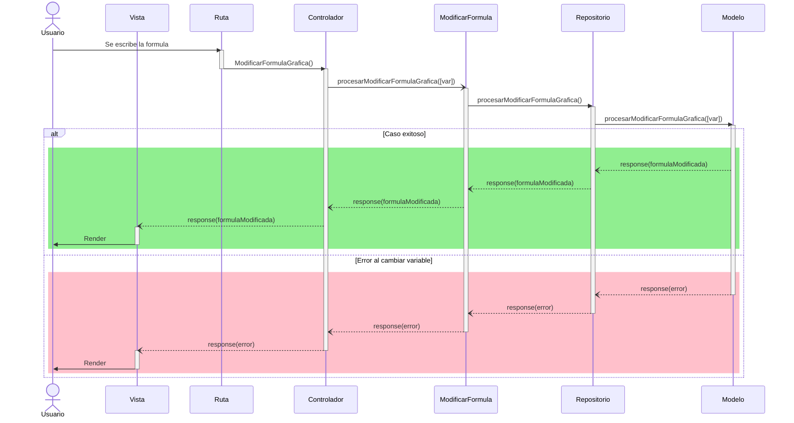
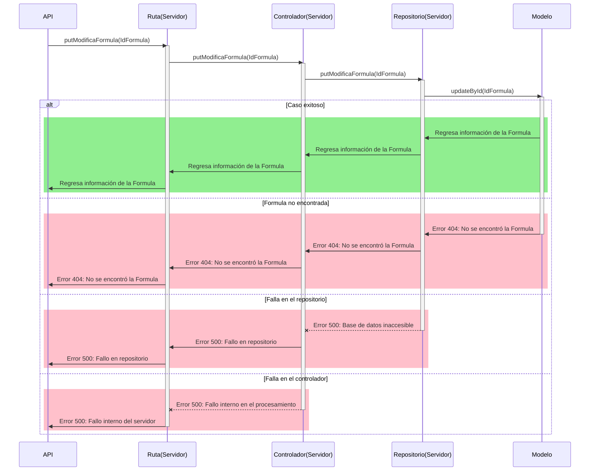

# RF29: Modificar fórmula

### Historia de Usuario

Yo como usuario quiero modificar la fórmula en el sistema para ajustar los cálculos según nuevos requerimientos.

  **Criterios de Aceptación:**
  - El sistema debe permitir modificar la fórmula sin afectar los cálculos previos.
  - Los cambios deben reflejarse en los reportes generados.

---

### Diagrama de Secuencia

![Diagrama de Secuencia]

> *Descripción*: El diagrama de secuencia muestra cómo el usuario interactúa con el sistema para modificar una fórmula, detallando los pasos de edición, validación y actualización de cálculos.

#### Diagrama Electron

#### Diagrama API

---

### Mockup

![Mockup]

> *Descripción*: El mockup representa la interfaz del sistema donde el usuario puede modificar una fórmula. Muestra los campos de edición y los botones de acción disponibles.

---

### Pruebas Unitarias
| ID Prueba | Descripción | Resultado Esperado |
|-----------|-------------|--------------------|
|PU-RF68-01|Modificar fórmula|La nueva fórmula se guarda y los cálculos se actualizan correctamente|

---

### Pull Request
[https://github.com/CodeAnd-Co/App-Local-TracTech/pull/85](https://github.com/CodeAnd-Co/App-Local-TracTech/pull/85)
