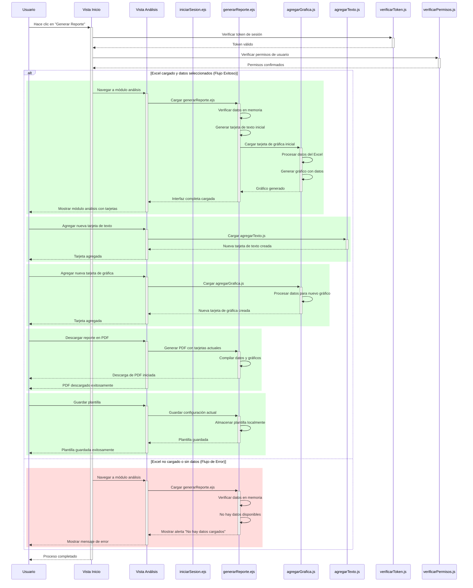
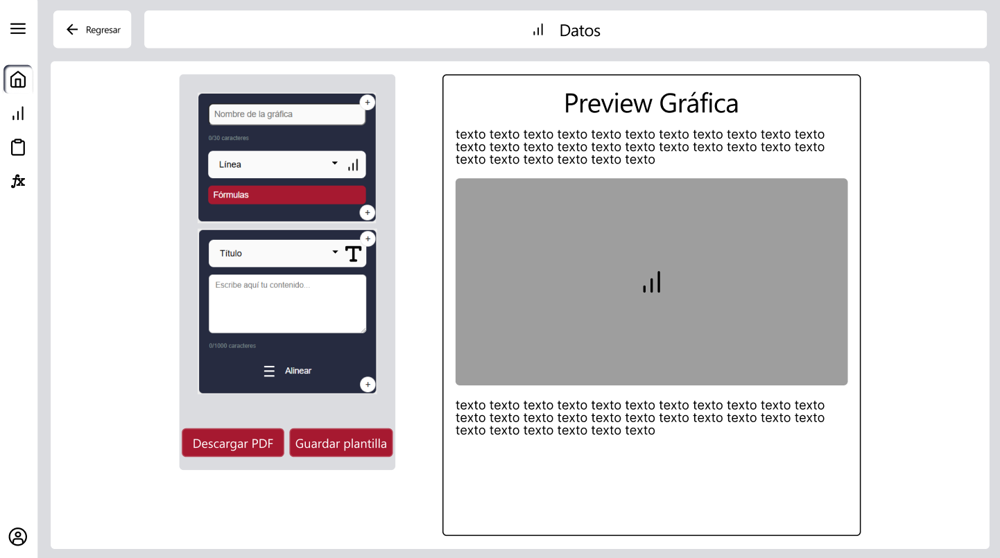

# RF3: Usuario consulta el módulo de análisis.

### Historia de Usuario

Yo como usuario de la aplicación de escritorio Harvester quiero acceder al módulo de análisis donde podré realizar reportes, visualizar gráficos, agregar tarjetas de texto y agregar tarjetas de gráfica para poder interpretar los datos del Excel cargado. 

  **Criterios de Aceptación:**
  - Al módulo solamente se puede acceder cuando se cargue un Excel, se seleccionen los datos a comparar y se de click en generar reporte proveniente del módulo de inicio.
  - La navegación al módulo debe ser inmediata (latencia < 1 segundo en condiciones normales).
  - La aplicación debe de hacer la carga inicial de los datos y gráficos debe completarse en menos de 10 segundos (en conexiones estándar).
  - Al momento de entrar al módulo de análisis se debe de mostrar una tarjeta de texto y una tarjeta de gráfica.
  - No se puede tener menos de una tarjeta, ya sea texto o de gráfica.
  - En dado caso de que se pueda acceder al módulo sin cargar un archivo de Excel, este mostrará una alerta donde diga que no hay datos cargados en el Excel. 
  - En el modulo de análisis se podrán descargar los reportes en pdf.
---

### Diagrama de Secuencia

### Mockup

---

### Pruebas Unitarias 

#### [Pruebas de la RF](https://docs.google.com/spreadsheets/d/1W-JW32dTsfI22-Yl5LydMhiu-oXHH_xo3hWvK6FHeLw/edit?gid=111374045#gid=111374045)

---

### Pull Request
[https://github.com/CodeAnd-Co/App-Local-TracTech/pull/7](https://github.com/CodeAnd-Co/App-Local-TracTech/pull/7)

[https://github.com/CodeAnd-Co/Backend-Desacoplado-TracTech/pull/20](https://github.com/CodeAnd-Co/Backend-Desacoplado-TracTech/pull/20)

### Historial de cambios

| **Tipo de Versión** | **Descripción**                            | **Fecha** | **Colaborador**         |
| ------------------- | ------------------------------------------ | --------- | ----------------------- |
| **1.0**             |  Añadir requisitos de tractores            | 4/3/2025  | Diego Fuentes           |
| **1.1**             |  Añadir pull request a requisitos completados | 27/5/2025  | Juan Carlos Calderón|
| **2.0**             |  Refactor de Usuario Consulta Modulo Analisis | 31/5/2025  | Mauricio Anguiano|
| **2.1**             |  Arreglar documentación | 31/5/2025  | Daniel Queijeiro|
| **2.2**             |  Ordenar todas las RFs y actualizar los datos | 1/6/2025  | Mauricio Anguiano|
| **2.3**             |  Correccion criterios de aceptacion | 3/6/2025  | Mauricio Anguiano|
| **2.4**             |  Agregar pull requests de RF | 5/6/2025  | Sofía Osorio|