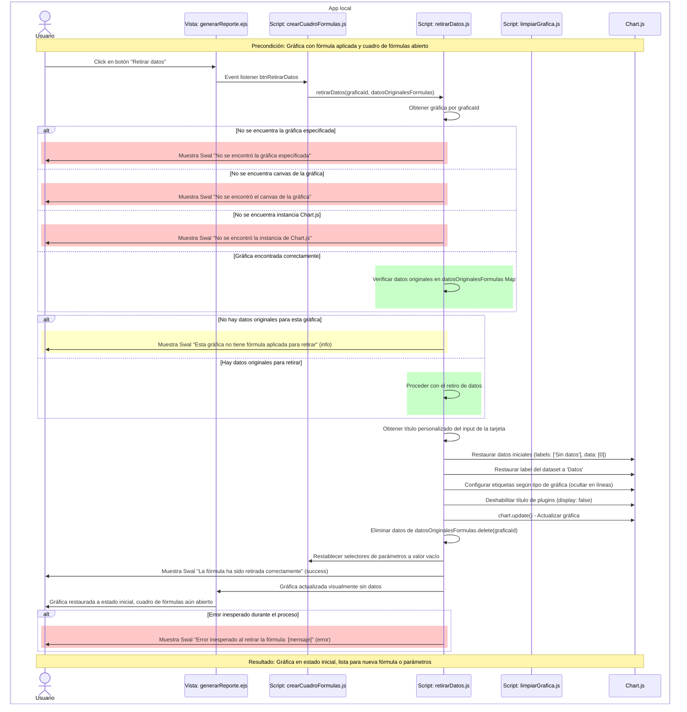

# RF30: Usuario retira fórmula.

### Historia de Usuario

Yo como usuario quiero retirar una fórmula aplicada en mi gráfica para regresar los datos a su estado original y poder aplicar una nueva fórmula o usar datos de columnas directamente.

  **Precondiciones:**
  - Debe haber al menos una fórmula aplicada a una gráfica en el reporte.
  - El cuadro de fórmulas debe estar abierto y mostrando los controles de la gráfica.

  **Criterios de Aceptación:**
  - El sistema debe mostrar un botón "Retirar datos" en el cuadro de fórmulas cuando hay una fórmula aplicada.
  - Al hacer click en "Retirar datos", el sistema debe verificar que existen datos aplicados para retirar.
  - Si no hay fórmula aplicada, debe mostrar un mensaje informativo indicando que no hay datos para retirar.
  - Si hay fórmula aplicada, debe proceder a retirar los datos inmediatamente sin confirmación adicional.
  - Los datos de la gráfica deben regresar al estado inicial (Sin datos - 0) inmediatamente.
  - La gráfica debe mantener el título personalizado ingresado por el usuario si existe.
  - El sistema debe eliminar los datos originales del Map datosOriginalesFormulas.
  - Los selectores de parámetros (columnas) deben restablecerse a su estado inicial.
  - Se debe mostrar un mensaje de éxito confirmando que la fórmula fue retirada correctamente.
  - La gráfica debe actualizarse visualmente de inmediato para reflejar el estado sin datos.
  - El cuadro de fórmulas debe permanecer abierto para permitir aplicar una nueva fórmula.
---

### Diagrama de Secuencia

---

### Mockup

> *Descripción*: El mockup representa la interfaz del sistema donde el usuario puede retirar una fórmula. 

---

### Pruebas Unitarias 

##### [Pruebas del RF](https://docs.google.com/spreadsheets/d/1W-JW32dTsfI22-Yl5LydMhiu-oXHH_xo3hWvK6FHeLw/edit?gid=1410973941#gid=1410973941)

---

### Pull request
[Github]
