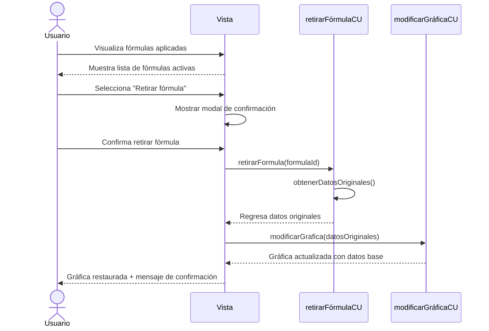

# RF31: Usuario retira fórmula.

### Historia de Usuario

Yo como usuario quiero retirar una fórmula aplicada en mi análisis para regresar mis datos a su valor base.

  **Precondiciones:**
  - Debe haber fórmulas aplicada a gráficas.

  **Criterios de Aceptación:**
  - El sistema debe mostrar un botón o control para retirar cada fórmula aplicada.
  - Al retirar una fórmula, los datos deben regresar a sus valores originales inmediatamente.
  - La gráfica debe actualizarse automáticamente después de retirar la fórmula.
  - El sistema debe solicitar confirmación antes de retirar una fórmula.
  
---

### Diagrama de Secuencia

---

### Mockup

> *Descripción*: El mockup representa la interfaz del sistema donde el usuario puede retirar una fórmula. 

---

### Pruebas Unitarias 
  - [Pruebas](https://docs.google.com/spreadsheets/d/1W-JW32dTsfI22-Yl5LydMhiu-oXHH_xo3hWvK6FHeLw/edit?gid=1410973941#gid=1410973941)

---

### Pull request
[Github]
