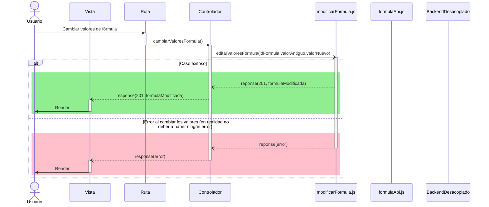

# RF31: Usuario modifica parámetros de fórmulas.

### Historia de Usuario

Yo como usuario quiero tener la capacidad de cambiar los parámetros (columnas de excel ej: Gasolina) de una fórmula.

  **Precondiciones:**
  - Haber creado una formula.
  - Consultar las formulas disponibles.

  **Dependencias:**
  - RF2: Usuario registrado inicia sesión.
  - RF21: Usuario consulta fórmulas.
  - RF22: Usuario guarda fórmula.

  **Criterios de Aceptación:**
  - El sistema debe permitir modificar el nombre de la fórmula.
  - El límite de caracteres para el nombre es de 50.
  - El sistema debe permitir modificar los valores de la fórmula.
  - El límite de caracteres para la fórmula es de 512.
  - El sistema debe notificar al usuario si no se pudo hacer la modificación.
  - Los parámetros de la fórmula (Si, Contar, Buscar, etc.) están en inglés debido a la librería hyperformula.
  - El sistema debe notificar visualmente al usuario si no se ha modificado nada.
  - El usuario puede cancelar los cambios en cualquier momento.
  - El sistema debe notificar visualmente al usuario cuando la operación es exitosa.

---

### Diagrama de Secuencia

---

### Mockup

> *Descripción*: El mockup representa la interfaz del sistema donde el usuario puede modificar los parámetros de la fórmula. 

---

### Pruebas Unitarias 
  - [Pruebas](https://docs.google.com/spreadsheets/d/1W-JW32dTsfI22-Yl5LydMhiu-oXHH_xo3hWvK6FHeLw/edit?gid=1967921723#gid=1967921723)
