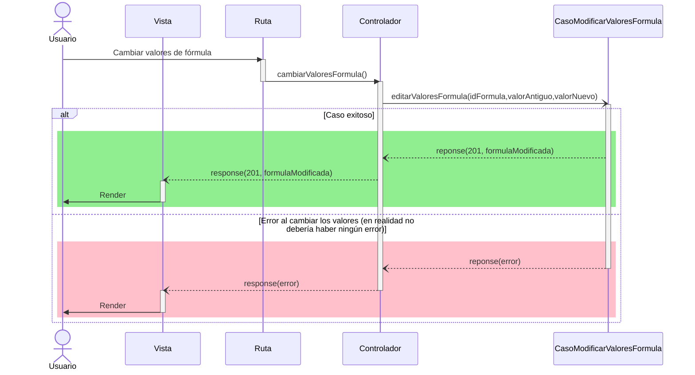

# RF32: Usuario modifica parámetros de fórmulas.

### Historia de Usuario

Yo como usuario quiero tener la capacidad de cambiar los parámetros (columnas de excel ej: Gasolina) de una fórmula.

  **Criterios de Aceptación:**
  - El sistema debe permitir modificar los valores de la fórmula a evaluar.
  - El sistema debe notificar al usuario si no se pudo hacer la modificación.
---

### Diagrama de Secuencia

---

### Mockup

> *Descripción*: El mockup representa la interfaz del sistema donde el usuario puede modificar los parámetros de la fórmula. 

---

### Pruebas Unitarias 
[Matriz de pruebas](https://docs.google.com/spreadsheets/d/1W-JW32dTsfI22-Yl5LydMhiu-oXHH_xo3hWvK6FHeLw/edit?gid=1967921723#gid=1967921723)
