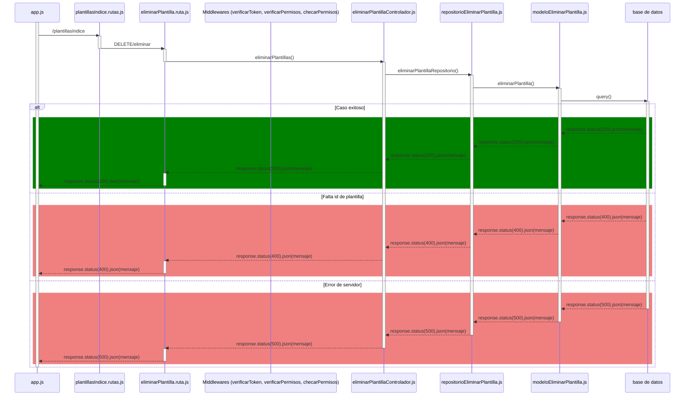

# RF33: Usuario elimina plantilla de reporte.

### Historia de Usuario

Yo como usuario quiero eliminar plantillas de reporte que ya no necesito para mantener organizada mi lista de plantillas 

  **Criterios de Aceptación:**
  - El usuario debe de poder seleccionar y eliminar alguna de las plantillas guardadas.
  - La plantilla debe de desaparecer de la lista.
  - El sistema debe de solicitar confirmación antes de la eliminación.
  - La plantilla se elimina de la base de datos.
  - Se muestra un mensaje de confirmación al eliminar la plantilla exitosamente.
  - Se muestra un mensaje de error si la eliminación no es exitosa.
  - Se muestra un mensaje de error si hay un fallo de red, conexión o servidor.

---

### Diagrama de Secuencia

![Diagrama de Secuencia] 

> *Descripción*: El diagrama de secuencia muestra cómo el usuario elimina una plantilla del reporte.

## Aplicación local

## Backend Desacoplado

### Mockup

![Mockup]

> *Descripción*: El mockup representa la interfaz del usuario utilizando la opción para eliminar plantillas de reporte guardadas.

---

### Pruebas Unitarias 

#### [Pruebas del RF](https://docs.google.com/spreadsheets/d/1W-JW32dTsfI22-Yl5LydMhiu-oXHH_xo3hWvK6FHeLw/edit?gid=406186219#gid=406186219)
---

### Pull Request
[https://github.com/CodeAnd-Co/App-Local-TracTech/pull/18](https://github.com/CodeAnd-Co/App-Local-TracTech/pull/18)
