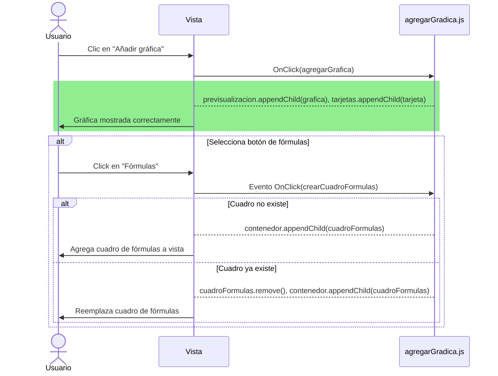

# RF36: Usuario añade gráfica a reporte.

**Última actualización:** 08 de marzo de 2025

### Historia de Usuario

Yo como usuario quiero añadir una gráfica al reporte para poder visualizar los datos que estoy manipulando.

**Criterios de Aceptación:**
- El usuario debe de poder crear múltiples gráficas en el reporte.
- El sistema debe permitir crear diferentes tipos de gráficas.
- Las gráficas deben poder redimensionarse y reposicionarse dentro del reporte.

---

### Diagrama de Secuencia: Añadir gráfica al reporte

### Mockup

--- 

### Pruebas Unitarias 
| ID Prueba | Descripción | Resultado Esperado |
|-----------|-------------|--------------------|
|PU-RF36-01|Crear una gráfica correctamente|La gráfica se crea y visualiza correctamente, así como su tarjeta correspondiente|
|PU-RF36-02|Modificar el título de la gráfica|El título de la gráfica cambia según lo que se escribió|
|PU-RF36-03|El título aparece correctamente|Cualquier símbolo generafo por un teclado puede mostrarse en el título|
|PU-RF36-04|Abrir el cuadro de fórmulas|Se crea el cuadro de fórmulas que corresponde a la gráfica creada (verificar la ID regresada en la terminal)|
|PU-RF36-05|Cerrar el cuadro de fórmulas|El cuadro de fórmulas se elimina sin modificar nada más que la UI|
|PU-RF36-06|Crear múltiples gráficas en el mismo reporte.|Todas las gráficas se muestran correctamente sin encimarse|
|PU-RF36-07|Modificar el texto con múltiples gráficas|El texo modificado en la tarjeta solo cambia la tarjeta correspondiente|
|PU-RF36-08|Abrir el cuadro de fórmulas con múltiples gráficas|Una vez el cuadro de gráficas se abre, abrir el cuadro en una gráfica diferente 9rea el cuadro de nuevo, pero con la 2da gráfica seleccionada|