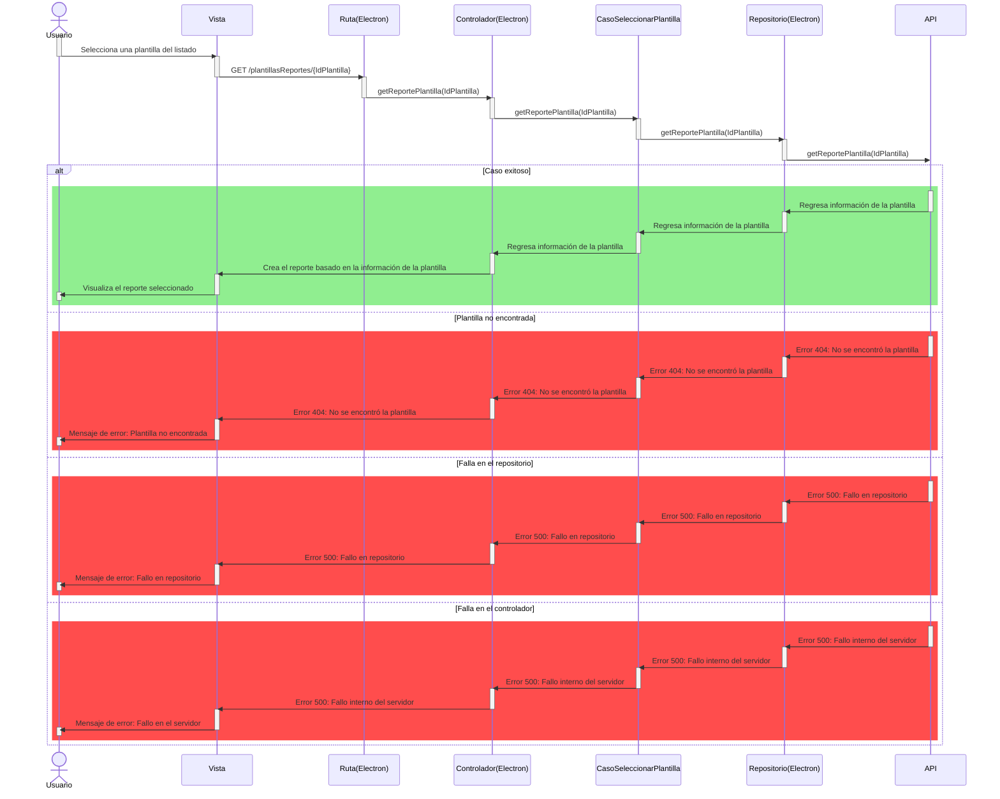
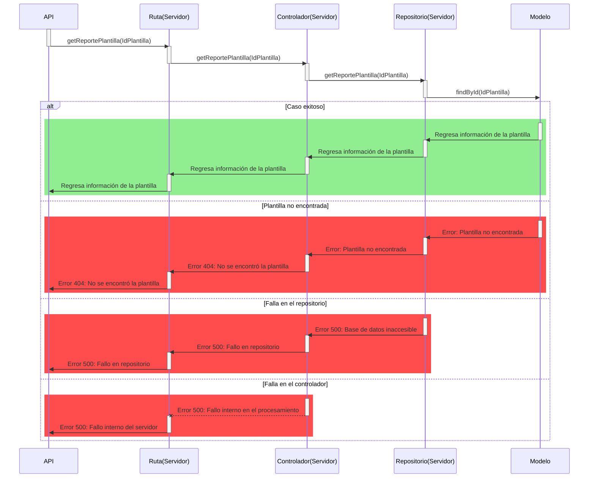

# RF36: Usuario selecciona plantilla de reporte.

### Historia de Usuario

Yo como usuario quiero seleccionar una plantilla de reporte para generar un informe en formato de PDF.

  **Criterios de Aceptación:**
  - El usuario debe de poder seleccionar una plantilla de la lista
  - La plantilla seleccionada debe de aplicarse automaticamente. 

---

### Diagrama de Secuencia
El diagrama de secuencia está separado en dos partes para facilitar la visualización. La mitad de arriba corresponde a la aplicación de Electron y la otra mitad al servidor desacoplado.

Primera parte (Electron)

Segunda parte (Servidor desacoplado)

> *Descripción*: El diagrama de secuencia muestra cómo el usuario selecciona una plantilla y esta se aplica automaticamente.

### Mockup

![Mockup]

> *Descripción*: El mockup representa la interfaz donde el usuario selecciona y aplica una plantilla de reporte. 

---

### Pruebas Unitarias 
  - [Pruebas](https://docs.google.com/spreadsheets/d/1W-JW32dTsfI22-Yl5LydMhiu-oXHH_xo3hWvK6FHeLw/edit?gid=1232940900#gid=1232940900)
