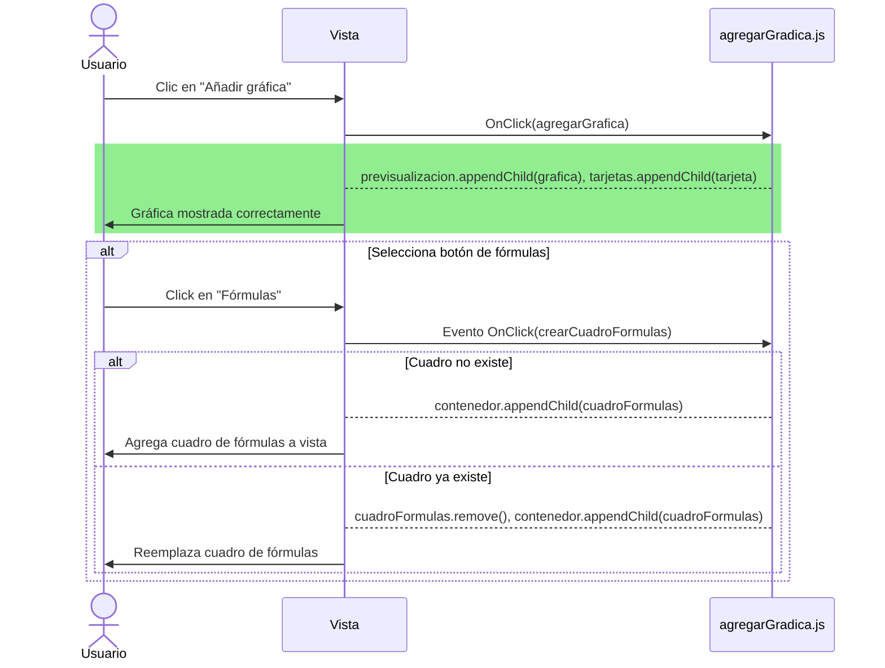

# RF36: Usuario añade gráfica a reporte.

**Última actualización:** 08 de marzo de 2025

### Historia de Usuario

Yo como usuario quiero añadir una gráfica al reporte para poder visualizar los datos que estoy manipulando.

**Criterios de Aceptación:**
- El usuario debe de poder crear múltiples gráficas en el reporte.
- El sistema debe permitir crear diferentes tipos de gráficas.
- Las gráficas deben poder redimensionarse y reposicionarse dentro del reporte.

---

### Diagrama de Secuencia: Añadir gráfica al reporte

### Mockup

![Mockup]

> *Descripción*: El mockup representa la interfaz del sistema donde el usuario puede cerrar sesión. Muestra los campos requeridos y los botones de acción disponibles.

--- 

### Pruebas Unitarias 
| ID Prueba | Descripción | Resultado Esperado |
|-----------|-------------|--------------------|
|PU-RF36-01|Crear una gráfica con datos válidos.|La gráfica se crea y visualiza correctamente.|
|PU-RF36-02|Intentar crear una gráfica sin datos seleccionados.| El sistema muestra un mensaje de error.|
|PU-RF36-03|Crear múltiples gráficas en el mismo reporte.| Todas las gráficas se muestran correctamente sin encimarse.|
|PU-RF36-04|Redimensionar una gráfica existente.| La gráfica sigue siendo legible despues de redimensionarse.|