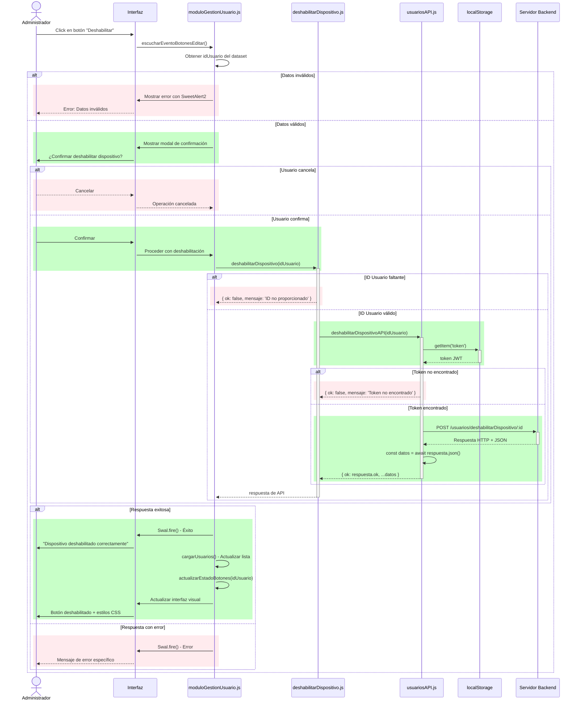
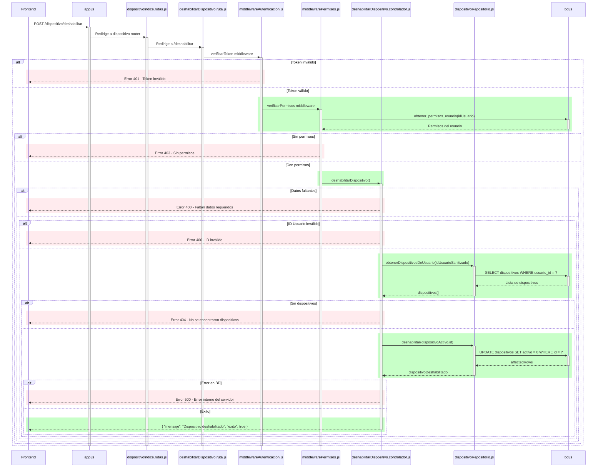
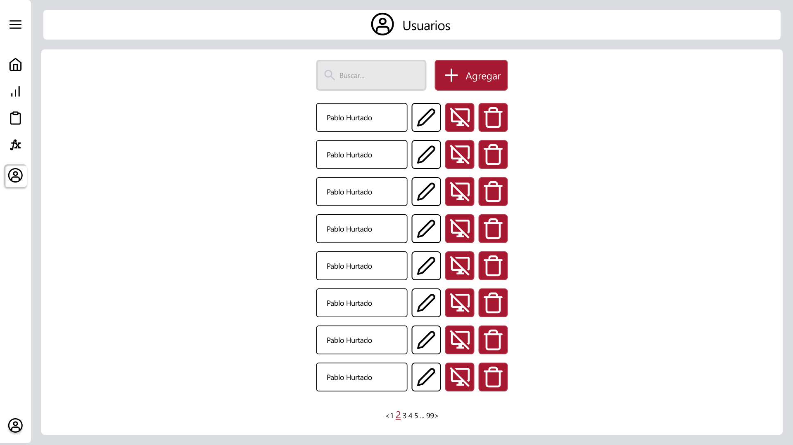

# RF39: Administrador deshabilita dispositivo.

### Historia de Usuario

Yo como administrador quiero deshabilitar un dispositivo de un empleado para prevenir accesos no autorizados en caso de robo o extravío del dispositivo.

  **Criterios de Aceptación:**
  - El administrador debe poder visualizar qué usuarios tienen dispositivos vinculados.
  - El botón de deshabilitar debe estar inactivo para usuarios sin dispositivos vinculados.
  - Al deshabilitar un dispositivo, ningún usuario podrá iniciar sesión desde ese dispositivo.
  - Al deshabilitar un dispositivo, se cerrará cualquier sesión iniciada en ese dispositivo en un plazo de tres minutos.
  - El sistema debe solicitar confirmación antes de deshabilitar un dispositivo.

---

### Diagrama de Secuencia
El diagrama de secuencia está separado en dos partes para facilitar la visualización. La mitad de arriba corresponde a la aplicación de Electron y la otra mitad al servidor desacoplado.

Primera parte (Electron)

Segunda parte (Servidor desacoplado)

> *Descripción*: El diagrama de secuencia muestra cómo el administrador carga el modulo de gestión de usuarios y deshabilita un dispositivo.

### Mockup

> *Descripción*: El mockup representa la interfaz donde el administrador observa todos los usuarios con sus dispositivos correspondientes. 

---

### Pruebas Unitarias 
| ID Prueba | Descripción | Resultado Esperado |
|-----------|-------------|--------------------|
|PU-RF39-01|Deshabilitar dispositivo.|El dispositivo se desvincula del usuario y queda deshabilitado.|
|PU-RF39-02|Intentar deshabilitar dispositivo a usuario sin dispositivo vinculado.|El botón está deshabilitado.|

[Pruebas](https://docs.google.com/spreadsheets/d/1W-JW32dTsfI22-Yl5LydMhiu-oXHH_xo3hWvK6FHeLw/edit?gid=1042471216#gid=1042471216)
---

### Pull Request
[Github](https://github.com/CodeAnd-Co/App-Local-TracTech/pull/125)
