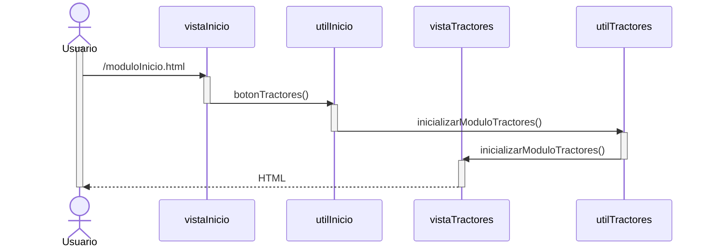

# RF4: Usuario consulta datos disponibles.

### Historia de Usuario

Yo como usuario quiero ver los datos disponibles para los tractores seleccionados con el fin de poder analizar el desempeño de estos

  **Criterios de Aceptación:**
  - El sistema debe de permitir al usuario visualizar los datos que se encuentren disponibles
  - La información debe de estar organizada por categorías como:
    - Rendimiento
    - Mantenimiento
    - Consumo de combustible
    - Kilometraje

---

### Diagrama de Secuencia

![Diagrama de Secuencia] 

> *Descripción*: El diagrama de secuencia muestra cómo el usuario accede a los datos disponibles que tienen los tractores para su análisis.

---

### Mockup

![Mockup]

> *Descripción*: El mockup representa la interfaz del sistema donde se presentan los datos disponibles que se tienen de los tractores para su análisis.

---

### Pruebas Unitarias 
| ID Prueba | Descripción | Resultado Esperado |
|-----------|-------------|--------------------|
|PU-RF13-01|Cargar lista de datos disponible.|Se muestran los datos del tractor de manera ordenada.|
|PU-RF13-02|Filtrar la información por la categoría.|Solo se muestran los datos de la categoría seleccionada|

---

### Pull Request
[https://github.com/CodeAnd-Co/App-Local-TracTech/pull/48](https://github.com/CodeAnd-Co/App-Local-TracTech/pull/48)