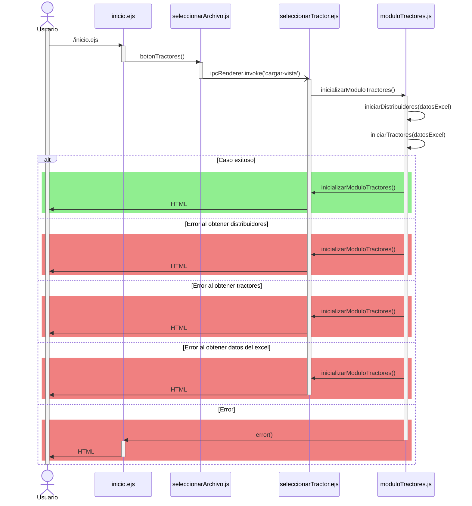

# RF4: Usuario consulta datos disponibles.

### Historia de Usuario

Yo como usuario quiero ver los datos disponibles para los tractores seleccionados con el fin de poder analizar el desempeño de estos

  **Criterios de Aceptación:**
  - El sistema debe de permitir al usuario visualizar los datos que se encuentren disponibles
  - La información debe de estar organizada por categorías como:
    - Distribuidores
    - Tractores
    - Datos de los tractores
  - El sistema debe mostrar una alerta si ocurre un error
---

### Diagrama de Secuencia

![Diagrama de Secuencia] 

> *Descripción*: El diagrama de secuencia muestra cómo el usuario accede a los datos disponibles que tienen los tractores para su análisis.

---

### Mockup

![Mockup]

> *Descripción*: El mockup representa la interfaz del sistema donde se presentan los datos disponibles que se tienen de los tractores para su análisis.

---

### Pruebas Unitarias 

- [Pruebas](https://docs.google.com/spreadsheets/d/1W-JW32dTsfI22-Yl5LydMhiu-oXHH_xo3hWvK6FHeLw/edit?gid=1089355168#gid=1089355168)

---

### Pull Request
[https://github.com/CodeAnd-Co/App-Local-TracTech/pull/48](https://github.com/CodeAnd-Co/App-Local-TracTech/pull/48)