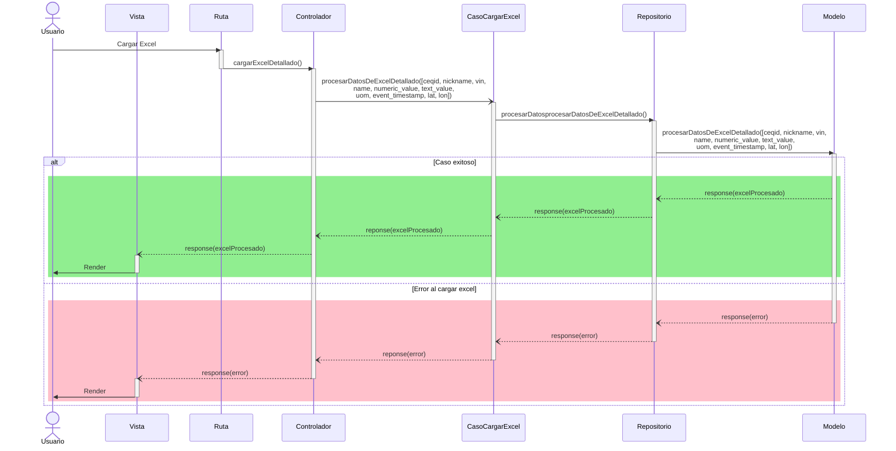

# RF44: Usuario carga Excel a la plataforma.

### Historia de Usuario

Yo como usuario quiero cargar archivos Excel a la plataforma para importar y analizar los datos para realizar reportes.

  **Criterios de Aceptación:**
  - El sistema debe aceptar archivos en formato .csv y .xls

---

### Diagrama de Secuencia

![Diagrama de Secuencia] 

> *Descripción*: El diagrama de secuencia muestra cómo el usuario interactúa con el sistema para cargar el excel en la aplicación.

---

### Mockup

![Mockup]

> *Descripción*: El mockup representa la interfaz del sistema donde el usuario puede cerrar sesión. Muestra los campos requeridos y los botones de acción disponibles.

---

### Pruebas Unitarias 
| ID Prueba | Descripción | Resultado Esperado |
|-----------|-------------|--------------------|
|PU-RF44-01|Cargar archivo Excel válido|Los datos del archivo son cargados y procesados correctamente|

---

## Historial de cambios

| **Tipo de Versión** | **Descripción** | **Fecha** | **Colaborador** |
| ------------------- | --------------- | --------- | --------------- |
| **1.0** | Primera versión de del RF44 | 27/03/2025 | Ian Julián Estrada Castro |