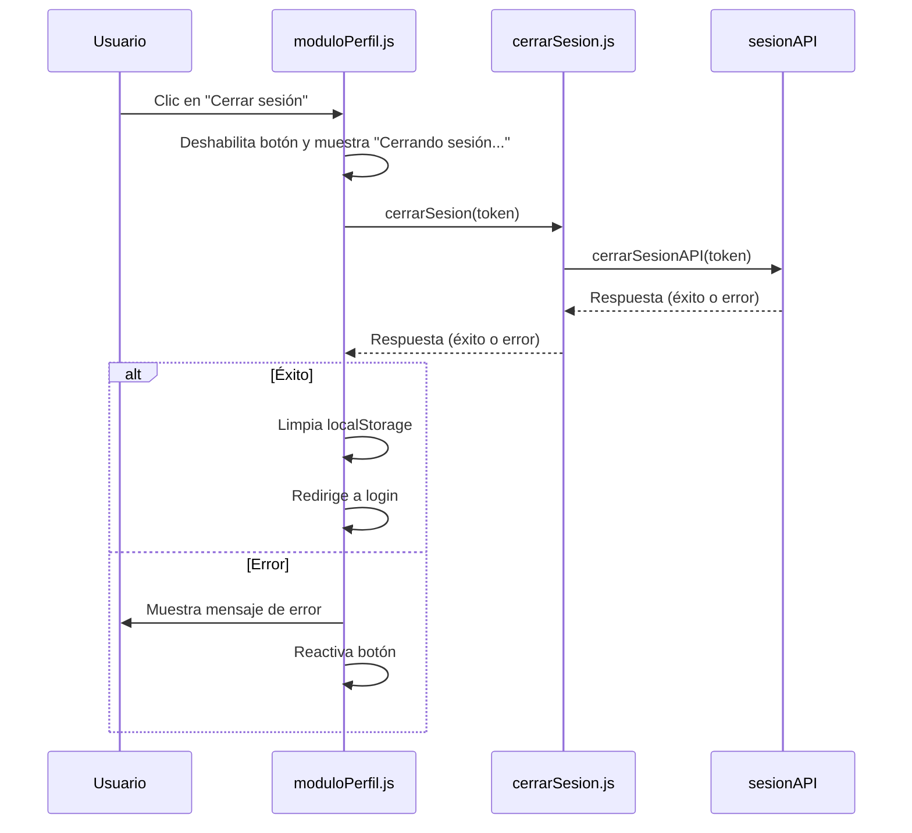
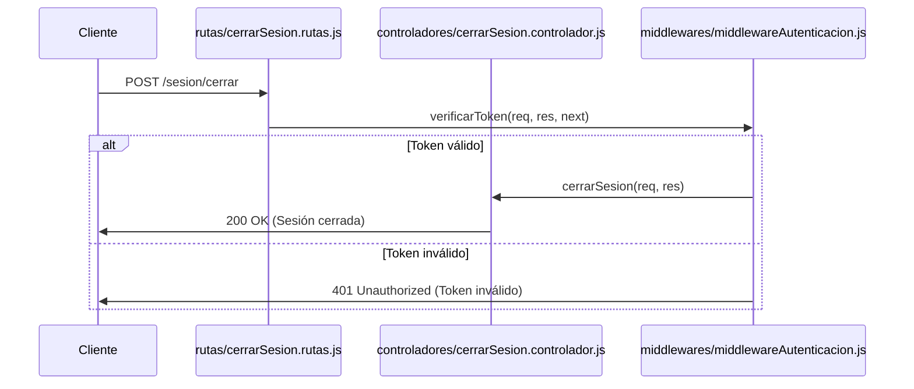
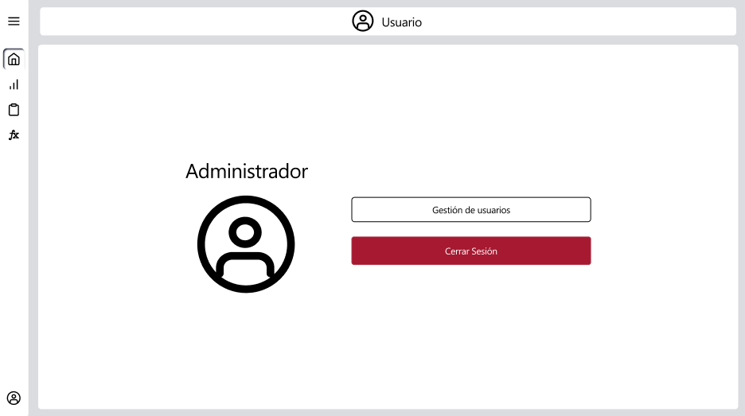

# RF5: Usuario cierra sesión.

**Última actualización:** 07 de marzo de 2025

### Historia de Usuario

Yo como usuario quiero cerrar sesión en el sistema de manera segura termino de utilizar la aplicación de escritorio, asegurando que no se puede accede a mis datos sin mis credenciales.

  **Criterios de Aceptación:**
  - El sistema debe garantizar que una vez el usuario cierre sesión ni el sistema ni los datos del usuario sean accesibles.
  - En caso debe que falle el cerrar sesión debe de aparecer un error con el servidor
  - Al cerrar sesión, el sistema debe redirigir al usuario a la página de inicio de sesión.

---

### Diagrama de Secuencia

![Diagrama de Secuencia] 

> *Descripción*: El diagrama de secuencia muestra cómo el usuario interactúa con el sistema para cerrar sesión, detallando los pasos de solicitud de datos, validación y confirmación.

---

### Mockup

> *Descripción*: El mockup representa la interfaz del sistema donde el usuario puede cerrar sesión. Muestra los campos requeridos y los botones de acción disponibles.

---

### Pruebas Unitarias 

---

### Link a pruebas

[Pruebas](https://docs.google.com/spreadsheets/d/1W-JW32dTsfI22-Yl5LydMhiu-oXHH_xo3hWvK6FHeLw/edit?gid=1725561716#gid=1725561716)

### Pull Request
[https://github.com/CodeAnd-Co/App-Local-TracTech/pull/21](https://github.com/CodeAnd-Co/App-Local-TracTech/pull/21)
