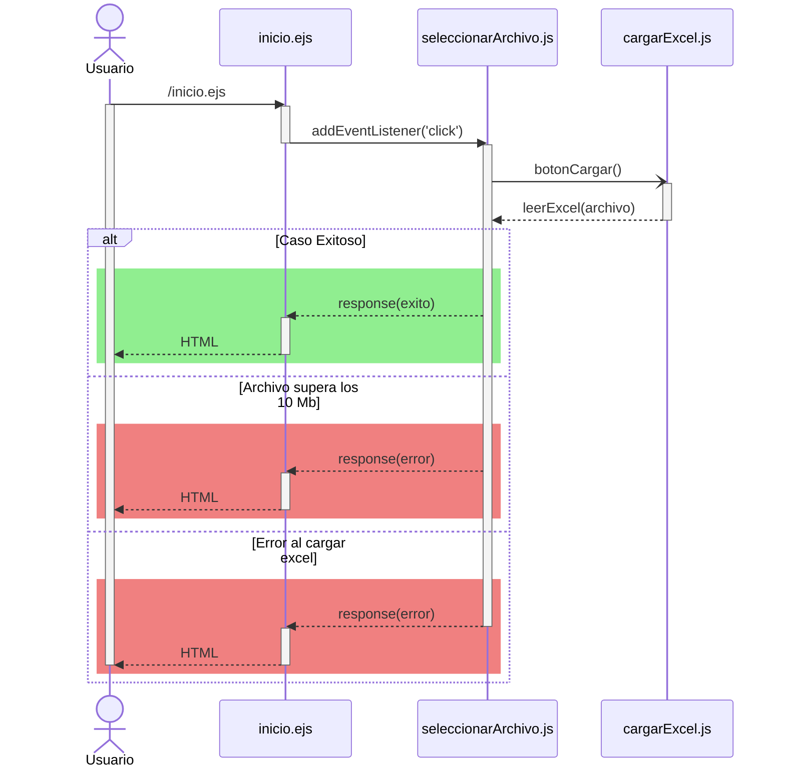
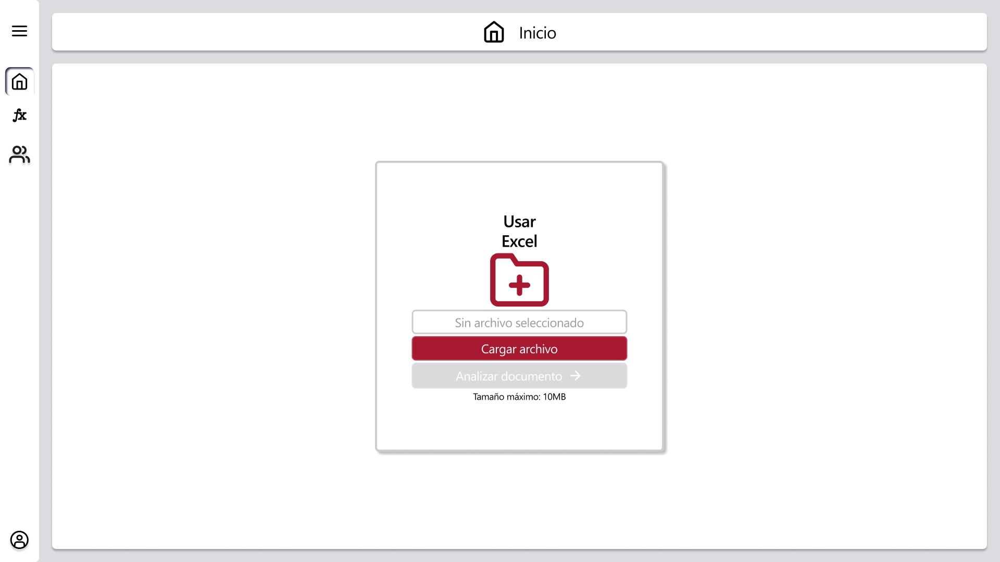

# RF6: Usuario carga Excel a la plataforma.

### Historia de Usuario

Yo como usuario quiero cargar archivos de Excel a la plataforma para importar y analizar los datos para realizar reportes.

  **Precondiciones:**
  - El sistema debe tener acceso a los archivos.

  **Criterios de Aceptación:**
  - El sistema debe aceptar archivos en formato .xlsx.
  - El sistema muestra una alerta si el archivo supera los 10 Mb.
  - El sistema muestra el nombre del archivo cargado.
  - El sistema permite que se arrastre y suelte un archivo .xlsx.
  - El sistema da un mensaje de error tras soltar varios archivos a la vez.
  - El sistema muestra error si le mandas un archivo vacio .xlsx
  - El sistema te muestra un error si le mandas un archivo .xlsx que cuente con celdas que contengan al principio [<>&"'`#+-] 
  - El sistema te muestra un error en caso de que alguna de las anteriores verificaciones no pasen en cada hoja de calculo del archivo.xlsx

---

### Diagrama de Secuencia

---

### Mockup

> *Descripción*: El mockup representa la interfaz del sistema donde el usuario puede cargar archivos Excel. 

---
### Pruebas Unitarias 
- [Pruebas](https://docs.google.com/spreadsheets/d/1W-JW32dTsfI22-Yl5LydMhiu-oXHH_xo3hWvK6FHeLw/edit?usp=sharing)

---

### Pull Request
[https://github.com/CodeAnd-Co/App-Local-TracTech/pull/11](https://github.com/CodeAnd-Co/App-Local-TracTech/pull/11)
