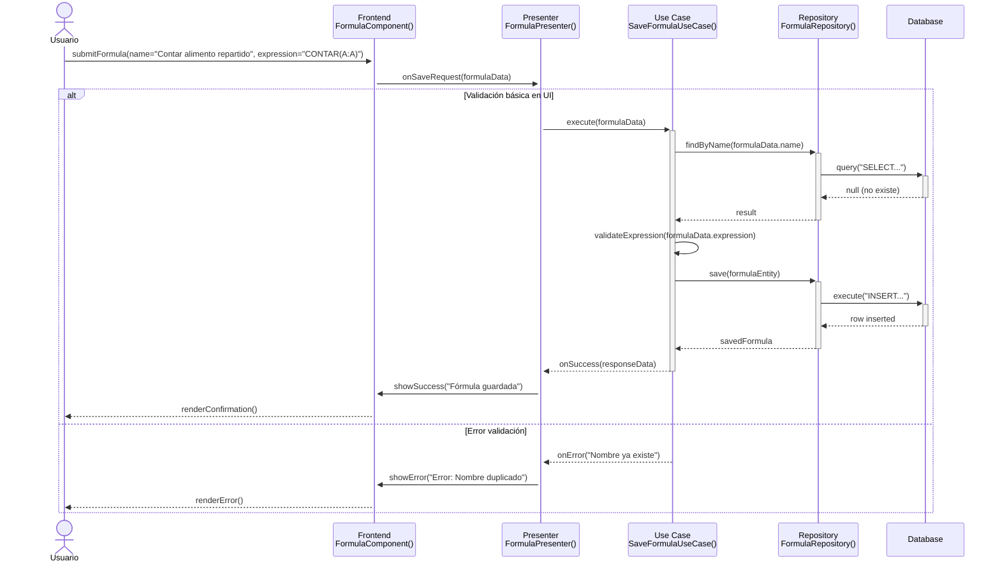

# RF69: Usuario guarda fórmula.

**Última actualización:** 01 de abril de 2025

### Historia de Usuario

Yo como usuario quiero guardar una fórmula matemática/comercial personalizada que pueda aplicarse en futuras tablas, filtrar datos, generar reportes y mostrar información relevante para la toma de decisiones, sin necesidad de reescribir expresiones complejas manualmente cada vez.

  **Criterios de Aceptación:**
  
  - El usuario debe de poder guardar fórmulas con variables modificables.
  - La fórmula guardada debe de estar accesible en la lista de fórmulas disponibles.

---

### Diagrama de Secuencia

---

### Mockup

![Mockup]

> *Descripción*: El mockup representa la interfaz del sistema donde el usuario puede cerrar sesión. Muestra los campos requeridos y los botones de acción disponibles.

---

### Pruebas Unitarias 
## Pruebas Unitarias

| ID Prueba    | Descripción                                      | Resultado Esperado                              |
|-------------|------------------------------------------------|-----------------------------------------------|
| PU-RF69-01 | Guardar fórmula válida (nombre y expresión correcta) | Sistema almacena la fórmula y muestra mensaje de éxito |
| PU-RF69-02 | Guardar fórmula con expresión vacía              | Sistema rechaza operación y muestra error de validación |
| PU-RF69-03 | Guardar fórmula con nombre duplicado            | Sistema detecta conflicto y muestra error correspondiente |
| PU-RF69-04 | Verificar persistencia en base de datos         | Fórmula queda registrada y es recuperable posteriormente |
| PU-RF69-05 | Guardar fórmula con caracteres no permitidos    | Sistema valida campos y muestra error si hay símbolos inválidos |
