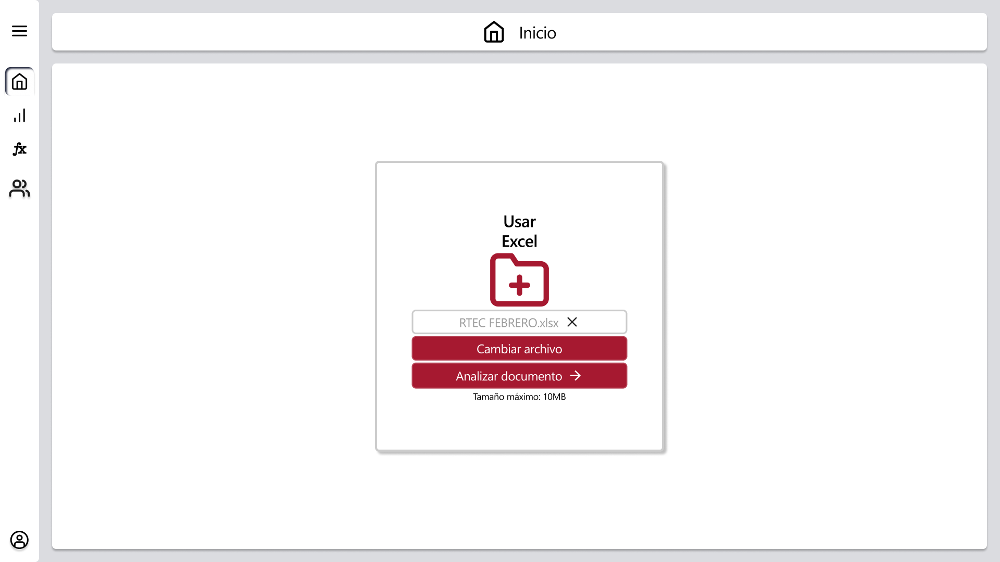

# RF7: Usuario sustituye el Excel cargado.

### Historia de Usuario

Yo como usuario quiero sustituir el excel cargado en la pestaña de inicio para poder cargar el correspondiente al análisis que haré. 

  **Criterios de Aceptación:**
  - El sistema debe de poder borrar los datos del anterior excel y cargar los del nuevo
  - El sistema debe de mostrar el nombre del nuevo excel.
  - El botón de analizar documento debe estar disponible cuando se cargue el nuevo excel.
  - El sistema no debe de aceptar archivos mayores a un tamaño de 10 mb.
  - El sistema no debe de aceptar archivos con una extensión diferente de .xlsx.
  - El sistema permite que se arrastre y suelte un archivo .xlsx.
  - El sistema da un mensaje de error tras soltar varios archivos a la vez.
  - Cuando se presione el botón de cargar excel se debe de abrir el explorador de archivos del dispositivo.

---

### Diagrama de Secuencia

- No aplica según nuestra [definición de Ready](../../definicion-ready-tractores.md).

---

### Mockup

> *Descripción*: El mockup representa la interfaz del sistema donde el usuario puede sustituir el excel cargado, se muestra el nombre del anterior excel y el botón para cargar otro excel si se encuentra habilitado.

---

### Pruebas Unitarias 

#### [Pruebas de la HU](https://docs.google.com/spreadsheets/d/1W-JW32dTsfI22-Yl5LydMhiu-oXHH_xo3hWvK6FHeLw/edit?gid=1105794420#gid=1105794420)

---

### Pull Request

_<u>[Pull Request Front-End](https://github.com/CodeAnd-Co/App-Local-TracTech/pull/11)</u>_

### Historial de cambios

| **Tipo de Versión** | **Descripción**                            | **Fecha** | **Colaborador**         |
| ------------------- | ------------------------------------------ | --------- | ----------------------- |
| **1.0**             |  Añadir requisitos de tractores            | 5/3/2025  | Antonio Landeros           |
| **2.0**             |  Agregar criterios de aceptacion | 3/4/2025  | Pablo Hurtda|
| **2.1**             |  Ordenar todas las RFs y actualizar los datos | 1/6/2025  | Mauricio Anguiano|
| **2.2**             |  Añadir criterios de aceptación | 2/6/2025  | Mauricio Anguiano|