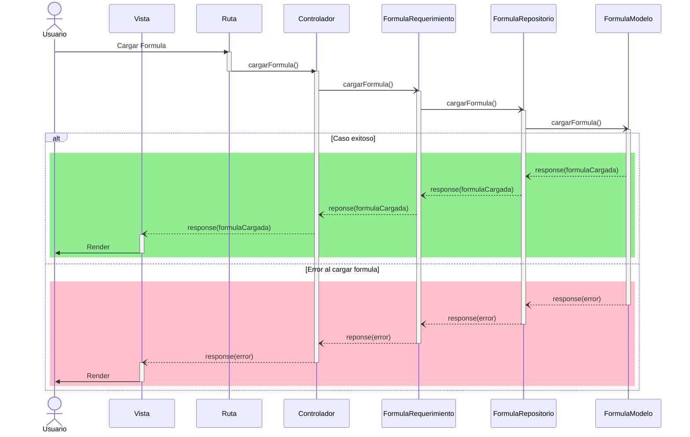

# RF70: Usuario carga formula.

### Historia de Usuario

Yo como usuario quiero cargar una formula guardada para ser más rápido al generar mis gráficas y reportes.

  **Precondiciones:**
  - Debe haber fórmulas guardadas en base de datos.
  - Ya se hizo la consulta de las fórmulas en la base de datos y se muestran en un menú desplegable.
  - El tipo de dato de la fórmula es un string. 

  **Criterios de Aceptación:**
  - La fórmula se selecciona desde un menú desplegable.
  
---

### Diagrama de Secuencia

---

### Mockup

![Mockup]

> *Descripción*: El mockup representa la interfaz del sistema donde el usuario puede cerrar sesión. Muestra los campos requeridos y los botones de acción disponibles.

---

### Pruebas Unitarias 
| ID Prueba | Descripción | Resultado Esperado |
|-----------|-------------|--------------------|
|PU-RF70-01|  |  |

--- 

## Historial de cambios

| **Tipo de Versión** | **Descripción** | **Fecha** | **Colaborador** |
| ------------------- | --------------- | --------- | --------------- |
| **1.0** | Primera versión de del RF70 | 25/03/2025 | Ian Julián Estrada Castro |