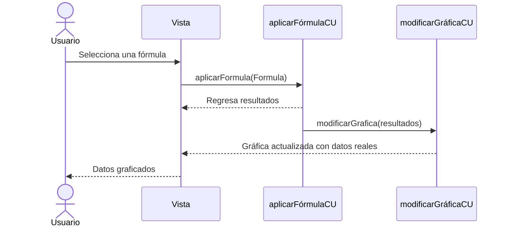

# RF70: Usuario carga formula.

### Historia de Usuario

Yo como usuario quiero cargar una formula guardada para ser más rápido al generar mis gráficas y reportes.

  **Precondiciones:**
  - Debe haber fórmulas guardadas en base de datos.
  - Ya se hizo la consulta de las fórmulas en la base de datos y se muestran en un menú desplegable.
  - El tipo de dato de la fórmula es un string. 

  **Criterios de Aceptación:**
  - La fórmula se selecciona desde un menú desplegable.
  - La fórmula se aplica en la gráfica y muestra el resultado del cálculo. 
  
---

### Diagrama de Secuencia

---

### Mockup

![Mockup]

> *Descripción*: El mockup representa la interfaz del sistema donde el usuario puede cerrar sesión. Muestra los campos requeridos y los botones de acción disponibles.

---

### Pruebas Unitarias 
[Matriz de pruebas](https://docs.google.com/spreadsheets/d/1W-JW32dTsfI22-Yl5LydMhiu-oXHH_xo3hWvK6FHeLw/edit?gid=1374043065#gid=1374043065)

| **Tipo de Versión** | **Descripción** | **Fecha**  | **Colaborador** |
| ------------------- | --------------- | ---------- | --------------- |
| **1.1** | Adición de la matriz de pruebas y actualización de RF.  | 30/05/2025 | Juan Pablo Chávez. |