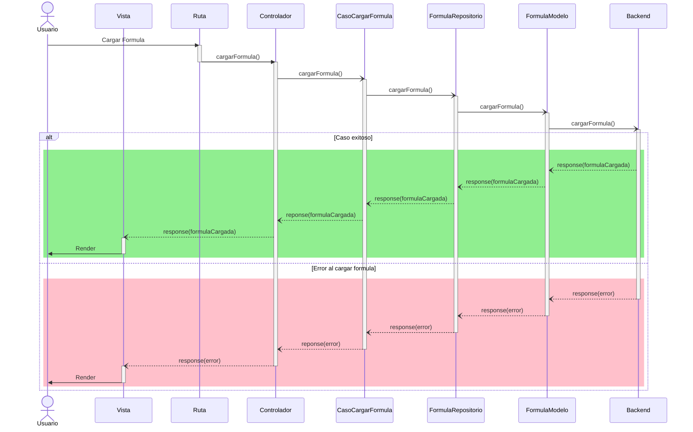
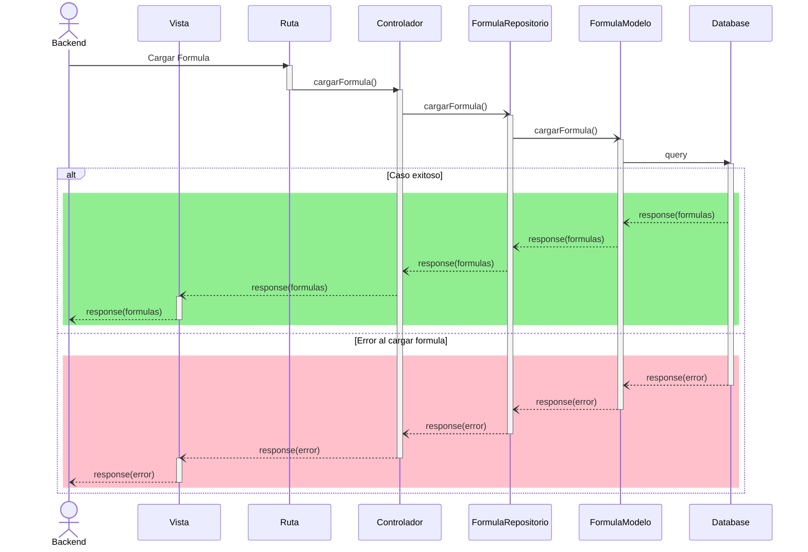

# RF70: Usuario carga formula.

**Última actualización:** 25 de marzo de 2025

### Historia de Usuario

Yo como usuario quiero cargar una formula guardada para ser más rápido al generar mis gráficas y reportes.

  **Precondiciones:**
  - Debe haber una fórmula guardada en base de datos.
  - El tipo de dato de la fórmula es un string.
  - Debe haber 

  **Criterios de Aceptación:**
  - El backend desacoplado se conecta a la base de datos.
  - Se obtiene un string de la base de datos.
  - La fórmula se selecciona desde un menú desplegable.
  
---

### Diagrama de Secuencia

---

### Mockup

![Mockup]

> *Descripción*: El mockup representa la interfaz del sistema donde el usuario puede cerrar sesión. Muestra los campos requeridos y los botones de acción disponibles.

---

### Pruebas Unitarias 
| ID Prueba | Descripción | Resultado Esperado |
|-----------|-------------|--------------------|
|PU-RF70-01|  |  |