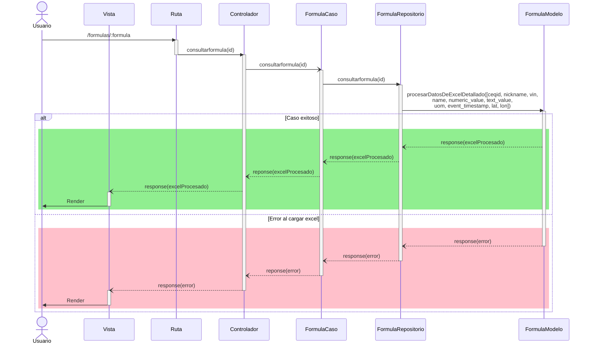

# RF72: Usuario selecciona parámetros de fórmula.

### Historia de Usuario

Yo como usuario quiero seleccionar los parámetros de la fórmula que voy a aplicar para mis gráficas 

  **Criterios de Aceptación:**
  - 
  
---

### Diagrama de Secuencia

![Diagrama de Secuencia] 

> *Descripción*: El diagrama de secuencia muestra cómo el usuario interactúa con el sistema para cerrar sesión, detallando los pasos de solicitud de datos, validación y confirmación.

---

### Mockup

![Mockup]

> *Descripción*: El mockup representa la interfaz del sistema donde el usuario puede cerrar sesión. Muestra los campos requeridos y los botones de acción disponibles.

---

### Pruebas Unitarias 
| ID Prueba | Descripción | Resultado Esperado |
|-----------|-------------|--------------------|
|PU-RF72-01|  |  |

---

## Historial de cambios

| **Tipo de Versión** | **Descripción** | **Fecha** | **Colaborador** |
| ------------------- | --------------- | --------- | --------------- |
| **1.0** | Primera versión de del RF72 | 02/04/2025 | Ian Julián Estrada Castro |