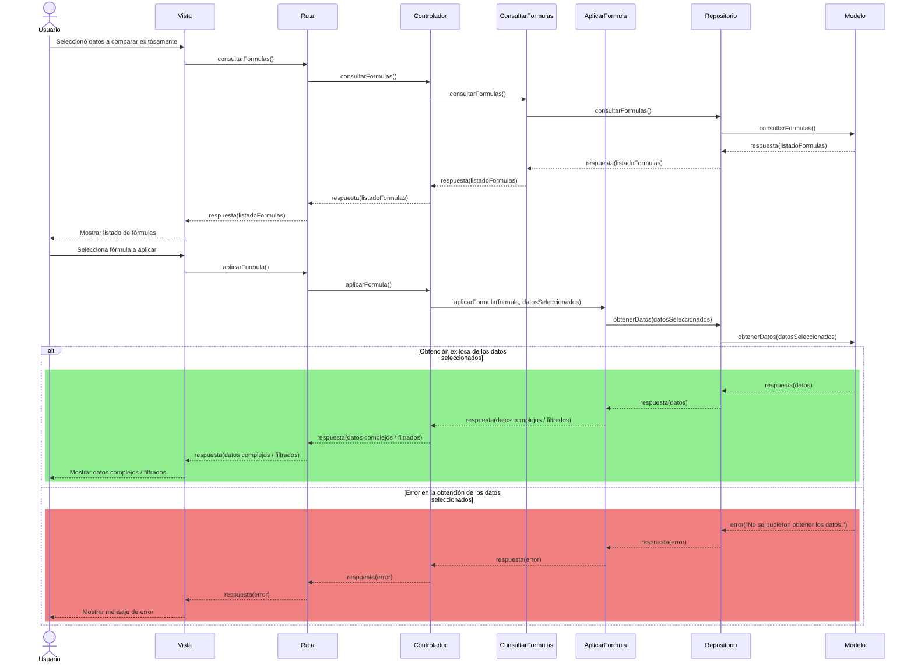

# RF74: Usuario aplica fórmula

**Última actualización:** 27 de marzo de 2025

### Historia de Usuario

Yo como usuario quiero poder aplicar las fórmulas que previamente fueron definidas para poder generar datos complejos o filtrar los datos que usaré en la generación de reportes.

  **Criterios de Aceptación:**
  - El sistema debe permitir seleccionar una fórmula previamente guardada.
  - El sistema debe aplicar la fórmula sobre los datos seleccionados.
  - El usuario debe poder ver el resultado aplicado en una tabla o gráfica.
  - Si la fórmula tiene un error de sintaxis o usa datos no disponibles, el sistema debe notificarlo visualmente.
---

### Diagrama de Secuencia

![Diagrama de Secuencia] 

> *Descripción*: El diagrama de secuencia muestra cómo el usuario interactúa con el sistema para visualizar la página de incio de sesión, detallando los pasos de solicitud de datos, validación y confirmación.

---

### Mockup

![Mockup]

> *Descripción*: El mockup representa la interfaz del sistema donde el usuario puede consultar la página de inicio de sesión. 

---

### Pruebas Unitarias 
| ID Prueba | Descripción | Resultado Esperado |
|-----------|-------------|--------------------|
|PU-RF74-01|Pendiente | Pendiente|
|PU-RF74-02|Pendiente | Pendiente|

---

### Registro de cambios

| Autor | Descripción del cambio | Versión |
|---------|-------------------------|---------|
| Rommel Toledo Crespo | Definición y Criterios de Aceptación | 1.0 |