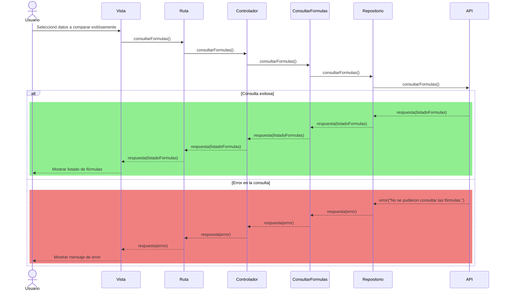

# RF76: Usuario consulta fórmulas

**Última actualización:** 06 de abril de 2025

### Historia de Usuario

Yo como usuario quiero poder consultar las fórmulas que previamente fueron definidas para conocer las que podré aplicar a los datos que usaré en la generación de reportes.

  **Criterios de Aceptación:**
  - El sistema debe permitir consultar una fórmula previamente guardada.
  - El sistema debe notificar visualmente al usuario en caso de un error al obtener los datos.

---

### Diagrama de Secuencia

![Diagrama de Secuencia] 

> *Descripción*: El diagrama de secuencia muestra cómo el usuario interactúa con el sistema para visualizar la página de incio de sesión, detallando los pasos de solicitud de datos, validación y confirmación.

---

### Mockup

![Mockup]

> *Descripción*: El mockup representa la interfaz del sistema donde el usuario puede consultar la página de inicio de sesión. 

---

### Pruebas Unitarias 
| ID Prueba | Descripción | Resultado Esperado |
|-----------|-------------|--------------------|
|PU-RF76-01|Pendiente | Pendiente|
|PU-RF76-02|Pendiente | Pendiente|

---

### Registro de cambios

| Autor | Descripción del cambio | Versión |
|---------|-------------------------|---------|
| Rommel Toledo Crespo | Definición y Criterios de Aceptación | 1.0 |