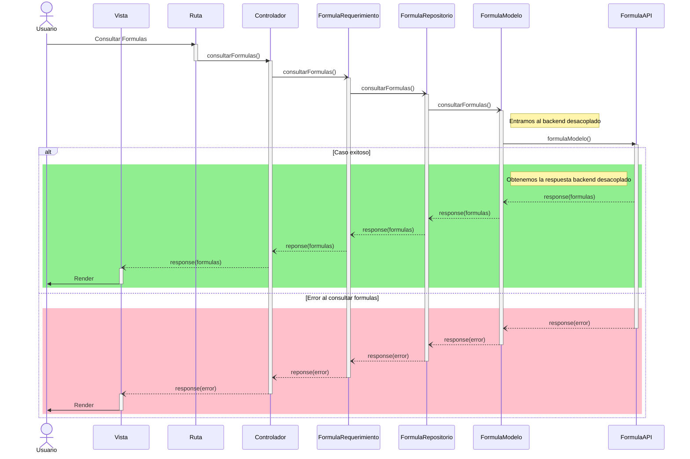
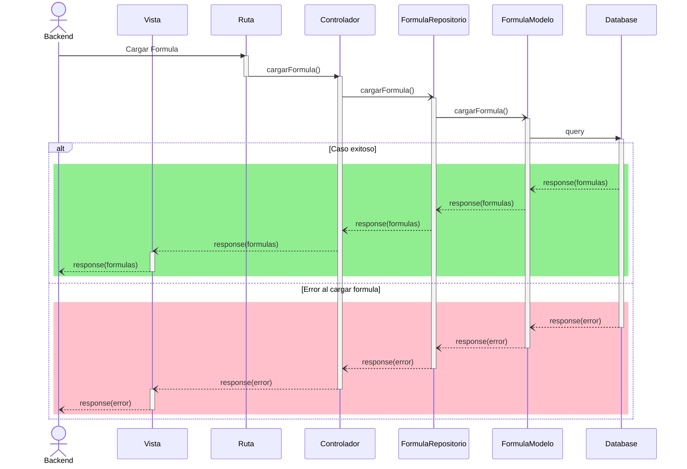

# RF76: Usuario consulta fórmulas.

**Última actualización:** 31 de marzo de 2025

### Historia de Usuario

Yo como usuario quiero consultar las formulas guardadas para cargarlas.

**Precondiciones:**
  - Debe haber una ruta para hacer la petición.
  - El tipo de dato de la fórmula es un string. 

**Criterios de Aceptación:**
  - El backend desacoplado se conecta a la base de datos.
  - Se obtiene un string de la base de datos.
  - Las fórmulas se muestran en un menú desplegable.
  - En caso de tener un error al consultar las fómulas, el menú desplegable aparece vacío.

---

### Diagrama de Secuencia

---

### Mockup

![Mockup]

> *Descripción*: El mockup representa la interfaz del sistema donde el usuario puede cerrar sesión. Muestra los campos requeridos y los botones de acción disponibles.

---

### Pruebas Unitarias 
| ID Prueba | Descripción | Resultado Esperado |
|-----------|-------------|--------------------|
|PU-RF76-01|  |  |