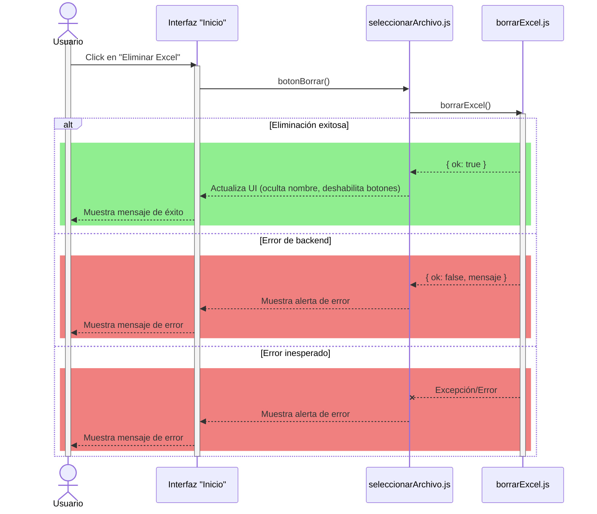
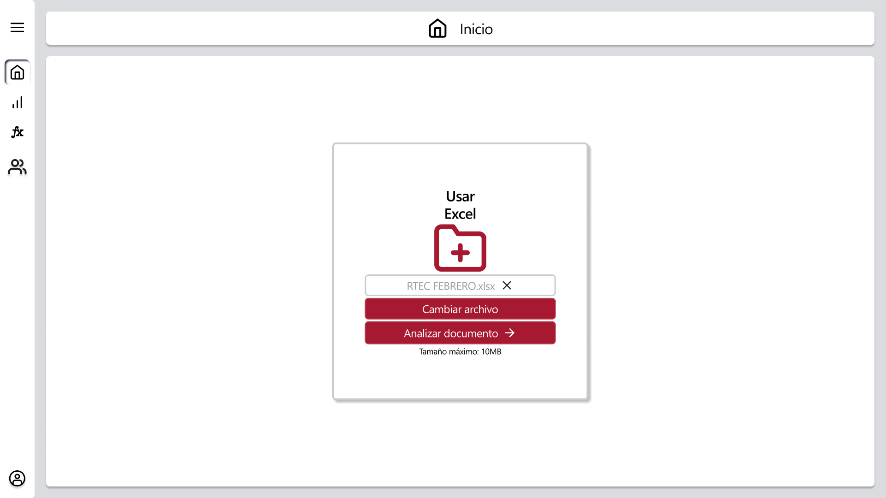

# RF8: Usuario elimina el Excel cargado.

### Historia de Usuario

Yo como usuario quiero eliminar el Excel cargado para cuando termine de trabajar en un reporte.

  **Criterios de Aceptación:**

  - El sistema debe mostrar una confirmación antes de eliminar el archivo.
  - Si el usuario confirma la eliminación, el archivo Excel debe eliminarse de la aplicación y no debe estar disponible para futuras operaciones.
  - Si el usuario cancela la acción, el archivo debe permanecer cargado y no debe realizarse ningún cambio.
  - Tras la eliminación exitosa, la interfaz debe actualizarse para reflejar que no hay archivo cargado (por ejemplo, ocultar el nombre del archivo y deshabilitar botones relacionados).
  - Si ocurre un error durante la eliminación, el sistema debe mostrar un mensaje de error claro al usuario.

---

### Diagrama de Secuencia

![Diagrama de Secuencia] 

> *Descripción*: El diagrama de secuencia muestra cómo el usuario interactúa con el sistema para eliminar un Excel, detallando los pasos de solicitud de datos, validación y confirmación.

---

### Mockup

> *Descripción*: El mockup representa la interfaz del sistema donde el usuario elimina un Excel. Muestra los campos requeridos y los botones de acción disponibles.

---

### Pruebas Unitarias 

---

### Link Pruebas

#### [Pruebas](https://docs.google.com/spreadsheets/d/1W-JW32dTsfI22-Yl5LydMhiu-oXHH_xo3hWvK6FHeLw/edit?gid=765173927#gid=765173927)

---

### Pull Request
[https://github.com/CodeAnd-Co/App-Local-TracTech/pull/19](https://github.com/CodeAnd-Co/App-Local-TracTech/pull/19)

### Historial de cambios

| **Tipo de Versión** | **Descripción**                            | **Fecha** | **Colaborador**         |
| ------------------- | ------------------------------------------ | --------- | ----------------------- |
| **1.0**             |  Añadir requisitos de tractores            | 5/3/2025  | Antonio Landeros           |
| **2.0**             |  Agregar criterios de aceptacion | 3/4/2025  | Pablo Hurtda|
| **2.1**             |  Ordenar todas las RFs y actualizar los datos | 1/6/2025  | Mauricio Anguiano|
| **2.2**             |  Añadir criterios de aceptación | 2/6/2025  | Mauricio Anguiano|
