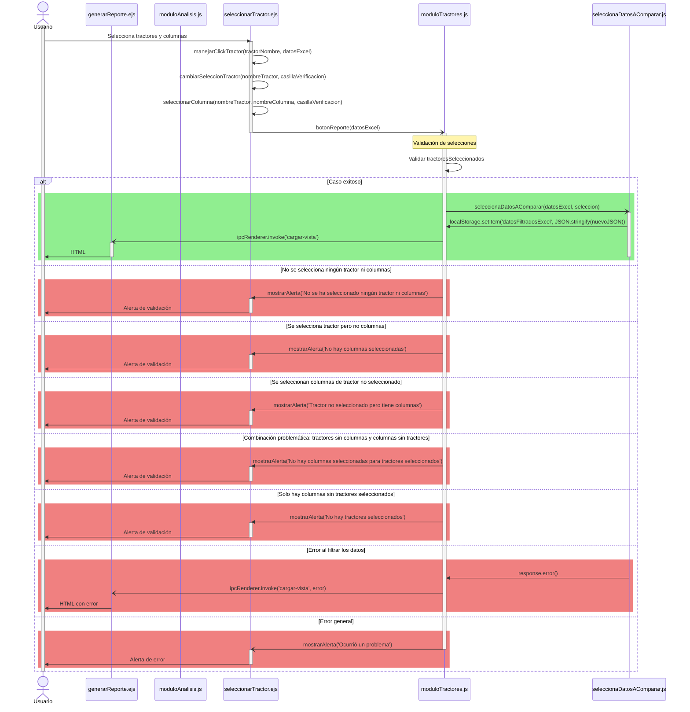

# RF9: Usuario descarga PDF del reporte.

### Historia de Usuario

Yo como usuario de la aplicación de escritorio Harvester quiero descargar el reporte en formato PDF para compartirlo o almacenarlo en el dispositivo en el que se tenga descargada la aplicación.

 **Criterios de Aceptación:**
 - El usuario debe poder descargar el reporte en formato PDF desde la interfaz del sistema.
 - El PDF debe incluir toda la información visible y clara del reporte.
 - El sistema debe procesar todas las tarjetas de texto y gráficas presentes en el reporte.
 - Las tarjetas de texto deben mantener su formato (Título, Subtítulo, Contenido) en el PDF.
 - Las gráficas deben incluirse como imágenes en el PDF.
 - Las gráficas deben reflejar los datos procesados según las fórmulas aplicadas desde el botón de fórmulas.
 - Si una gráfica tiene fórmulas asociadas, los datos mostrados deben ser el resultado de aplicar esas fórmulas a los parámetros seleccionados.
 - El PDF debe mantener el orden de los elementos tal como aparecen en la previsualización.
 - El usuario debe ver un indicador de "Descargando..." mientras se genera el PDF.
 - La pantalla debe bloquearse temporalmente durante la generación del PDF.
 - El sistema debe manejar errores si jsPDF no está disponible o falla la generación.
 - El PDF debe tener formato A4 con márgenes apropiados (40pt).
 - Si el contenido excede una página, el sistema debe crear páginas adicionales automáticamente.
 - El proceso de descarga debe completarse en menos de 10 segundos para reportes estándar.
 - Después de la descarga exitosa, la interfaz debe regresar a su estado normal.
 - Los títulos de las gráficas configurados por el usuario deben aparecer correctamente en el PDF.

---

### Diagrama de Secuencia

> *Descripción*: El diagrama de secuencia muestra cómo el usuario solicita la descarga del reporte y el sistema genera y entrega el PDF del reporte usando jsPDF localmente, incluyendo el procesamiento de fórmulas aplicadas a las gráficas

### Mockup

> *Descripción*: El mockup representa la interfaz del sistema donde el usuario puede seleccionar la opción para descargar el archivo PDF del reporte.

### Pruebas Unitarias 

[Pruebas](https://docs.google.com/spreadsheets/d/1W-JW32dTsfI22-Yl5LydMhiu-oXHH_xo3hWvK6FHeLw/edit?gid=177557881#gid=177557881)
---

### Pull Request
[https://github.com/CodeAnd-Co/App-Local-TracTech/pull/27](https://github.com/CodeAnd-Co/App-Local-TracTech/pull/27)

### Historial de cambios

| **Tipo de Versión** | **Descripción**                            | **Fecha** | **Colaborador**         |
| ------------------- | ------------------------------------------ | --------- | ----------------------- |
| **1.0**             |  Añadir requisitos de tractores            | 5/3/2025  | Antonio Landeros           |
| **1.1**             |  Agregar precondicion en RF9 | 3/4/2025  | Ian Julian Estrada|
| **1.2**             |  Ordenar todas las RFs y actualizar los datos | 1/6/2025  | Mauricio Anguiano|
| **1.3**             |  Correcion de diagrama de secuencia | 2/6/2025  | Mauricio Anguiano|
| **1.4**             |  Correccion criterios de aceptacion | 2/6/2025  | Mauricio Anguiano|