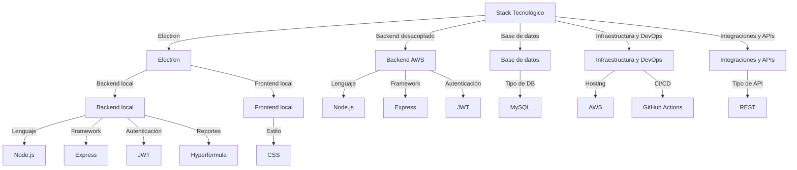

# Diagrama Stack Tecnológico TracTech

**Última modificación:** 8 de marzo de 2025 por Daniel Contreras Chávez

```mermaid

graph TD
    A[Stack Tecnológico] --> |Electron| B[Electron]
    A --> |Backend desacoplado| C[Backend AWS]
    A --> |Base de datos| D[Base de datos]
    A -->|Infraestructura y DevOps| E[Infraestructura y DevOps]
    A -->|Integraciones y APIs| F[Integraciones y APIs]

    %% Electron
    B -->|Backend local| B1[Backend local]
    B -->|Frontend local| B2[Frontend local]
    B1 -->|Lenguaje| B3[Node.js]
    B1 -->|Framework| B4[Express]
    B1 -->|Autenticación| B5[JWT]
    B1 -->|Reportes| B6[Hyperformula]
    B2 -->|Estilo| B7[CSS]

    %% Backend AWS
    C -->|Lenguaje| C1[Node.js]
    C -->|Framework| C2[Express]
    C -->|Autenticación| C3[JWT]

    %% Base de Datos
    D -->|Tipo de DB| D1[MySQL]

    %% Infraestructura y DevOps
    E -->|Hosting| E2[AWS]
    E -->|CI/CD| E3[GitHub Actions]

    %% Integraciones y APIs
    F -->|Tipo de API| F1[REST]

```