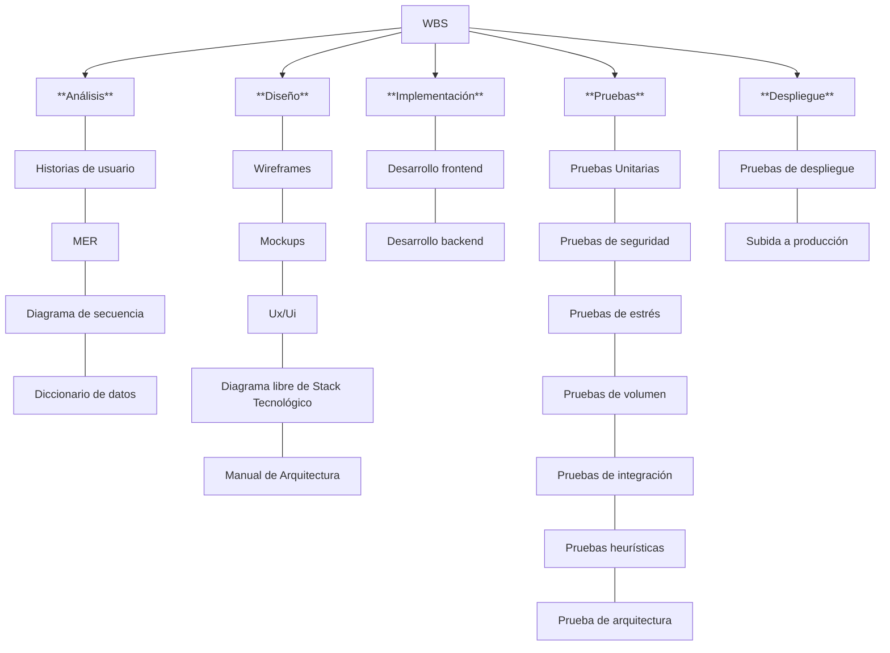

# Work Breakdown Structure TracTech

**Última actualización:** 6 de marzo de 2025 por Daniel Contreras

```mermaid

graph TD;
    F[WBS] --> A 
    F[WBS] --> B
    F[WBS] --> C
    F[WBS] --> D
    F[WBS] --> E

    A[**Análisis**] --- A1[Historias de usuario]
    A1 --- A2[MER]
    A2 ---A3[Diagrama de secuencia]
    A3 ---A4[Diccionario de datos]
 
    B[**Diseño**] --- B1[Wireframes]
    B1 --- B2[Mockups]
    B2 --- B3[Ux/Ui]
    B3 --- B4[Diagrama libre de Stack Tecnológico]
    B4 --- B5[Manual de Arquitectura]

    C[**Implementación**] ---C1[Desarrollo frontend]
    C1 --- C2[Desarrollo backend]
 
    D[**Pruebas**] ---D1[Pruebas Unitarias]
    D1 --- D2[Pruebas de seguridad]
    D2 --- D3[Pruebas de estrés]
    D3 --- D4[Pruebas de volumen]
    D4 --- D5[Pruebas de integración]
    D5 --- D6[Pruebas heurísticas]
    D6 --- D7[Prueba de arquitectura]

    E[**Despliegue**] --- E1[Pruebas de despliegue]
    E1 --- E2[Subida a producción]

```