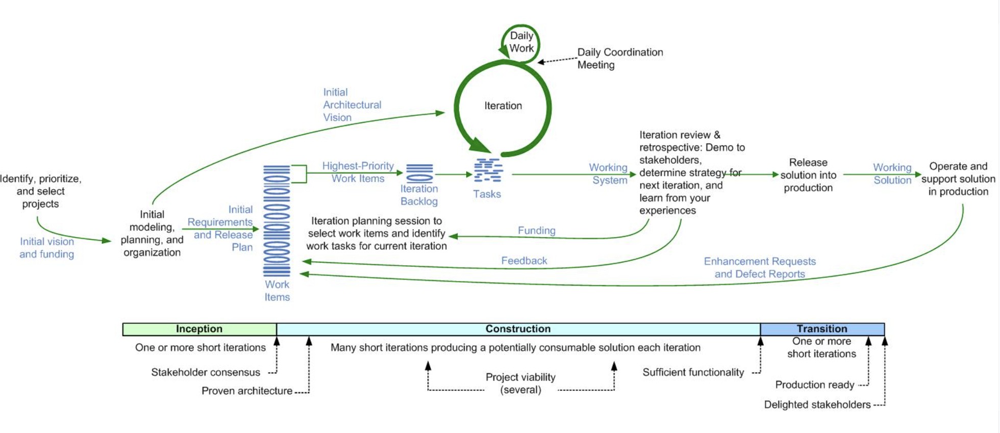

# Ciclo de Vida en DAD

### En qué consiste?

En Disciplined Agile Delivery (DAD), el ciclo de vida de desarrollo de software es un enfoque estructurado pero flexible que guía cómo se gestiona un proyecto desde su inicio hasta su entrega y mantenimiento. A diferencia de metodologías ágiles más tradicionales como Scrum, DAD reconoce que hay múltiples formas de trabajar y proporciona varios ciclos de vida en función del contexto del equipo y del negocio.

## Tipos de ciclos de vida en DAD

###  Ciclo de vida DAD básico

El ciclo de vida básico de Disciplined Agile Delivery (DAD) es un enfoque iterativo e incremental que guía el desarrollo de software desde la concepción hasta la entrega. Se estructura en tres fases principales: inicio, construcción y transición. Durante la fase de inicio, se establecen los objetivos, la arquitectura y el equipo. En la fase de construcción, se desarrolla el producto en iteraciones, validando continuamente con los stakeholders. Finalmente, en la fase de transición, se prepara el producto para su implementación y adopción. Este enfoque busca equilibrar la flexibilidad de las metodologías ágiles con una mayor estructura y gobernanza.

| **Ventajas** | **Desventajas** |
|-------------|----------------|
| Se adapta a distintos entornos y necesidades del proyecto. | Puede ser complejo para equipos sin experiencia en DAD. |
| Permite mejorar continuamente el producto. | Puede generar sobrecarga si no se gestiona bien. |
| Identifica y aborda riesgos desde el inicio. | Requiere una planificación inicial más detallada. |
| Combina prácticas ágiles y tradicionales para mayor adaptabilidad. | Puede ser difícil de implementar en organizaciones con mentalidad rígida. |
| Define responsabilidades de forma más estructurada que Scrum. | Puede generar resistencia en equipos acostumbrados a métodos más simples. |
| Adecuado para proyectos grandes y equipos distribuidos. | No siempre es necesario para proyectos pequeños. |

###  Ciclo de vida DAD avanzado
 5.45.15 p.m..png>)

El ciclo de vida avanzado de Disciplined Agile Delivery (DAD) amplía el enfoque iterativo e incremental del ciclo básico al incorporar prácticas adicionales para mejorar la escalabilidad, la entrega continua y la integración con otras áreas de la organización. Se estructura en tres fases principales: inicio, construcción y transición, pero con un énfasis mayor en la optimización del flujo de trabajo, la automatización y la gobernanza. Además, permite la adaptación a diferentes contextos empresariales mediante la integración de prácticas de Lean, DevOps y gestión de portafolio ágil.

| **Ventajas** | **Desventajas** |
|-------------|----------------|
| Mejora la escalabilidad y permite gestionar proyectos complejos. | Puede requerir una curva de aprendizaje más pronunciada. |
| Facilita la entrega continua e integración con DevOps. | Necesita una infraestructura más robusta para automatización. |
| Ofrece mayor gobernanza y control sin sacrificar agilidad. | Puede ser percibido como demasiado estructurado en equipos pequeños. |
| Se adapta mejor a organizaciones con múltiples equipos y dependencias. | Requiere mayor coordinación y alineación entre equipos. |
| Integra prácticas avanzadas como gestión de portafolio ágil. | No siempre es necesario para proyectos de menor alcance. |

###  Ciclo de vida DAD de entrega continua
 5.45.19 p.m..png>)

El ciclo de vida de entrega continua en Disciplined Agile Delivery (DAD) está diseñado para equipos que requieren desplegar software de manera frecuente y confiable. Se basa en la automatización de pruebas, integración y despliegue continuo (CI/CD), minimizando los tiempos de espera entre el desarrollo y la entrega. Este enfoque es ideal para entornos de alto dinamismo, donde la retroalimentación rápida y la adaptación constante son clave para el éxito del producto. Además, fomenta la colaboración entre equipos de desarrollo, operaciones y calidad para garantizar entregas estables y sin fricciones.

| **Ventajas** | **Desventajas** |
|-------------|----------------|
| Permite entregas rápidas y frecuentes de software. | Requiere una fuerte inversión en automatización y herramientas. |
| Reduce riesgos al implementar cambios pequeños y continuos. | Puede generar fatiga en los equipos si no se gestiona bien el ritmo de entrega. |
| Mejora la calidad del software mediante integración y pruebas continuas. | Necesita una cultura organizacional alineada con DevOps. |
| Facilita una respuesta ágil a cambios y retroalimentación del usuario. | Puede ser difícil de adoptar en entornos con procesos rígidos o regulaciones estrictas. |
| Reduce tiempos de inactividad y problemas en producción. | La infraestructura debe estar preparada para soportar despliegues frecuentes. |

###  Ciclo de vida DAD exploratorio “lean startup”
 5.45.22 p.m..png>)

El ciclo de vida Lean Startup en Disciplined Agile Delivery (DAD) está diseñado para entornos de alta incertidumbre, donde la validación rápida de hipótesis y la iteración constante son fundamentales. Se enfoca en experimentar con ideas, medir resultados y aprender de la retroalimentación del mercado para ajustar o pivotar el producto. Este enfoque es ideal para startups y proyectos innovadores, ya que minimiza el riesgo de inversión en productos que podrían no tener demanda.

| **Ventajas** | **Desventajas** |
|-------------|----------------|
| Permite validar ideas rápidamente antes de invertir grandes recursos. | Puede generar cambios constantes que afecten la estabilidad del desarrollo. |
| Reduce el riesgo de fracaso al enfocarse en la retroalimentación del usuario. | No es adecuado para proyectos con requerimientos fijos o regulaciones estrictas. |
| Favorece la innovación y la experimentación controlada. | Requiere una mentalidad flexible y tolerante al fracaso. |
| Facilita el ajuste o pivote del producto según la demanda real del mercado. | Puede ser difícil de coordinar en equipos grandes o distribuidos. |
| Optimiza el uso de recursos al centrarse en lo esencial para el cliente. | La falta de una visión clara a largo plazo puede dificultar la planificación estratégica. |