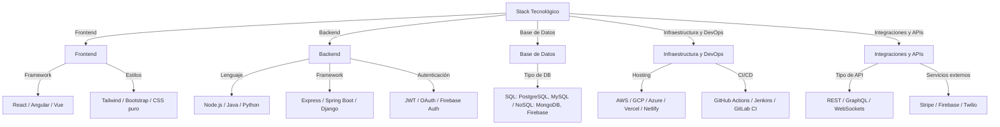

# Diagrama Stack Tecnológico

**Autores:** Daniel Contreras Chávez y Diego Ricardo Alfaro Pinto

```mermaid

graph TD
    A[Stack Tecnológico] -->|Frontend| B[Frontend]
    A -->|Backend| C[Backend]
    A -->|Base de Datos| D[Base de Datos]
    A -->|Infraestructura y DevOps| E[Infraestructura y DevOps]
    A -->|Integraciones y APIs| F[Integraciones y APIs]

    %% Frontend
    B -->|Framework| B1[React / Angular / Vue]
    B -->|Estilos| B2[Tailwind / Bootstrap / CSS puro]

    %% Backend
    C -->|Lenguaje| C1[Node.js / Java / Python]
    C -->|Framework| C2[Express / Spring Boot / Django]
    C -->|Autenticación| C3[JWT / OAuth / Firebase Auth]

    %% Base de Datos
    D -->|Tipo de DB| D1[SQL: PostgreSQL, MySQL / NoSQL: MongoDB, Firebase]
    
    %% Infraestructura y DevOps
    E -->|Hosting| E2[AWS / GCP / Azure / Vercel / Netlify]
    E -->|CI/CD| E3[GitHub Actions / Jenkins / GitLab CI]

    %% Integraciones y APIs
    F -->|Tipo de API| F1[REST / GraphQL / WebSockets]
    F -->|Servicios externos| F2[Stripe / Firebase / Twilio]

```