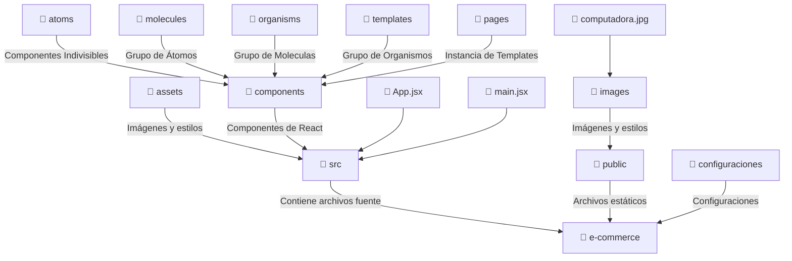
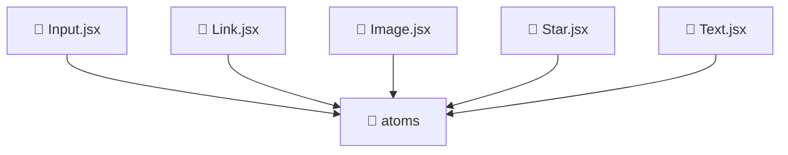
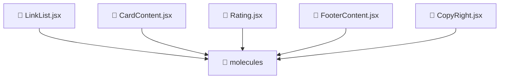
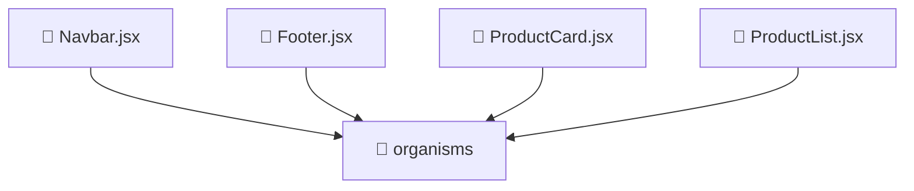
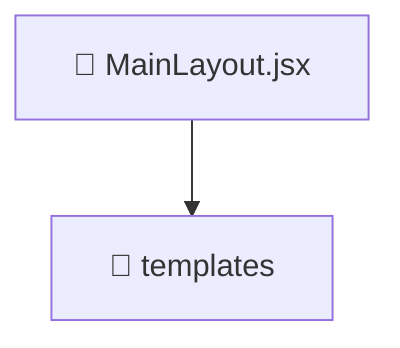

# Componentes y Props

**Última actualización:** 16 de marzo de 2025

**Autores:** Angel Mauricio Ramírez Herrera

## Separar Componentes

Dentro de `App.jsx` existen varios elementos que se pueden dividir en componentes, para mantener una estructura limpia, usaremos [atomic design](https://rjroopal.medium.com/atomic-design-pattern-structuring-your-react-application-970dd57520f8).

La organización de las carpetas quedará de la siguiente forma:



Al dar un vistaso al código de `App.jsx` concluimos que hay muchos errores críticos que se tienen que resolver. Primero, los estilos se están asignando a las etiquetas mediante `class` lo cual es un problema porque los archivos `jsx` utilizan `className` en lugar de `class` ya que JSX es una extensión de JavaScript y se ejecuta en un entorno de JavaScript, donde `class` es una palabra clave reservada para definir clases en la programación orientada a objetos. El segundo error es que el código está muy largo y es dificil de comprender a simple vista, por lo que es recomendable separar los componentes como se planteó en la anterior lección.

> Corrige el archivo `App.jsx` y cambia `class` por `className`

Antes de separar los componentes, hay que plantear qué es lo que vamos a generar para saber si se trata de un átomo, molécula, organismo, template o página.

Separación del Navbar:

```js
{
  /* Organismo: Nav */
}
<nav className="light-blue darken-4">
  <div className="nav-wrapper container">
    <div className="row">
      {/* Átomo: Logo */}
      <div className="col s4">
        <a href="#" className="brand-logo">
          Logo
        </a>
      </div>

      {/* Átomo: Campo de búsqueda */}
      <div className="col s4 center">
        <div className="input-field">
          <input
            type="text"
            className="grey lighten-5"
            placeholder="Buscar..."
          />
        </div>
      </div>

      <div className="col s4">
        {/* Molécula: Menú de navegación */}
        <ul id="nav-mobile" className="right hide-on-med-and-down">
          {/* Átomo: Ítem de navegación con ícono */}
          <li>
            <a href="#">
              <ShoppingCartOutlinedIcon />
            </a>
          </li>

          {/* Átomo: Ítem de navegación con ícono */}
          <li>
            <a href="#">
              <FavoriteBorderOutlinedIcon />
            </a>
          </li>

          {/* Átomo: Ítem de navegación con ícono */}
          <li>
            <a href="#">
              <Person3OutlinedIcon />
            </a>
          </li>
        </ul>
      </div>
    </div>
  </div>
</nav>;
```

Separación del contenido principal:

```js
{
  /* Template: Contenido principal */
}
<div className="row">
  {/* Sección lateral izquierda (puede ser un espacio vacío o un sidebar futuro) */}
  <div className="col s12 m4 l3"></div>

  {/* Sección principal donde se muestran los productos */}
  {/* Organismo: Lista de productos */}
  <div className="col s12 m8">
    <div className="row">
      {/* Organismo: Tarjeta de producto */}
      <div className="col s12 m4">
        <div className="card hoverable">
          {/* Átomo: Imagen del producto */}
          <div className="card-image">
            
          </div>

          {/* Molécula: Contenido de la tarjeta */}
          <div className="card-content">
            <div className="row">
              {/* Molécula: Calificación del producto */}
              <div className="col s6">
                <div className="rating-container row">
                  {/* Átomo: Estrella de calificación */}
                  <div className="col s2">
                    <StarIcon
                      style={{ color: "#ffab00", fontSize: "1.5rem" }}
                    />
                  </div>
                  <div className="col s2">
                    <StarIcon
                      style={{ color: "#ffab00", fontSize: "1.5rem" }}
                    />
                  </div>
                  <div className="col s2">
                    <StarIcon
                      style={{ color: "#ffab00", fontSize: "1.5rem" }}
                    />
                  </div>
                  <div className="col s2">
                    <StarHalfIcon
                      style={{ color: "#ffab00", fontSize: "1.5rem" }}
                    />
                  </div>
                  <div className="col s2">
                    <StarBorderIcon
                      style={{ color: "#ffab00", fontSize: "1.5rem" }}
                    />
                  </div>

                  {/* Átomo: Número de calificaciones */}
                  <div className="col s2">
                    <p>(738)</p>
                  </div>
                </div>
              </div>

              {/* Átomo: Nombre del producto */}
              <div className="col s12">
                <p>TOZO T6 True Wireless Earbuds Bluetooth Headphon...</p>
              </div>

              {/* Átomo: Precio del producto */}
              <div className="col s12">
                <p className="light-blue-text">$70</p>
              </div>
            </div>
          </div>
        </div>
      </div>
    </div>
  </div>
</div>;
```

Separación del Footer:

```js
{
  /* Organismo: Footer */
}
<footer className="page-footer grey darken-4">
  <div className="container">
    <div className="row">
      {/* Molécula: Sección de contenido del footer */}
      <div className="col l6 s12">
        {/* Átomo: Título del footer */}
        <h5 className="white-text">Footer Content</h5>
        {/* Átomo: Descripción */}
        <p className="grey-text text-lighten-4">
          You can use rows and columns here to organize your footer content.
        </p>
      </div>

      {/* Molécula: Sección de enlaces */}
      <div className="col l4 offset-l2 s12">
        {/* Átomo: Título de enlaces */}
        <h5 className="white-text">Links</h5>
        {/* Molécula: Lista de enlaces */}
        <ul>
          {/* Átomos: Enlaces individuales */}
          <li>
            <a className="grey-text text-lighten-3" href="#!">
              Link 1
            </a>
          </li>
          <li>
            <a className="grey-text text-lighten-3" href="#!">
              Link 2
            </a>
          </li>
          <li>
            <a className="grey-text text-lighten-3" href="#!">
              Link 3
            </a>
          </li>
          <li>
            <a className="grey-text text-lighten-3" href="#!">
              Link 4
            </a>
          </li>
        </ul>
      </div>
    </div>
  </div>

  {/* Molécula: Copyright */}
  <div className="footer-copyright">
    <div className="container">
      {/* Átomo: Texto de copyright */}© 2014 Copyright Text
      {/* Átomo: Enlace adicional */}
      <a className="grey-text text-lighten-4 right" href="#!">
        More Links
      </a>
    </div>
  </div>
</footer>;
```

## Crear la Estructura

Ya que tenemos separados los componentes conceptualmente, es importante definir la estrucutra de los archivos para evitar que se repitan componentes, para ello, es útil hacer un diagrama de paquetes o algo similar.

Componentes distribuidos en la estrucutra:










> Crea los archivos correspondientes dentro de las carpetas indicadas. Es importante entender que el flujo de los componentes puede ir variando a lo largo del laboratorio.

Una vez separados los componentes de manera conceptual, nos ponemos manos a la obra y creamos los átomos para definir si hacen falta más componentes o si con esos son suficientes.

## Crear los Componentes

### Componente de Texto

#### Paso 1: Recibir las props del componente

El componente `Text` recibe varias propiedades (props) que permiten personalizar su comportamiento:

- **`content`**: El contenido que se mostrará dentro del componente. Este valor es obligatorio.
- **`size`**: Define el tamaño del texto. Los valores posibles son `small`, `medium` y `large`. Si no se proporciona, se usa "medium" por defecto.
- **`color`**: El color del texto. Este valor puede ser cualquier color que puedas usar en las clases CSS, como `black`, `red`, `blue`, etc. Por defecto es `black`.
- **`className`**: Permite agregar clases CSS adicionales. Esto es útil si quieres aplicar estilos personalizados adicionales. Viene con un valor predeterminado de una cadena vacía.
- **`tag`**: El tipo de etiqueta HTML que se usará para envolver el contenido. Por defecto, es un `<p>`, pero puede ser cualquier otra etiqueta HTML como `h1`, `h2`, `span`, etc.

```jsx
const Text = ({
  content,
  size = "medium",
  color = "black",
  className = "",
  tag = "p",
}) => {
```

#### Paso 2: Definir las clases dinámicas

En este paso, creamos clases dinámicas para aplicar tamaños y colores al texto de acuerdo con las props proporcionadas.

1. **`sizeClass`**: Determina la clase de tamaño del texto. Si `size` es "small", se asigna la clase `small`, si es "large" se asigna la clase `large`, y si es cualquier otro valor o no se proporciona, se asigna la clase `medium`. Esto permite una personalización del tamaño del texto.

```jsx
const sizeClass =
  size === "small" ? "small" : size === "large" ? "large" : "medium";
```

2. **`colorClass`**: Se construye a partir del valor de la prop `color`. La clase se asigna como `${color}-text`, lo que aplicará un estilo como `black-text`, `red-text`, `blue-text`, etc., dependiendo del valor de `color`.

```jsx
const colorClass = `${color}-text`;
```

3. **`Tag`**: Se define el tipo de etiqueta HTML que envolverá el contenido. Utilizamos `tag` como el nombre de la etiqueta, que puede ser cualquier valor válido como `h1`, `span`, etc. Así, el componente es flexible y puede renderizar cualquier etiqueta HTML que elijas.

```jsx
const Tag = tag;
```

#### Paso 3: Devolver el componente

Finalmente, el componente devuelve una etiqueta HTML cuyo tipo es el valor de `tag`. El contenido que se muestra es el valor de la prop `content`, y se le aplican las clases CSS definidas para el tamaño, el color y cualquier clase adicional proporcionada por `className`.

```jsx
return (
  <Tag className={`${sizeClass} ${colorClass} ${className}`}>{content}</Tag>
);
```

#### Paso 4: Exportar el componente

Por último, exportamos el componente para que pueda ser usado en otras partes de la aplicación.

```jsx
export default Text;
```

#### Código completo:

```jsx
const Text = ({
  content,
  size = "medium",
  color = "black",
  className = "",
  tag = "p",
}) => {
  const sizeClass =
    size === "small" ? "small" : size === "large" ? "large" : "medium";

  const colorClass = `${color}-text`;

  const Tag = tag;

  return (
    <Tag className={`${sizeClass} ${colorClass} ${className}`}>{content}</Tag>
  );
};

export default Text;
```

### Componente de Link

#### Paso 1: Recibir las props del componente

El componente `Link` recibe varias propiedades (props) que permiten personalizar su comportamiento y apariencia:

- **`href`**: La URL a la que el enlace llevará. Este valor es obligatorio porque es lo que define el destino del enlace.
- **`children`**: El contenido que se mostrará dentro del enlace. Puede ser texto o cualquier otro componente que quieras renderizar dentro del enlace.
- **`target`**: El atributo `target` de un enlace, que indica dónde abrir el destino. Los valores posibles son `_self` (por defecto, abre en la misma ventana o pestaña) y `_blank` (abre en una nueva pestaña).
- **`color`**: El color del texto del enlace. Este valor puede ser cualquier color que se use en las clases CSS, como `blue`, `red`, `green`, etc. Por defecto, se utiliza `blue`.
- **`className`**: Permite agregar clases CSS adicionales para personalizar aún más el enlace. Viene con un valor predeterminado de una cadena vacía.
- **`underline`**: Si esta propiedad es `true`, el enlace será subrayado. Si es `false`, no tendrá subrayado. El valor predeterminado es `false`.

```jsx
const Link = ({
  href,
  children,
  target = "_self",
  color = "blue",
  className = "",
  underline = false,
}) => {
```

#### Paso 2: Definir las clases dinámicas

En este paso, creamos las clases dinámicas necesarias para aplicar estilos al componente según las props proporcionadas.

1. **`colorClass`**: Se construye a partir del valor de la prop `color`. La clase se asigna como `${color}-text`. Esto asegura que el texto del enlace tenga el color adecuado (por ejemplo, si `color = "red"`, se asignará la clase `red-text`).

```jsx
const colorClass = `${color}-text`;
```

2. **`underlineClass`**: Usamos un operador ternario para determinar si se debe aplicar el subrayado. Si `underline` es `true`, se asigna la clase `underline`; de lo contrario, se asigna una cadena vacía (sin subrayado).

```jsx
const underlineClass = underline ? "underline" : "";
```

#### Paso 3: Devolver el componente

Finalmente, el componente devuelve un elemento `<a>`, que es el enlace HTML básico. Este elemento tiene los siguientes atributos:

- **`href`**: El destino del enlace.
- **`target`**: El comportamiento del enlace (abrir en la misma pestaña o en una nueva).
- **`className`**: Las clases dinámicas generadas para el color y el subrayado, junto con cualquier clase adicional proporcionada por la prop `className`.
- **`children`**: El contenido dentro del enlace, que puede ser texto o cualquier otro componente.

```jsx
return (
  <a
    href={href}
    target={target}
    className={`${colorClass} ${underlineClass} ${className}`}
  >
    {children}
  </a>
);
```

#### Paso 4: Exportar el componente

Al final, exportamos el componente para que pueda ser usado en otras partes de la aplicación.

```jsx
export default Link;
```

#### Código completo:

```jsx
import React from "react";

const Link = ({
  href,
  children,
  target = "_self",
  color = "blue",
  className = "",
  underline = false,
}) => {
  const colorClass = `${color}-text`;

  const underlineClass = underline ? "underline" : "";

  return (
    <a
      href={href}
      target={target}
      className={`${colorClass} ${underlineClass} ${className}`}
    >
      {children}
    </a>
  );
};

export default Link;
```

### Componente de Image

#### Paso 1: Recibir las props del componente

El componente `Image` recibe varias propiedades (props) que permiten personalizar su comportamiento y apariencia:

- **`src`**: La URL de la imagen que se desea mostrar. Este valor es obligatorio porque sin esta propiedad no se puede renderizar la imagen.
- **`alt`**: El texto alternativo para la imagen, útil para la accesibilidad. Si la imagen no se carga, este texto será mostrado. El valor por defecto es una cadena vacía.
- **`width`**: El ancho de la imagen. Puede ser un valor numérico (en píxeles) o una cadena que defina el porcentaje o unidad del ancho. Por defecto, el valor es `"auto"`, lo que permite que la imagen tome su tamaño natural.
- **`height`**: La altura de la imagen. Al igual que el `width`, puede ser un valor numérico o una cadena que defina el porcentaje o unidad de la altura. El valor por defecto es `"auto"`.
- **`className`**: Permite agregar clases CSS adicionales al componente para personalizar la imagen. Viene con un valor predeterminado de una cadena vacía.

```jsx
const Image = ({
  src,
  alt = "",
  width = "auto",
  height = "auto",
  className = "",
}) => {
```

#### Paso 2: Renderizar la imagen

El siguiente paso es usar la etiqueta `` de HTML para renderizar la imagen. Esta etiqueta acepta las props que hemos recibido y las utiliza para personalizar el comportamiento de la imagen:

1. **`src`**: La fuente de la imagen, proporcionada a través de la prop `src`. Este valor es esencial para que la imagen se muestre correctamente.
2. **`alt`**: La propiedad `alt` es importante para mejorar la accesibilidad de la aplicación, permitiendo que los usuarios con discapacidades visuales comprendan el contenido de la imagen mediante lectores de pantalla.
3. **`width` y `height`**: Se utilizan para controlar el tamaño de la imagen. Si no se especifican, la imagen tomará su tamaño natural, gracias a los valores por defecto `"auto"`.
4. **`className`**: Se utiliza para agregar clases CSS personalizadas, lo que permite ajustar los estilos de la imagen según sea necesario.

```jsx
return (
  
);
```

#### Paso 3: Exportar el componente

Al final, exportamos el componente `Image` para que pueda ser utilizado en otras partes de la aplicación. Este paso es fundamental para que el componente sea reutilizable.

```jsx
export default Image;
```

#### Código completo:

```jsx
import React from "react";

const Image = ({
  src,
  alt = "",
  width = "auto",
  height = "auto",
  className = "",
}) => {
  return (
    
  );
};

export default Image;
```

### Componente de Star

Este componente se utiliza para mostrar estrellas con diferentes estilos (llena, media y vacía), como iconos de estrellas para calificaciones, votaciones o cualquier otro uso que requiera una representación visual de estrellas. Utiliza Material-UI para los iconos de las estrellas y permite personalizar su tamaño, color y el comportamiento al hacer clic.

#### **Paso 1: Recibir las Props del Componente**

El componente `Star` recibe las siguientes propiedades (`props`) que se pueden usar para personalizar su comportamiento:

- **`type`** (opcional, por defecto `"full"`): Define el tipo de estrella que se va a mostrar:
  - `"full"`: Estrella llena (usando `StarIcon`).
  - `"half"`: Estrella media (usando `StarHalfIcon`).
  - `"empty"`: Estrella vacía (usando `StarBorderIcon`).
- **`color`** (opcional, por defecto `"#ffab00"`): Define el color de la estrella. Este valor es una cadena de texto que puede ser un color en formato hexadecimal, rgb, nombre de color, etc.
- **`size`** (opcional, por defecto `"1.5rem"`): Define el tamaño de la estrella. Puede ser cualquier valor válido para la propiedad CSS `font-size`, como `"2rem"`, `"20px"`, o un porcentaje.
- **`onClick`** (opcional): Esta es una función que se ejecuta cuando el usuario hace clic en la estrella. Esto permite agregar interactividad, como cambiar el estado o enviar la calificación.

```jsx
const Star = ({
  type = "full",
  color = "#ffab00",
  size = "1.5rem",
  onClick,
}) => {
  // Lógica para determinar qué tipo de estrella renderizar
};
```

#### **Paso 2: Lógica para Seleccionar el Tipo de Estrella**

Dependiendo de la prop `type`, el componente decidirá qué icono mostrar: `StarIcon`, `StarHalfIcon`, o `StarBorderIcon` de Material-UI. El componente también maneja el color y el tamaño utilizando las props `color` y `size`.

```jsx
let StarComponent;

if (type === "half") {
  StarComponent = (
    <StarHalfIcon style={{ color, fontSize: size }} onClick={onClick} />
  );
} else if (type === "empty") {
  StarComponent = (
    <StarBorderIcon style={{ color, fontSize: size }} onClick={onClick} />
  );
} else {
  StarComponent = (
    <StarIcon style={{ color, fontSize: size }} onClick={onClick} />
  );
}
```

#### **Paso 3: Aplicar Estilos**

Se aplica un conjunto de estilos de transición y cursor en el contenedor de la estrella para mejorar la interactividad. Estos estilos permiten que la estrella tenga un efecto de transformación al pasar el mouse por encima o al hacer clic.

```jsx
const StarStyles = {
  cursor: "pointer",
  transition: "transform 0.2s ease-in-out",
};
```

#### **Paso 4: Renderizar el Componente**

Finalmente, el componente renderiza la estrella correspondiente con los estilos aplicados. El `onClick` es pasado al icono para que pueda ser manejado en el componente que use este componente `Star`.

```jsx
return <div style={StarStyles}>{StarComponent}</div>;
```

#### **Paso 5: Exportar el Componente**

Para poder usar el componente en otros archivos, exportamos el componente al final del archivo:

```jsx
export default Star;
```

#### Código completo

```jsx
import React from "react";
import StarIcon from "@mui/icons-material/Star";
import StarHalfIcon from "@mui/icons-material/StarHalf";
import StarBorderIcon from "@mui/icons-material/StarBorder";

const StarStyles = {
  cursor: "pointer",
  transition: "transform 0.2s ease-in-out",
};

const Star = ({
  type = "full",
  color = "#ffab00",
  size = "1.5rem",
  onClick,
}) => {
  let StarComponent;

  if (type === "half") {
    StarComponent = (
      <StarHalfIcon style={{ color, fontSize: size }} onClick={onClick} />
    );
  } else if (type === "empty") {
    StarComponent = (
      <StarBorderIcon style={{ color, fontSize: size }} onClick={onClick} />
    );
  } else {
    StarComponent = (
      <StarIcon style={{ color, fontSize: size }} onClick={onClick} />
    );
  }

  return <div style={StarStyles}>{StarComponent}</div>;
};

export default Star;
```

#### Código de App.jsx

```jsx
import ShoppingCartIcon from "@mui/icons-material/ShoppingCart";
import ShoppingCartOutlinedIcon from "@mui/icons-material/ShoppingCartOutlined";
import FavoriteOutlinedIcon from "@mui/icons-material/FavoriteOutlined";
import FavoriteBorderOutlinedIcon from "@mui/icons-material/FavoriteBorderOutlined";
import Person3Icon from "@mui/icons-material/Person3";
import Person3OutlinedIcon from "@mui/icons-material/Person3Outlined";

import Text from "./components/atoms/text";
import Link from "./components/atoms/link";
import Image from "./components/atoms/image";
import Star from "./components/atoms/star";

function App() {
  return (
    <>
      {/* Organismo: Nav */}
      <nav className="light-blue darken-4">
        <div className="nav-wrapper container">
          <div className="row">
            {/* Átomo: Logo */}
            <div className="col s4">
              <Link href="#" className="brand-logo" color="white">
                Logo
              </Link>
            </div>

            {/* Átomo: Campo de búsqueda */}
            <div className="col s4 center">
              <div className="input-field">
                <input
                  type="text"
                  className="grey lighten-5"
                  placeholder="Buscar..."
                />
              </div>
            </div>

            <div className="col s4">
              {/* Molécula: Menú de navegación */}
              <ul id="nav-mobile" className="right hide-on-med-and-down">
                {/* Átomo: Ítem de navegación con ícono */}
                <li>
                  <Link href="#" color="white">
                    <ShoppingCartOutlinedIcon />
                  </Link>
                </li>

                {/* Átomo: Ítem de navegación con ícono */}
                <li>
                  <Link href="#" color="white">
                    <FavoriteBorderOutlinedIcon />
                  </Link>
                </li>

                {/* Átomo: Ítem de navegación con ícono */}
                <li>
                  <Link href="#" color="white">
                    <Person3OutlinedIcon />
                  </Link>
                </li>
              </ul>
            </div>
          </div>
        </div>
      </nav>

      {/* Template: Contenido principal */}
      <div className="row">
        {/* Sección lateral izquierda (puede ser un espacio vacío o un sidebar futuro) */}
        <div className="col s12 m4 l3"></div>

        {/* Sección principal donde se muestran los productos */}
        {/* Organismo: Lista de productos */}
        <div className="col s12 m8">
          <div className="row">
            {/* Organismo: Tarjeta de producto */}
            <div className="col s12 m4">
              <div className="card hoverable">
                {/* Átomo: Imagen del producto */}
                <div className="card-image">
                  <Image src="/images/computadora.jpg" alt="Descripción" />
                </div>

                {/* Molécula: Contenido de la tarjeta */}
                <div className="card-content">
                  <div className="row">
                    {/* Molécula: Calificación del producto */}
                    <div className="col s6">
                      <div className="rating-container row">
                        {/* Átomo: Estrella de calificación */}
                        <div className="col s2">
                          <Star type="full" />
                        </div>
                        <div className="col s2">
                          <Star type="full" />
                        </div>
                        <div className="col s2">
                          <Star type="full" />
                        </div>
                        <div className="col s2">
                          <Star type="half" />
                        </div>
                        <div className="col s2">
                          <Star type="empty" />
                        </div>
                        <div className="col s2">
                          <Star type="empty" />
                        </div>
                        <div className="col s2">
                          <Text tag="span" content="(738)" size="small" />
                        </div>
                      </div>
                    </div>

                    {/* Átomo: Nombre del producto */}
                    <div className="col s12">
                      <Text
                        content="TOZO T6 True Wireless Earbuds Bluetooth Headphon..."
                        size="small"
                      />
                    </div>

                    {/* Átomo: Precio del producto */}
                    <div className="col s12">
                      <Text content="$70" size="small" color="light-blue" />
                    </div>
                  </div>
                </div>
              </div>
            </div>
          </div>
        </div>
      </div>

      {/* Organismo: Footer */}
      <footer className="page-footer grey darken-4">
        <div className="container">
          <div className="row">
            {/* Molécula: Sección de contenido del footer */}
            <div className="col l6 s12">
              {/* Átomo: Título del footer */}
              <Text tag="h5" content="Footer Content" color="white" />
              {/* Átomo: Descripción */}
              <Text
                content="You can use rows and columns here to organize your footer content."
                size="small"
                color="grey"
                className="text-lighten-4"
              />
            </div>

            {/* Molécula: Sección de enlaces */}
            <div className="col l4 offset-l2 s12">
              {/* Átomo: Título de enlaces */}
              <Text tag="h5" content="Links" color="white" />
              {/* Molécula: Lista de enlaces */}
              <ul>
                {/* Átomos: Enlaces individuales */}
                <li>
                  <Link href="#" color="grey" className="text-lighten-3">
                    Link 1
                  </Link>
                </li>
                <li>
                  <Link href="#" color="grey" className="text-lighten-3">
                    Link 2
                  </Link>
                </li>
                <li>
                  <Link href="#" color="grey" className="text-lighten-3">
                    Link 3
                  </Link>
                </li>
                <li>
                  <Link href="#" color="grey" className="text-lighten-3">
                    Link 4
                  </Link>
                </li>
              </ul>
            </div>
          </div>
        </div>

        {/* Molécula: Copyright */}
        <div className="footer-copyright">
          <div className="container">
            {/* Átomo: Texto de copyright */}
            <Text content="© 2014 Copyright Text" size="small" color="white" />
            {/* Átomo: Enlace adicional */}
            <Link href="#" color="grey" className="text-lighten-4 right">
              More Links
            </Link>
          </div>
        </div>
      </footer>
    </>
  );
}

export default App;
```
