# Primeros Pasos

**Última actualización:** 15 de marzo de 2025

**Autores:** Angel Mauricio Ramírez Herrera

## Pensando en React

Si leiste la [documentación oficial de React](https://react.dev/learn), te habrás dado cuenta de que existe un apartado que se llama [pensando en React](https://react.dev/learn/thinking-in-react) en donde se menciona la importancia de separar la interfaz estática en diversos componentes para comprender cómo es que fluye la información en la jerarquía.

Separar las cosas por componentes, es una buena práctica para mantener un código limpio. En React se aplica el [principio de la responsabilidad única](https://es.wikipedia.org/wiki/Principio_de_responsabilidad_%C3%BAnica), que es ideal para que un componente sólo se encargue de hacer una cosa. Si termina creciendo, debería de descomponerse en subcomponentes. Esta práctica es muy común en la programación y va muy relacionada con el código limpio, así como se menciona en la parte de [refactorización](https://refactoring.guru/refactoring/smells) en el blog refactoring guru.

En esta laboratorio, se desarrollará un e-commerce, por lo que el primer paso para empezar a desarrollar el proyecto, es definir el alcance.

Utilizaremos el siguiente API para obtener los datos de los productos:

```markdown
https://fakestoreapi.com/products
```

Como podemos observar, al ingresar a la URL y realizar la consulta, obtenemos los siguientes datos:

```json
{
"id": 1,
"title": "Fjallraven - Foldsack No. 1 Backpack, Fits 15 Laptops",
"price": 109.95,
"description": "Your perfect pack for everyday use and walks in the forest. Stash your laptop (up to 15 inches) in the padded sleeve, your everyday",
"category": "men's clothing",
"image": "https://fakestoreapi.com/img/81fPKd-2AYL._AC_SL1500_.jpg",
"rating": {
"rate": 3.9,
"count": 120
}
```

Analizando la documentación, podemos realizar una aplicación sencilla que administre el CRUD de los productos. Ahora, la pregunta es, ¿qué interfaz vamos a utilizar para empezar a trabajar?. Utilizaremos el siguiente [template de figma](https://www.figma.com/community/file/1271751279140741643/clicon-ecommerce-marketplace-website-figma-template-community) y nos guiaremos de el para crear los componentes necesarios junto con sus estilos.

Debido a que este laboratorio es sencillo, no se van a desarrollar todas las funcionalidades que plantea la interfaz, por lo que solo nos enfocaremos en crear un componente enfocado a los productos. Como podemos observar, nuestro componente de producto tiene varios sucomponentes que lo integran, por lo que ahora nos toca separar cada subcomponente para mantener una funcionalidad adecuada.

Explicación de la separación de los subcomponentes:

- **Lista**: Dado que habrá una lista de productos, es recomendable contar con un componente encargado de desplegar los recursos en orden. Esta lista puede reutilizarse en varias partes del sistema.
- **Producto**: El producto contiene varios subcomponentes que pueden cambiar con el tiempo. Algunos de ellos, como el de reseñas, deben pasarse como _children_ para garantizar un buen flujo de datos.
- **Contenido**: Dentro del subcomponente de contenido se muestra la imagen del producto. Sin embargo, también pueden existir otros subcomponentes dentro de él, como alertas de descuento o notificaciones sobre el estado del producto.
- **Reseña**: El componente de reseñas se utiliza en varias partes del sistema, por lo que debe separarse del producto y mantener independencia para garantizar su reutilización a lo largo del tiempo.
- **Descripción**: La descripción del producto contiene texto con distintos estilos, lo que sugiere la necesidad de crear otro subcomponente específico para el texto. La descripción es un subcomponente, ya que se le pasará la información básica del producto.


## Construyendo las Bases

Ahora que ya tenemos separados los componentes, es hora de empezar a construirlos ¿no?, la respuesta es que es mala idea empezar a construir los componentes sin antes tener diseñado el layout de manera estática. Entonces, empezaremos construyendo un diseño estático de la página, teniendo en cuenta que después se separará en componentes.

Utilizaremos el siguiente stack tecnológico:

- [vite](https://es.vite.dev/guide/)
- [materialize](https://materializecss.com/getting-started.html)

### Instalación de Vite

Para crear un nuevo proyecto con Vite, ejecuta el siguiente comando en tu terminal:

```bash
npm create vite@latest
```

Luego, sigue los pasos interactivos que te permitirán elegir un nombre para tu proyecto y seleccionar una plantilla (por ejemplo, `react`, `vue`, `svelte` o `vanilla`).

En nuestro caso, el nombre del proyecto será e-commerce, seleccionamos el framework de React y elegimos la variante de javascript.

### Configuración del Proyecto

Una vez creado el proyecto, navega a la carpeta del mismo e instala las dependencias necesarias:

```bash
cd e-commerce
npm install
npm install materialize-css@next
npm install @mui/icons-material @mui/material @emotion/styled @emotion/react
```

### Ejecutar el Servidor de Desarrollo

Para iniciar el servidor de desarrollo, usa el siguiente comando:

```bash
npm run dev
```

Esto iniciará un servidor en `http://localhost:5173/` (puede variar según la configuración).

### Estableciendo Todo

Ahora, abre el proyecto con tu editor de código y, podrás observar que la jerarquía de carpetas es la siguiente:


Eliminamos los siguientes archivos:

1. App.css
2. index.css
3. react.svg
4. vite.svg

Nuestra estructura se debería ver de la siguiente forma:


Dentro de `main.jsx` y `App.jsx`se debe de tener el siguiente código, para eliminar las dependencias a los archivos eliminados e importar el framework de materialize.

**main.jsx**

```js
import { StrictMode } from "react";
import { createRoot } from "react-dom/client";
import "materialize-css/dist/css/materialize.min.css"; // Estilos CSS
import "materialize-css/dist/js/materialize.min.js"; // Funcionalidades JS
import App from "./App.jsx";

createRoot(document.getElementById("root")).render(
  <StrictMode>
    <App />
  </StrictMode>
);
```

Para entender la siguiente parte del laboratorio, es necesario leer la documentación de materialize y entender qué hace cada elemento dentro del código. Dentro de `App.jsx` existe un link hacia una imágen estática que nos servirá como placeholder de la imagen del producto.

La estructura de la interfaz se creó con base a el mockup de figma que se referenció anteriormente.

```mermaid
graph TD
    root["📁 e-commerce"]
    sub1["📁 src"] -->|Contiene archivos fuente| root
    sub2["📁 public"] -->|Archivos estáticos| root
    sub3["📁 assets"] -->|Imágenes y estilos| sub1
    sub4["📁 images"] -->|Imágenes y estilos| sub2
    file1["📄 configuraciones"] -->|Configuraciones| root
    file4["📄 App.jsx"] --> sub1
    file6["📄 main.jsx"] --> sub1
    file7["📄 computadora.jpg"] --> sub4
```



**App.jsx**

```js
import ShoppingCartIcon from "@mui/icons-material/ShoppingCart";
import ShoppingCartOutlinedIcon from "@mui/icons-material/ShoppingCartOutlined";
import FavoriteOutlinedIcon from "@mui/icons-material/FavoriteOutlined";
import FavoriteBorderOutlinedIcon from "@mui/icons-material/FavoriteBorderOutlined";
import Person3Icon from "@mui/icons-material/Person3";
import Person3OutlinedIcon from "@mui/icons-material/Person3Outlined";
import StarIcon from "@mui/icons-material/Star";
import StarBorderIcon from "@mui/icons-material/StarBorder";
import StarHalfIcon from "@mui/icons-material/StarHalf";

function App() {
  return (
    <>
      <nav className="light-blue darken-4">
        <div className="nav-wrapper container">
          <div className="row">
            <div className="col s4">
              <a href="#" className="brand-logo">
                Logo
              </a>
            </div>

            <div className="col s4 center">
              <div className="input-field">
                <input
                  type="text"
                  className="grey lighten-5"
                  placeholder="Buscar..."
                />
              </div>
            </div>

            <div className="col s4">
              <ul id="nav-mobile" className="right hide-on-med-and-down">
                <li>
                  <a href="#">
                    <ShoppingCartOutlinedIcon />
                  </a>
                </li>
                <li>
                  <a href="#">
                    <FavoriteBorderOutlinedIcon />
                  </a>
                </li>
                <li>
                  <a href="#">
                    <Person3OutlinedIcon />
                  </a>
                </li>
              </ul>
            </div>
          </div>
        </div>
      </nav>

      <div class="row">
        <div class="col s12 m4 l3"></div>

        <div class="col s12 m8">
          <div class="row">
            <div class="col s12 m4">
              <div class="card hoverable">
                <div class="card-image">
                  
                </div>
                <div class="card-content">
                  <div className="row">
                    <div className="col s6">
                      <div className="rating-container row">
                        <div className="col s2">
                          <StarIcon
                            style={{ color: "#ffab00", fontSize: "1.5rem" }}
                          />
                        </div>
                        <div className="col s2">
                          <StarIcon
                            style={{ color: "#ffab00", fontSize: "1.5rem" }}
                          />
                        </div>
                        <div className="col s2">
                          <StarIcon
                            style={{ color: "#ffab00", fontSize: "1.5rem" }}
                          />
                        </div>
                        <div className="col s2">
                          <StarHalfIcon
                            style={{ color: "#ffab00", fontSize: "1.5rem" }}
                          />
                        </div>
                        <div className="col s2">
                          <StarBorderIcon
                            style={{ color: "#ffab00", fontSize: "1.5rem" }}
                          />
                        </div>
                        <div className="col s2">
                          <p>(738)</p>
                        </div>
                      </div>
                    </div>
                    <div className="col s12">
                      <p>TOZO T6 True Wireless Earbuds Bluetooth Headphon...</p>
                    </div>
                    <div className="col s12">
                      <p class="light-blue-text">$70</p>
                    </div>
                  </div>
                </div>
              </div>
            </div>
          </div>
        </div>
      </div>
      <footer class="page-footer grey darken-4">
        <div class="container">
          <div class="row">
            <div class="col l6 s12">
              <h5 class="white-text">Footer Content</h5>
              <p class="grey-text text-lighten-4">
                You can use rows and columns here to organize your footer
                content.
              </p>
            </div>
            <div class="col l4 offset-l2 s12">
              <h5 class="white-text">Links</h5>
              <ul>
                <li>
                  <a class="grey-text text-lighten-3" href="#!">
                    Link 1
                  </a>
                </li>
                <li>
                  <a class="grey-text text-lighten-3" href="#!">
                    Link 2
                  </a>
                </li>
                <li>
                  <a class="grey-text text-lighten-3" href="#!">
                    Link 3
                  </a>
                </li>
                <li>
                  <a class="grey-text text-lighten-3" href="#!">
                    Link 4
                  </a>
                </li>
              </ul>
            </div>
          </div>
        </div>
        <div class="footer-copyright">
          <div class="container">
            © 2014 Copyright Text
            <a class="grey-text text-lighten-4 right" href="#!">
              More Links
            </a>
          </div>
        </div>
      </footer>
    </>
  );
}

export default App;
```
