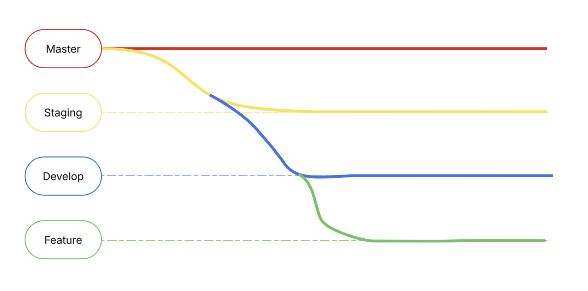

### Autores

| Nombre           | Rol   |
| ---------------- | ----- |
| Diego Alfaro     | Autor |
| Daniel Contreras | Autor |

---

# Plantilla Estrategia tecnica

## Objetivo

Establecer lineamientos claros para el desarrollo, asegurando calidad y consistencia.

---

## Repositorios

Utilizaremos 2 repositorios separados, tanto para el backend como para el frontend de la aplicación, de esta manera nuestro sistema puede ser modular.

## Estrategia de Ramas

Utilizaremos 3 ramas principales:

- **Master**: Contiene el código que será desplegado en producción y sobre el que se maneja el versionamiento de la aplicación.
  - El código no debe tener problemas de integración o ejecución.
  - El código debe haber sido probado.
- **Staging**: Rama pre-productiva usada para preparar el release de las versiones y realizar pruebas de aceptación.
- **Develop**: Rama de desarrollo donde se mantiene la integración de todos los desarrollos del equipo.
- **Feature**: Ramas temporales destinadas para el código de uno o varios developers que trabajan en una característica.

---

## Gestión de Requerimientos

### Objetivo

Alinear las decisiones técnicas con los objetivos de negocio.

### Priorización basada en valor y riesgos

La priorización de requerimientos se puede encontrar aquí:

[Insertar documento con la priorización de sus requerimientos]

La especificación de historias de usuario se llevarán a cabo teniendo en cuenta la definición de **Done** y **Ready** que se encuentran en este archivo:

[Meter el link al apartado de Docusaurus con el Done y Ready]

---

## Gestión de Calidad y Pruebas

### Objetivo

Garantizar un software confiable a través de buenas prácticas de aseguramiento de calidad.

---

### Estrategia de Pruebas

La estrategia que se seguirá para las pruebas será la siguiente:

- **Plantilla STP**: [Llenar la plantilla con el plan de pruebas de su proyecto]
- **Plan de pruebas**: [Poner el link hacia el apartado de STP]

---

## Documentación del código

### Objetivo

Documentar claramente las funcionalidades y código del sistema para lectura en caso de confusiones.

**Ejemplo:**

- Se agregaron espacios alrededor de operadores y comas.
- Se agregan punto y coma al final de definiciones simples.
- Para documentar el código utilizaremos el estándar de documentación JS docs.
- El detalle del estándar de codificación se podrá ver en el siguiente documento: [**Estandar de codificación**](../guias/standards/general.md).

---
