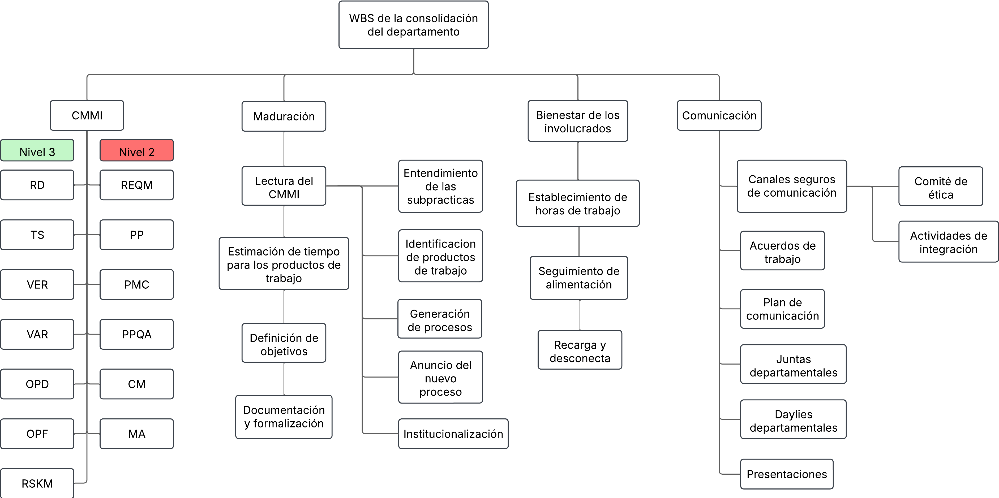

# Work Breakdown Structure

**Última actualización:** 7 de Marzo por Miguel Angel Uribe Esquivel

### Historial de cambios

| **Tipo de versión** | **Descripción**                              | **Fecha** | **Colaborador**                        |
| ------------------- | -------------------------------------------- | --------- | -------------------------------------- |
| **1.0**             | Creación del documento.                       | 20/2/2025 | Angélica Ríos Cuentas                  |
| **1.1**             | Modificación de la estructura del WBS.        | 26/2/2025 | Emiliano Valdivia Lara                 |
| **2.0**             | Se añadio el nuevo WBS departamental.         | 07/3/2025 | Miguel Angel Uribe Esquivel            |
| **2.1**             | Elimina las pruebas de estrés y arquitectura. | 08/4/2025 | Rodrigo Antonio Benítez De La Portilla |
| **2.2**             | Agregar tabla de historial de cambios.        | 08/5/2025 | Carlos Iván Fonseca Mondragón          |
