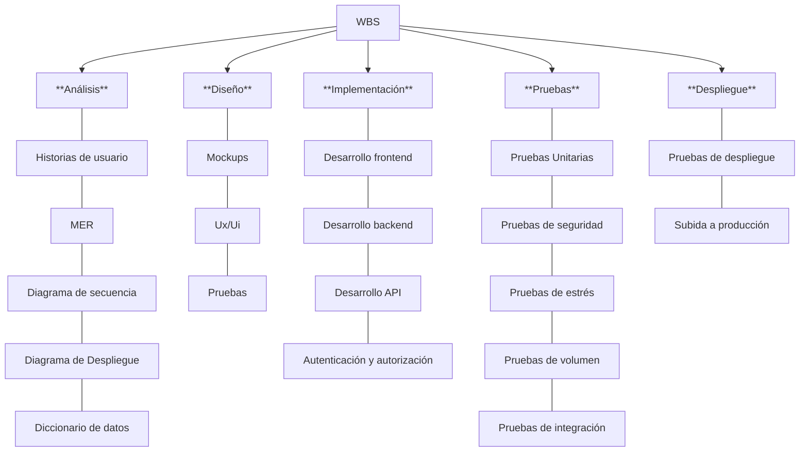

# Work Breakdown Structure

**Última actualización:** 19 de febrero de 2025

```mermaid

graph TD;
    F[WBS] --> A
    F[WBS] --> B
    F[WBS] --> C
    F[WBS] --> D
    F[WBS] --> E

    A[**Análisis**] --- A1[Historias de usuario]
    A1 --- A2[MER]
    A2 ---A3[Diagrama de secuencia]
    A3 ---A4[Diagrama de Despliegue]
    A4 ---A5[Diccionario de datos]
 
    B[**Diseño**] --- B1[Mockups]
    B1 --- B2[Ux/Ui]
    B2 --- B3[Pruebas]

    C[**Implementación**] ---C1[Desarrollo frontend]
    C1 --- C2[Desarrollo backend]
    C2 --- C3[Desarrollo API]
    C3 --- C4[Autenticación y autorización]
 
    D[**Pruebas**] ---D1[Pruebas Unitarias]
    D1 --- D2[Pruebas de seguridad]
    D2 --- D3[Pruebas de estrés]
    D3 --- D4[Pruebas de volumen]
    D4 --- D5[Pruebas de integración]

    E[**Despliegue**] --- E1[Pruebas de despliegue]
    E1 --- E2[Subida a producción]

```