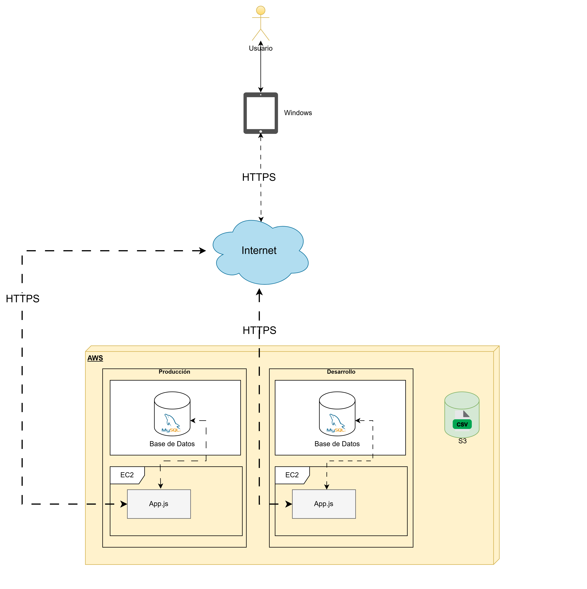

## Tipo de arquitectura de software

**Arquitectura elegida**: Arquitectura multiserver

---

## Desglose de arquitectura

Escribir el desglose de los componentes de arquitectura.

La arquitectura se compone de capas principales:

- **Frontend:** Flutter (Dart)
- **Backend:** (Node-express)
- **Servicios AWS:** (S3, EC2)
- **Base de datos:** (MySQL)
 ---
**Diagrama de Despliegue**

---

## Frontend

### Objetivo

Desglose del componente Frontend de la arquitectura.

- Interfaz de usuario para el registro, el tracking y el analisis de charolas (cajas) de Zuustento

### Tecnologías

Escribir todas las tecnologías que se usarán para el frontend (Frameworks de diseño, tecnologías para consumir APIs).

- Framework principal: Flutter (Dart)
- Consumo de APIs: HTTP package, Postman para manejo de endpoints

### Características

- Panel de registro
    - Formulario de registro de charola
    - Eliminar charola
    - Modificar charola
    - Consultar datos de la charola
- Inicio de sesion
- Tracking de charolas
- Analsiis de charolas
    - Graficos de historial de charolas

### Despliegue de su frontend

Donde se hosteará su frontend.

El frontend no estará hosteado.
---

## Backend

### Objetivo

- Realizar el manejo de peticiones y consumo de servicios para cada una de las funcionalidades del sistema de Zuustento.

### Tecnologías

Escribir las tecnologías que se usarán para crear el backend.

- Node.JS + Express.JS para construir la API
- NPM para el manejo de dependencias
- JWT para manejar la autenticación
- PM2 para administrar procesos en producción

### Características

Agregar las características del backend de su proyecto.

- **API REST**
  - Se definen endpoints para el consumo de servicios
  - Uso de middlewares para proteger las rutas según el rol del usuario
- **Dependencias**
  -  Uso de NPM para manejar las paqueterias de Node
- **RBAC y autenticación**
  - Uso de JWT para manejar las sesiones

### Despliegue

- AWS EC2 para el despliegue del backend.

### Endpoints Principales

- Usar Swagger UI para documentar endpoints.

---

## Servicios de infraestructura

### Objetivo

Proveer infraestructura escalable y segura para la aplicación.

### Servicios

Escribe tu servicio a utilizar, justificación técnica breve de la elección del servicio y alternativas consideradas.

- **S3 de Amazon**
  - El socio ya contaba con servicios de AWS y nos dará acceso a los mismos.

**Alternativas:**

- Azure (Se descartó)

---

## Beneficios de la arquitectura seleccionada

Redactar los beneficios de la arquitectura seleccionada.

- Desarrollo más seguro
- Resiliencia
- Agilidad

# Propuestas alternativas

**Se evaluaron las siguientes opciones**

## Monolítica

### Definición
Con esta arquitectura todas las partes del sistema se encuentran definidas en un único código base y se ejecutan en un solo proceso.

### Características
- **Interdependencia**: Al estar todo definido dentro de un mismo código, todos los elementos del mismo son interdependientes.

### Ventajas
- **Simplicidad**: Desarrollar y desplegar el proyecto es más sencillo gracias a que todo está contenido en un solo código.

### Desventajas
- **Dificultad para modificar**: Tener un código altamente interdependiente significa que al hacer una modificación, hay una alta probabilidad de que la misma tenga efectos inesperados.
- **Errores complejos**: Tener un error en el código podría afectar a más de una parte o incluso a toda la aplicación.

---

## Arquitectura en capas

### Definición
La arquitectura está dividida en varias capas con diferentes responsabilidades bien definidas. No se define la cantidad de capas que el proyecto debe tener.

### Características
- **Responsabilidades**: Cada capa de la aplicación se encarga de una tarea diferente (por ejemplo: IU, lógica de negocio, datos).

### Ventajas
- **Código ordenado**: Al solo tener código con ciertas funcionalidades en cada capa, este se vuelve más legible.
- **Fácil de mantener**: Elimina interdependencias inesperadas en el código, por lo que el mantenimiento también es más fácil.

### Desventajas
- **Rigidez**: Si un cambio en los requerimientos abarca más de una capa de la aplicación, el tiempo necesario para modificar el código puede volverse alto.

---

## Microservicios

### Definición
Es un enfoque de desarrollo de software donde una aplicación se construye como un conjunto de servicios pequeños e independientes que se comunican entre sí a través de APIs bien definidas.

### Características
- **Independencia**: Cada microservicio opera en su propio proceso y puede ser desarrollado en diferentes lenguajes de programación o utilizar distintas tecnologías de almacenamiento de datos.
- **Escalabilidad**: Cada servicio puede escalarse de forma autónoma según la demanda, optimizando el uso de recursos y mejorando la eficiencia.

### Ventajas
- **Agilidad en el desarrollo**: Permite a los equipos implementar nuevas funciones y realizar cambios más rápidamente, sin necesidad de modificar grandes partes del código existente.
- **Resiliencia**: La falla de un servicio no necesariamente afecta al resto de la aplicación, lo que aumenta la robustez y disponibilidad del sistema.

### Desventajas
- **Complejidad en la gestión**: Coordinar múltiples servicios independientes puede ser complejo y requiere una gestión eficiente.
- **Comunicación entre servicios**: Es fundamental diseñar mecanismos de comunicación efectivos y eficientes para garantizar la coherencia y el rendimiento del sistema.

---

## Basada en eventos

### Definición
Utiliza eventos para desencadenar y comunicarse entre servicios desacoplados. En este modelo, los sistemas detectan eventos (cambios significativos en el estado) y reaccionan a ellos, permitiendo una comunicación asíncrona y flexible entre componentes.

### Características
- **Desacoplamiento**: Los productores y consumidores de eventos operan de manera independiente, lo que facilita la escalabilidad y el mantenimiento del sistema.
- **Asincronía**: La comunicación se realiza de forma asíncrona, permitiendo que los componentes procesen eventos a su propio ritmo sin bloquearse mutuamente.

### Ventajas
- **Escalabilidad**: Al estar desacoplados, los componentes pueden escalar de manera independiente según la demanda.
- **Flexibilidad**: La incorporación de nuevas funcionalidades o servicios es más sencilla debido al bajo acoplamiento entre componentes.
- **Eficiencia**: El procesamiento asíncrono permite una utilización más eficiente de los recursos, mejorando el rendimiento general del sistema.

### Desventajas
- **Complejidad en la gestión**: La coordinación y el monitoreo de múltiples componentes independientes pueden ser desafiantes.
- **Dificultad en el seguimiento**: La naturaleza asíncrona complica la trazabilidad de eventos y la depuración de errores.

---

## Serverless

### Definición
Con esta arquitectura el desarrollador no se preocupa por administrar su servidor y le deja esta tarea a un proveedor de servicios. El proveedor de servicios en la nube administra, escala y mantiene el servidor.

### Características
- **Sin servidores**: Para el desarrollador, la experiencia es simplemente escribir el código y ejecutarlo.

### Ventajas
- **Sin gestión**: Dejar el servidor en manos de alguien más nos quita la responsabilidad de gestión de encima.
- **Escalamiento automático**: El proveedor de servicio detectará el tráfico y escalará el servidor automáticamente para atenderlo.

### Desventajas
- **Dependencia**: Nos volvemos dependientes de los proveedores de servicio, lo que puede traer problemas.
- **Monitoreo**: El monitoreo se vuelve más complejo que el de una aplicación normal.

---

## Orientada a servicios (SOA)

### Definición
Organiza las funcionalidades de una aplicación en servicios independientes y reutilizables, los cuales se comunican entre sí a través de interfaces bien definidas.

### Características
- **Interoperabilidad**: Los servicios pueden interactuar entre sí independientemente de las plataformas o lenguajes de programación en los que fueron desarrollados, gracias al uso de estándares comunes.
- **Reutilización**: Las funcionalidades se encapsulan en servicios que pueden ser reutilizados en diferentes aplicaciones o procesos de negocio, lo que reduce la duplicación de esfuerzos y mejora la eficiencia.
- **Desacoplamiento**: Los servicios están diseñados para ser independientes, lo que facilita su mantenimiento, actualización y escalabilidad sin afectar a otros componentes del sistema.

### Ventajas
- **Mitigación de riesgos**: Facilita la integración de sistemas y la reutilización de componentes, reduciendo los riesgos en el desarrollo.
- **Optimización de recursos**: La reutilización de servicios y la reducción de redundancias conducen a una gestión más eficiente de los recursos.

### Desventajas
- **Complejidad en la implementación**: La adopción de SOA puede ser costosa y requerir una gestión adecuada de los servicios.

 # Historial de cambios

| **Tipo de Versión** | **Descripción**                                             | **Fecha** | **Colaborador**            |
| ------------------- | ----------------------------------------------------------- | --------- | -------------------------- |
| **1.0**             | Documento inicial                   | 6/03/2025 | Emiliano Gomez Gonzalez  |
| **1.1**             | Agrega Diagrama de Despliegue                  | 8/03/2025 | Emiliano Gomez Gonzalez  |
