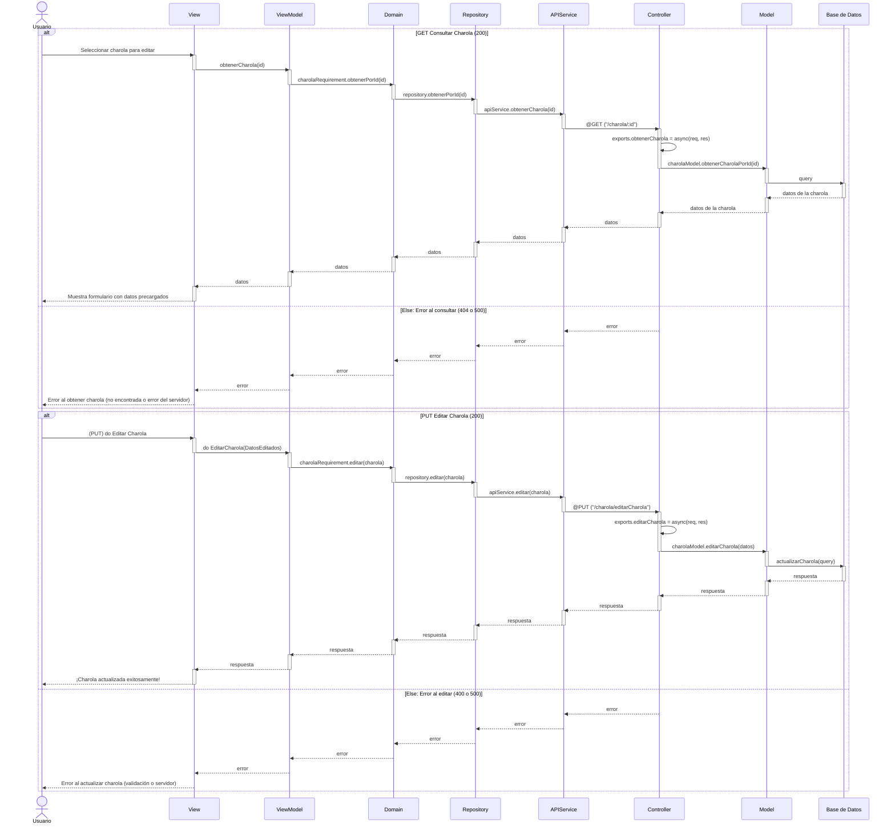
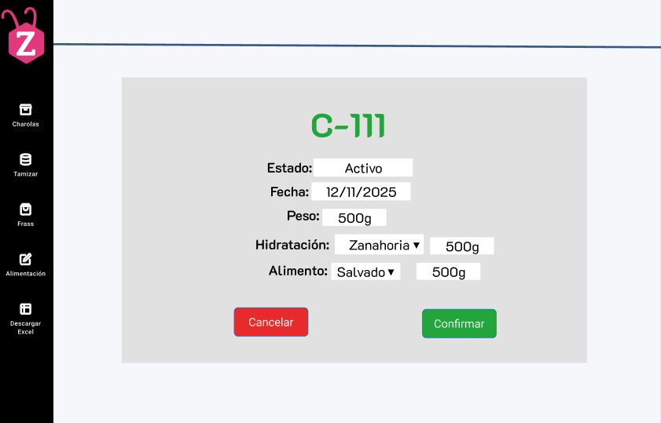

# RF7: Modificar datos generales Charola

**Última actualización:** 08 de marzo de 2025

### Historia de Usuario

Como usuario del sistema, quiero modificar los datos de una charola que están guardados en la base de datos, para corregir errores o actualizar su información y mantener registros precisos.

**Criterios de Aceptación:**

- El sistema debe permitir la edición de los datos de una charola previamente registrada.
- Solo los usuarios autorizados deben poder modificar la información.
- La actualización de datos debe reflejarse de inmediato en la base de datos.

---

### Diagrama de Secuencia

> _Descripción_: El diagrama de secuencia muestra el proceso de actualización de un empleado, con la interacción entre el Super Administrador y el sistema para modificar la información del empleado.

---

### Mockup

> _Descripción_: El mockup muestra el formulario de actualización de empleado, con los campos de datos actuales y opciones para modificarlos.

### Pruebas Unitarias

| ID Prueba | Descripción                                                               | Resultado Esperado                                                                         |
| --------- | ------------------------------------------------------------------------- | ------------------------------------------------------------------------------------------ |
| PU-RF7-01 | Modificar los datos de una charola existente con información válida.      | El sistema actualiza los datos y muestra un mensaje de éxito.                              |
| PU-RF7-02 | Intentar modificar una charola inexistente.                               | El sistema muestra un mensaje de error indicando que la charola no existe.                 |
| PU-RF7-04 | Verificar que los cambios se reflejan en la base de datos inmediatamente. | La información modificada es visible en la base de datos sin necesidad de recargar.        |
| PU-RF7-05 | Intentar guardar modificaciones con datos inválidos o vacíos.             | El sistema valida la información y muestra errores si los datos no cumplen los requisitos. |
| PU-RF7-06 | Intentar modificar múltiples campos de una charola al mismo tiempo.       | El sistema procesa correctamente los cambios y los almacena sin inconsistencias.           |
