# Documentación de MER, Diccionario de Datos y Tablas del Sistema

**Última actualización:** 08 de abril de 2025

**Nombre de la Empresa:** Altertex US

[Requisitos de Información](/docs/proyectos/textiles/documentacion/requisitos/#requisitos-de-información)

```mermaid

erDiagram
    %% Entidades principales de usuario
    USUARIO {
        NumberInt idUsuario "Identificador del usuario"
        String nombreCompleto "Nombre completo del usuario"
        String correoElectronico "Correo electronico del usuario"
        String contrasenia "Contraseña del usuario"
        String numeroTelefono "Número de teléfono del usuario"
        String direccion "Dirección de domicilio del usuario"
        Date fechaNacimiento "Fecha de nacimiento"
        String genero "Genero del usuario"
        Boolean estatus "Estatus del usuario"
    }
    CLIENTE {
        NumberInt idCliente "Identificador del cliente"
        String nombreComercial "Nombre legal de la empresa"
        String nombreFiscal "Nombre publico de la empresa"
    }
    EMPLEADO {
        NumberInt idEmpleado "Identificador del empleado"
        NumberInt idUsuario "Identificador del usuario"
        NumberInt idCliente "Identificador del cliente"
        String numeroEmergencia "Numero de emergencia del empleado"
        String areaTrabajo "Area en la que trabaja en empleado"
        String posicion "Posicion del empleado"
        NumberDecimal cantidadPuntos "Numero de puntos que tiene el emepleado"
        Date antiguedad "Fecha en la que ingeso el empleado"
    }
    GRUPO_EMPLEADO {
        NumberInt idGrupo "Identificador del grupo de empleados"
        NumberInt idCliente "Identificador del cliente"
        String nombre "Nombre del grupo de empleados"
        String descripcion "Descripción del grupo de empleados"
    }
    ROL {
        NumberInt idRol "Identificador del rol"
        String nombre "Nombre del rol"
        String descripcion "Descripción corta del rol"
    }
    PERMISO {
        NumberInt idPermiso "Identificador del permiso"
        String nombre "Nombre del permiso"
        String descripcion "Descripción corta del permiso"
    }


    %% Entidades de productos y categorización
    PRODUCTO {
        NumberInt idProducto "Identificador del producto"
        NumberInt idCliente "Identificador del cliente"
        NumberInt idProveedor "Identificador del proveedor"
        String nombreComun "Nombre comun del producto"
        String nombreComercial "Nombre comercial del producto"
        String descripcion "Descripcion del producto"
        String marca "Marca del producto"
        String modelo "Modelo del producto"
        String tipoProducto "Tipo de producto"
        NumberInt precioPuntos "Precio del producto en puntos"
        NumberDecimal precioCliente "Precio de venta al cliente"
        NumberDecimal precioVenta "Precio de venta al empleado "
        NumberDecimal costo "Costo del producto"
        NumberDecimal impuesto "Impuesto del producto dependiendo el pais"
        NumberDecimal descuento "Descuento del producto"
        Boolean estado "Estado del producto"
        Boolean envio "Estado de envio del producto"
    }
    DATOS_ENVIO {
        NumberInt idDatosEnvio "Identificador de la fecha de envio"
        NumberInt idProducto "Identificador del producto"
        NumberDecimal peso "Peso del envio"
        NumberDecimal longitud "Longitud del envio"
        NumberDecimal ancho "Ancho del envio"
        NumberDecimal altura "Altura del envio"
        NumberDecimal volumen "Volumen del envio"
        String tipoPaquete "Tipo de paquete del envio"
    }
    VARIANTE {
        NumberInt idVariante "Identificador de variante"
        NumberInt idProducto "Identificador del producto"
        String nombreVariante "Nombre de variante"
        String descripcion "Descripcion de variante"
    }
    OPCION {
        NumberInt idOpcion "Identificador de opcion"
        NumberInt idVariante "Identificador de variante"
        NumberInt cantidad "Cantidad de opciones disponibles del producto"
        String valorOpcion "Etiqueta de las opciones"
        String SKUautomatico "Unidad de mantenimiento de existencias automatico"
        String SKUcomercial "Unidad de mantenimiento de existencias comercial"
        NumberDecimal costoAdicional "Costos adicionales aplicados"
        NumberDecimal descuento "Descuento aplicado"
        Boolean estado "Estado de las opciones"
    }
    CATEGORIA {
        NumberInt idCategoria "Identificador de la categoria"
        String nombreCategoria "Nombre de la categoria"
        String descripcion "Descripcion de la categoria"
    }
    IMAGEN {
        NumberInt idImagen "Identificador de la imagen"
        String urlImagen "Ubicación de la imagen"
        String tipoImagen "Tipo de imagen"
        String textoAlternativo "Descripción corta de la imagen"
    }
    PROVEEDOR {
        NumberInt idProveedor "Identificador del proveedor"
        NumberInt idCliente "Identificador del cliente"
        String nombre "Nombre del proveedor"
        String nombreCompania "Nombre de la compañia"
        String telefonoContacto "Teléfono de contacto"
        String correoContacto "Correo Electrónico de contacto"
        String direccion "Dirección del proveedor"
        String codigoPostal "Código postal del proveedor"
        String pais "País del proveedor"
        Boolean estado "Estado del proveedor"
    }
    SET_PRODUCTO {
        NumberInt idSetProducto "Identificador del set de productos"
        NumberInt idCliente "Identificador del cliente"
        String nombre "Nombre del set de productos"
        String descripcion "Descripción del set de productos"
        String nombre "Nombre del set de productos"
        String nombreVisible "Nombre visible para los empleados"
        String descripcion "Descripción corta del set de productos"
        Boolean activo "Estado del set de productos"
    }
    CUOTA_SET {
        NumberInt idCuotaSet "Identificador del set de cuotas"
        NumberInt idCliente "Identificador del cliente"
        String nombre "Nombre del set de cuotas"
        NumberInt periodoRenovacion "Periodo de renovación del set de cuotas"
        Boolean renovacionHabilitada "Estado del set de cuotas"
        String descripcion "Descripcion del set de cuotas"
    }
    CUOTA_SET_GRUPO {
        NumberInt idCuotaSetGrupo "Identificador del grupo de set de cuotas"
        NumberInt idCliente "Identificador del cliente"
        String nombre "Nombre del grupo de set de cuotas"
        String descripcion "Descripción corta del grupo de set de cuotas"
    }


    %% Entidades de pedidos y solicitudes
    PEDIDO {
        NumberInt idPedido "Identificador del pedido"
        NumberInt idCliente "Identificador del cliente"
        NumberInt idEnvio "Identificador del envio"
        NumberInt idPago "Identificador de pago"
        Date fechaOrden "Fecha en la que se hizo la orden"
        String estado "Estado del pedido"
        NumberDecimal precioTotal "Precio completo del pedido"
    }
    CARRITO {
        NumberInt idCarrito "Identificador del carrito"
        NumberInt idUsuario "Identificador del usuario"
        Boolean estado "Estado del carrito"
    }
    ENVIO {
        NumberInt idEnvio "Identificador del envio"
        NumberInt idPedido "Identificador del pedido"
        String domicilio "Domicilio al que se dirige el envio"
        String ciudad "Ciudad al que se dirige el envio"
        String ciudadEstado "Estado al que se dirige el envio "
        String codigoPostal "Codigo postal al que se dirige el envio"
        String pais "Pais al que se dirige el envio "
        NumberDecimal costoEnvio "Costos de envio "
        String estado "Estado del envio "
    }
    PAGO {
        NumberInt idPago "Identificador del pago"
        NumberInt idPedido "Identificador del pedido"
        NumberInt idTipoPago "Identificador del tipo de pago"
        String estatus "Estado del pago"
        NumberDecimal cantidad "Cantidad total a pagar"
    }
    TIPO_PAGO {
        NumberInt idTipoPago "Identificador del tipo de pago"
        NumberInt idCliente "Identificador del cliente"
        String metodo "Metodo de pago"
    }
    EVENTO {
        NumberInt idEvento "Identificador de puntos de empelado"
        NumberInt idCliente "Identificador del cliente"
        String nombre "Nombre del evento"
        String descripcion "Descripcion del evento "
        NumberDecimal puntos "Puntos del evento"
        NumberDecimal multiplicador "Multiplicador de puntos después del periodo"
        String periodoRenovacion "Periodo de renovacion del evento"
        Boolean renovacion "Renovacion del evento"
    }


    %% Tablas intermedias para relaciones muchos a muchos
    USUARIO_ROL {
        NumberInt idUsuario "Identificador del usuario"
        NumberInt idRol "Identificador del rol"
    }
    ROL_PERMISO {
        NumberInt idRol "Identificador del rol"
        NumberInt idPermiso "Identificador del permiso"
    }
    EMPLEADO_GRUPO {
        NumberInt idEmpleado "Identificador del empleado"
        NumberInt idGrupo "Identificador del grupo de empleados"
    }
    PEDIDO_OPCION {
        NumberInt idPedido "Identificador del pedido"
        NumberInt idOpcion "Identificador de opcion"
    }
    EMPLEADO_PEDIDO {
        NumberInt idEmpleado "Identificador de empleado"
        NumberInt idPedido "Identificador del pedido"
    }
    EMPLEADO_EVENTO {
        NumberInt idEmpleado "Identificador de empleado"
        NumberInt idEvento "Identificador del evento"
    }

    USUARIO_CLIENTE {
        NumberInt idUsuario "Identificador del usuario"
        NumberInt idCliente "Identificador del cliente"
    }
    IMAGEN_CLIENTE {
        NumberInt idImagen "Identificador de la imagen"
        NumberInt idCliente "Identificador del cliente"
    }
    SET_PRODUCTO_GRUPO_EMPLEADO {
        NumberInt idSetProducto "Identificador del set de productos"
        NumberInt idGrupo "Identificador del grupo de empleados"
    }
    TIPO_PAGO_EMPLEADO {
        NumberInt idTipoPago "Identificador del tipo de pago"
        NumberInt idEmpleado "Identificador del empleado"
    }


    CATEGORIA_PRODUCTO {
        NumberInt idCategoria "Identificador de la categoria"
        NumberInt idProducto "Identificador del producto"
    }
    PRODUCTO_SET_PRODUCTO {
        NumberInt idProducto "Identificador del producto"
        NumberInt idSetProcuto "Identificador del set de productos"
    }
    IMAGEN_VARIANTE {
        NumberInt idImagen "Identificador de la imagen"
        NumberInt idVariante "Identificador de la variante"
    }
    IMAGEN_PRODUCTO {
        NumberInt idImagen "Identificador de la imagen"
        NumberInt idProducto "Identificador del producto"
    }


    CUOTA_SET_GRUPO_EMPLEADO {
        NumberInt idCuotaSetGrupo "Identificador del grupo de set de cuotas"
        NumberInt idEmpleado "Identificador del empleado"
    }
    CUOTA_SET_GRUPO_CUOTA_SET {
        NumberInt idCuotaSetGrupo "Identificador del grupo de set de cuotas"
        NumberInt idCuotaSet "Identificador del set de cuotas"
    }
    CUOTA_SET_PRODUCTO {
        NumberInt idCuotaSet "Identificador del set de cuotas"
        NumberInt idProducto "Identificador del producto"
        NumberInt limite "Limite de compra de productos"
        NumberInt limite_actual "Limite de compra de productos actual"
    }
    CARRITO_OPCION {
        NumberInt idCarrito "Identificador del carrito"
        NumberInt idOpcion "Identificador de opcion"
    }


    USUARIO ||--o{ EMPLEADO : "es un"
    USUARIO ||--o{ USUARIO_ROL: tiene
    USUARIO ||--|{ USUARIO_CLIENTE: "administra"
    USUARIO_ROL }|--|| ROL: asigna
    ROL ||--o{ ROL_PERMISO: asocia
    ROL_PERMISO }|--|| PERMISO: requiere


    EMPLEADO ||--o{ EMPLEADO_PEDIDO : "realiza"
    EMPLEADO ||--o{ CARRITO : "posee"


    CLIENTE ||--o{ EMPLEADO : "emplea"
    CLIENTE ||--o{ TIPO_PAGO : "define"
    CLIENTE ||--o{ PRODUCTO : "ofrece"
    CLIENTE ||--o{ PROVEEDOR: "solicita"
    CLIENTE ||--o{ PEDIDO : "consulta"
    CLIENTE ||--o{ GRUPO_EMPLEADO : "organiza"
    CLIENTE ||--o{ CUOTA_SET_PRODUCTO : "asigna"
    CLIENTE ||--o{ CUOTA_SET : "establece"
    CLIENTE ||--o{ CUOTA_SET_GRUPO : "configura"
    CLIENTE ||--o{ EVENTO : "organiza"
    CLIENTE ||--o{ SET_PRODUCTO : "administra"
    CLIENTE ||--o{ CATEGORIA : "administra"
    CLIENTE ||--|{ USUARIO_CLIENTE: "pertenece"
    CLIENTE ||--|{ IMAGEN_CLIENTE: "posee"


    EMPLEADO ||--o{ EMPLEADO_GRUPO : "pertenece a"
    EMPLEADO ||--|{ TIPO_PAGO_EMPLEADO : "realiza pago con"


    TIPO_PAGO_EMPLEADO }|--|| TIPO_PAGO : "usa"
    TIPO_PAGO ||--|{ PAGO : "asigna"
    EMPLEADO_GRUPO }|--|| GRUPO_EMPLEADO : "se agrupa en"


    PRODUCTO ||--o{ VARIANTE : "tiene"
    PRODUCTO ||--|{ DATOS_ENVIO : "requiere"
    PRODUCTO ||--o{ IMAGEN_PRODUCTO : "incluye"
    PRODUCTO ||--|{ CATEGORIA_PRODUCTO: "divide"
    VARIANTE ||--o{ OPCION : "define"


    CATEGORIA ||--|{ CATEGORIA_PRODUCTO : "clasifica"


    PROVEEDOR ||--o{ PRODUCTO : "suministra"


    VARIANTE ||--o{ IMAGEN_VARIANTE : "incluye"
    IMAGEN_VARIANTE }o--|| IMAGEN : "muestra"
    IMAGEN_PRODUCTO }o--|| IMAGEN : "tiene"
    IMAGEN_CLIENTE }o--|| IMAGEN: "tiene"
    PRODUCTO ||--|{ PRODUCTO_SET_PRODUCTO : "pertenece a"
    PRODUCTO_SET_PRODUCTO }|--|| SET_PRODUCTO : "forma parte de"
    SET_PRODUCTO ||--|{ SET_PRODUCTO_GRUPO_EMPLEADO : "agrupa en"
    GRUPO_EMPLEADO ||--|{ SET_PRODUCTO_GRUPO_EMPLEADO : "se asigna a"


    PEDIDO ||--|{ EMPLEADO_PEDIDO: "ejecuta"
    PEDIDO ||--|| ENVIO : "incluye"
    PEDIDO ||--|| PAGO : "procesa"
    PEDIDO ||--|{ PEDIDO_OPCION : "contiene"
    PEDIDO_OPCION }|--|| OPCION : "especifica"


    CARRITO ||--|{ CARRITO_OPCION : "almacena"
    CARRITO_OPCION }|--|| OPCION : "contiene"


    EMPLEADO ||--|{ CUOTA_SET_GRUPO_EMPLEADO: "asigna"
    CUOTA_SET_GRUPO_EMPLEADO }|--|| CUOTA_SET_GRUPO: "pertenece"
    CUOTA_SET_GRUPO ||--|{ CUOTA_SET_GRUPO_CUOTA_SET: "agrupa"
    CUOTA_SET_GRUPO_CUOTA_SET }|--|| CUOTA_SET: "asocia"
    CUOTA_SET ||--|{ CUOTA_SET_PRODUCTO: "aplica"
    CUOTA_SET_PRODUCTO }|--|| PRODUCTO: "pertenece"


    EMPLEADO ||--|{ EMPLEADO_EVENTO: "recibe"
    EMPLEADO_EVENTO }|--|| EVENTO: "asigna"

```

# Descripción de Tablas del Sistema

## Entidades de Usuario

### USUARIO

Almacena la información básica de todos los usuarios del sistema, independientemente de su rol. Contiene datos personales como nombre, correo electrónico, contraseña (encriptada), información de contacto y estado de la cuenta.

### CLIENTE

Registra los datos de las empresas o entidades comerciales que utilizan el sistema. Cada cliente puede tener múltiples empleados y representa una organización completa con su nombre comercial y fiscal.

### EMPLEADO

Contiene información específica de los empleados que pertenecen a un cliente. Cada empleado está vinculado a un usuario del sistema y a un cliente específico. Almacena datos laborales como área de trabajo, posición, puntos acumulados y antigüedad.

### GRUPO_EMPLEADO

Permite agrupar empleados bajo categorías definidas por el cliente. Estos grupos pueden servir para asignar diferentes permisos, acceso a productos o cuotas específicas a conjuntos de empleados.

### ROL

Define los diferentes roles de usuario disponibles en el sistema, cada uno con un conjunto específico de responsabilidades y permisos.

### PERMISO

Especifica las acciones individuales que pueden ser asignadas a diferentes roles en el sistema, controlando así el acceso a funcionalidades específicas.

## Entidades de Productos y Categorización

### PROVEEDOR

Almacena la información de los proveedores que suministran productos a los clientes. Incluye datos de contacto, ubicación y estado del proveedor.

### PRODUCTO

Contiene la información completa de los productos disponibles en el sistema. Cada producto pertenece a un cliente específico y puede estar asociado a un proveedor. Almacena datos comerciales como precios, costos, impuestos y estado del producto.

### DATOS_ENVIO

Registra las características físicas de los productos que requieren envío, como peso, dimensiones y tipo de empaque, facilitando el cálculo de costos de envío.

### VARIANTE

Permite definir diferentes características de un producto que pueden generar opciones de selección (como color, tamaño, material, etc.). Cada producto puede tener múltiples variantes.

### OPCION

Almacena las opciones específicas disponibles para cada variante de producto (por ejemplo, "Rojo", "XL", "Acero inoxidable"). Incluye información de inventario, códigos SKU y ajustes de precio para cada opción.

### CATEGORIA

Define las categorías para clasificar los productos, permitiendo organizarlos de manera jerárquica o temática.

### IMAGEN

Almacena información sobre las imágenes asociadas a productos, variantes o clientes. Incluye la URL de la imagen, tipo y texto alternativo para accesibilidad.

### SET_PRODUCTO

Permite agrupar productos relacionados en conjuntos que pueden ser asignados a grupos específicos de empleados, facilitando la gestión de catálogos personalizados.

### CUOTA_SET

Define límites de adquisición de productos para empleados, con configuraciones de renovación y restricciones de cantidad.

### CUOTA_SET_GRUPO

Permite agrupar diferentes cuotas bajo una categoría común para facilitar la administración y asignación a grupos de empleados.

## Entidades de Pedidos y Solicitudes

### ENVIO

Contiene la información de entrega asociada a un pedido, incluyendo dirección completa, costos y estado del envío.

### TIPO_PAGO

Define los métodos de pago disponibles para cada cliente, como efectivo, tarjeta, puntos, etc.

### PAGO

Registra las transacciones de pago asociadas a los pedidos, incluyendo el método utilizado, el monto y el estado del pago.

### PEDIDO

Almacena la información principal de las órdenes realizadas por los empleados o usuarios del sistema. Vincula al cliente, información de envío, pago y contiene datos como fecha y estado del pedido.

### CARRITO

Registra los productos que un usuario ha seleccionado pero aún no ha convertido en pedido, funcionando como una lista temporal de compras.

### EVENTO

Define eventos especiales creados por los clientes que pueden otorgar puntos a los empleados, con configuraciones de multiplicadores y renovación automática.

## Tablas de Relación

### USUARIO_ROL

Establece la relación muchos a muchos entre usuarios y roles, permitiendo que un usuario tenga múltiples roles y que un rol sea asignado a múltiples usuarios.

### ROL_PERMISO

Vincula roles con permisos específicos, definiendo las capacidades asociadas a cada rol en el sistema.

### EMPLEADO_GRUPO

Asocia empleados con grupos específicos, permitiendo la administración colectiva de empleados.

### PEDIDO_OPCION

Relaciona pedidos con las opciones específicas de productos seleccionadas, detallando el contenido exacto de cada pedido.

### EMPLEADO_PEDIDO

Vincula empleados con sus pedidos, permitiendo el seguimiento de las transacciones por empleado.

### EMPLEADO_EVENTO

Registra la participación de empleados en eventos, facilitando el seguimiento de puntos otorgados.

### USUARIO_CLIENTE

Establece qué usuarios están asociados a qué clientes, permitiendo que un usuario pueda pertenecer a múltiples organizaciones cliente.

### IMAGEN_CLIENTE

Asocia imágenes con clientes, como logos, banners promocionales u otros activos visuales.

### SET_PRODUCTO_GRUPO_EMPLEADO

Vincula conjuntos de productos con grupos de empleados, definiendo qué catálogos están disponibles para cada grupo.

### TIPO_PAGO_EMPLEADO

Especifica qué métodos de pago están disponibles para cada empleado, permitiendo restricciones personalizadas.

### CATEGORIA_PRODUCTO

Relaciona productos con sus categorías, permitiendo que un producto pertenezca a múltiples categorías.

### PRODUCTO_SET_PRODUCTO

Asocia productos con conjuntos de productos, definiendo qué productos conforman cada conjunto.

### IMAGEN_VARIANTE

Vincula imágenes con variantes específicas de productos, permitiendo mostrar visualmente cada opción.

### IMAGEN_PRODUCTO

Asocia imágenes con productos, permitiendo la visualización adecuada en catálogos y fichas de producto.

### CUOTA_SET_GRUPO_EMPLEADO

Relaciona grupos de cuotas con empleados específicos, asignando límites de compra.

### CUOTA_SET_GRUPO_CUOTA_SET

Vincula grupos de cuotas con cuotas individuales, organizando jerárquicamente las restricciones de compra.

### CUOTA_SET_PRODUCTO

Asocia cuotas con productos específicos, definiendo qué productos están sujetos a cada cuota.

### CARRITO_OPCION

Relaciona carritos de compra con opciones específicas de productos, registrando los items seleccionados por un usuario antes de confirmar un pedido.

# Diccionario de Datos

## Entidades de Usuario

### USUARIO

| Campo             | Tipo         | Descripción                        | Restricciones              |
| ----------------- | ------------ | ---------------------------------- | -------------------------- |
| idUsuario         | INT          | Identificador único del usuario    | Llave primaria             |
| nombreCompleto    | VARCHAR(100) | Nombre completo del usuario        | No nulo                    |
| correoElectronico | VARCHAR(100) | Correo electrónico del usuario     | No nulo, único             |
| contrasenia       | VARCHAR(255) | Contraseña encriptada del usuario  | No nulo                    |
| numeroTelefono    | VARCHAR(20)  | Número telefónico de contacto      | Opcional                   |
| direccion         | VARCHAR(200) | Dirección física del usuario       | Opcional                   |
| fechaNacimiento   | DATE         | Fecha de nacimiento del usuario    | Opcional                   |
| genero            | VARCHAR(20)  | Género del usuario                 | Opcional                   |
| estatus           | BOOLEAN      | Estado activo/inactivo del usuario | Valor predeterminado: TRUE |

### CLIENTE

| Campo           | Tipo         | Descripción                              | Restricciones  |
| --------------- | ------------ | ---------------------------------------- | -------------- |
| idCliente       | INT          | Identificador único del cliente          | Llave primaria |
| nombreComercial | VARCHAR(150) | Nombre comercial de la empresa cliente   | No nulo        |
| nombreFiscal    | VARCHAR(150) | Razón social o nombre fiscal del cliente | No nulo        |

### EMPLEADO

| Campo            | Tipo          | Descripción                                | Restricciones           |
| ---------------- | ------------- | ------------------------------------------ | ----------------------- |
| idEmpleado       | INT           | Identificador único del empleado           | Llave primaria          |
| idUsuario        | INT           | Identificador del usuario asociado         | No nulo, llave foránea  |
| idCliente        | INT           | Identificador del cliente al que pertenece | No nulo, llave foránea  |
| numeroEmergencia | VARCHAR(20)   | Número de contacto en caso de emergencia   | Opcional                |
| areaTrabajo      | VARCHAR(100)  | Área o departamento del empleado           | Opcional                |
| posicion         | VARCHAR(100)  | Cargo o puesto del empleado                | Opcional                |
| cantidadPuntos   | DECIMAL(10,2) | Cantidad de puntos acumulados              | Valor predeterminado: 0 |
| antiguedad       | DATE          | Fecha de ingreso del empleado              | Opcional                |

### GRUPO_EMPLEADO

| Campo       | Tipo         | Descripción                                         | Restricciones          |
| ----------- | ------------ | --------------------------------------------------- | ---------------------- |
| idGrupo     | INT          | Identificador único del grupo                       | Llave primaria         |
| idCliente   | INT          | Identificador del cliente al que pertenece el grupo | No nulo, llave foránea |
| nombre      | VARCHAR(100) | Nombre del grupo                                    | No nulo                |
| descripcion | VARCHAR(255) | Descripción del propósito del grupo                 | Opcional               |

### ROL

| Campo       | Tipo         | Descripción                                  | Restricciones  |
| ----------- | ------------ | -------------------------------------------- | -------------- |
| idRol       | INT          | Identificador único del rol                  | Llave primaria |
| nombre      | VARCHAR(50)  | Nombre del rol                               | No nulo        |
| descripcion | VARCHAR(255) | Descripción de las responsabilidades del rol | Opcional       |

### PERMISO

| Campo       | Tipo         | Descripción                             | Restricciones  |
| ----------- | ------------ | --------------------------------------- | -------------- |
| idPermiso   | INT          | Identificador único del permiso         | Llave primaria |
| nombre      | VARCHAR(50)  | Nombre del permiso                      | No nulo        |
| descripcion | VARCHAR(255) | Descripción de las acciones que permite | Opcional       |

## Entidades de Productos y Categorización

### PROVEEDOR

| Campo            | Tipo         | Descripción                          | Restricciones              |
| ---------------- | ------------ | ------------------------------------ | -------------------------- |
| idProveedor      | INT          | Identificador único del proveedor    | Llave primaria             |
| idCliente        | INT          | Identificador del cliente            |                            |
| nombre           | VARCHAR(100) | Nombre del proveedor                 | No nulo                    |
| nombreCompania   | VARCHAR(150) | Nombre de la compañía proveedora     | Opcional                   |
| telefonoContacto | VARCHAR(20)  | Teléfono de contacto                 | Opcional                   |
| correoContacto   | VARCHAR(100) | Correo electrónico de contacto       | Opcional                   |
| direccion        | VARCHAR(200) | Dirección física del proveedor       | Opcional                   |
| codigoPostal     | VARCHAR(20)  | Código postal                        | Opcional                   |
| pais             | VARCHAR(50)  | País del proveedor                   | Opcional                   |
| estado           | BOOLEAN      | Estado activo/inactivo del proveedor | Valor predeterminado: TRUE |

### PRODUCTO

| Campo           | Tipo          | Descripción                                  | Restricciones               |
| --------------- | ------------- | -------------------------------------------- | --------------------------- |
| idProducto      | INT           | Identificador único del producto             | Llave primaria              |
| idCliente       | INT           | Identificador del cliente dueño del producto | No nulo, llave foránea      |
| idProveedor     | INT           | Identificador del proveedor del producto     | Opcional, llave foránea     |
| nombreComun     | VARCHAR(100)  | Nombre común o genérico del producto         | No nulo                     |
| nombreComercial | VARCHAR(150)  | Nombre de marca o comercial                  | Opcional                    |
| descripcion     | TEXT          | Descripción detallada del producto           | Opcional                    |
| marca           | VARCHAR(100)  | Marca del producto                           | Opcional                    |
| modelo          | VARCHAR(100)  | Modelo del producto                          | Opcional                    |
| tipoProducto    | VARCHAR(50)   | Categoría o tipo de producto                 | Opcional                    |
| precioPuntos    | INT           | Precio en puntos para empleados              | Opcional                    |
| precioCliente   | DECIMAL(10,2) | Precio especial para clientes                | Opcional                    |
| precioVenta     | DECIMAL(10,2) | Precio de venta regular                      | Opcional                    |
| costo           | DECIMAL(10,2) | Costo de adquisición                         | Opcional                    |
| impuesto        | DECIMAL(5,2)  | Porcentaje de impuesto aplicable             | Opcional                    |
| descuento       | DECIMAL(5,2)  | Porcentaje de descuento                      | Opcional                    |
| estado          | BOOLEAN       | Estado activo/inactivo del producto          | Valor predeterminado: TRUE  |
| envio           | BOOLEAN       | Indica si requiere envío                     | Valor predeterminado: FALSE |

### DATOS_ENVIO

| Campo        | Tipo          | Descripción                               | Restricciones          |
| ------------ | ------------- | ----------------------------------------- | ---------------------- |
| idDatosEnvio | INT           | Identificador único de los datos de envío | Llave primaria         |
| idProducto   | INT           | Identificador del producto asociado       | No nulo, llave foránea |
| peso         | DECIMAL(10,2) | Peso del producto                         | Opcional               |
| longitud     | DECIMAL(10,2) | Longitud del producto                     | Opcional               |
| ancho        | DECIMAL(10,2) | Ancho del producto                        | Opcional               |
| altura       | DECIMAL(10,2) | Altura del producto                       | Opcional               |
| volumen      | DECIMAL(10,2) | Volumen calculado del producto            | Opcional               |
| tipoPaquete  | VARCHAR(50)   | Tipo de empaque requerido                 | Opcional               |

### VARIANTE

| Campo          | Tipo         | Descripción                               | Restricciones          |
| -------------- | ------------ | ----------------------------------------- | ---------------------- |
| idVariante     | INT          | Identificador único de la variante        | Llave primaria         |
| idProducto     | INT          | Identificador del producto padre          | No nulo, llave foránea |
| nombreVariante | VARCHAR(100) | Nombre de la variante (ej. Color, Tamaño) | No nulo                |
| descripcion    | TEXT         | Descripción de la variante                | Opcional               |

### OPCION

| Campo          | Tipo          | Descripción                                     | Restricciones              |
| -------------- | ------------- | ----------------------------------------------- | -------------------------- |
| idOpcion       | INT           | Identificador único de la opción                | Llave primaria             |
| idVariante     | INT           | Identificador de la variante a la que pertenece | No nulo, llave foránea     |
| cantidad       | INT           | Cantidad disponible en inventario               | Valor predeterminado: 0    |
| valorOpcion    | VARCHAR(100)  | Valor específico de la opción (ej. Rojo, XL)    | Opcional                   |
| SKUautomatico  | VARCHAR(50)   | Código SKU generado automáticamente             | Opcional                   |
| SKUcomercial   | VARCHAR(50)   | Código SKU comercial                            | Opcional                   |
| costoAdicional | DECIMAL(10,2) | Costo adicional sobre el producto base          | Valor predeterminado: 0    |
| descuento      | DECIMAL(5,2)  | Descuento específico para la opción             | Valor predeterminado: 0    |
| estado         | BOOLEAN       | Estado activo/inactivo de la opción             | Valor predeterminado: TRUE |

### CATEGORIA

| Campo           | Tipo         | Descripción                         | Restricciones  |
| --------------- | ------------ | ----------------------------------- | -------------- |
| idCategoria     | INT          | Identificador único de la categoría | Llave primaria |
| nombreCategoria | VARCHAR(100) | Nombre de la categoría              | No nulo        |
| descripcion     | TEXT         | Descripción de la categoría         | Opcional       |

### IMAGEN

| Campo            | Tipo         | Descripción                          | Restricciones  |
| ---------------- | ------------ | ------------------------------------ | -------------- |
| idImagen         | INT          | Identificador único de la imagen     | Llave primaria |
| urlImagen        | VARCHAR(255) | URL o ruta de acceso a la imagen     | No nulo        |
| tipoImagen       | VARCHAR(50)  | Tipo o formato de imagen             | Opcional       |
| textoAlternativo | VARCHAR(255) | Texto alternativo para accesibilidad | Opcional       |

### SET_PRODUCTO

| Campo         | Tipo         | Descripción                                   | Restricciones              |
| ------------- | ------------ | --------------------------------------------- | -------------------------- |
| idSetProducto | INT          | Identificador único del conjunto de productos | Llave primaria             |
| idCliente     | INT          | Identificador del cliente al que pertenece    | No nulo, llave foránea     |
| nombre        | VARCHAR(100) | Nombre interno del conjunto                   | No nulo                    |
| nombreVisible | VARCHAR(100) | Nombre visible para usuarios                  | Opcional                   |
| descripcion   | TEXT         | Descripción del conjunto                      | Opcional                   |
| activo        | BOOLEAN      | Estado activo/inactivo del conjunto           | Valor predeterminado: TRUE |

### CUOTA_SET

| Campo                | Tipo         | Descripción                             | Restricciones              |
| -------------------- | ------------ | --------------------------------------- | -------------------------- |
| idCuotaSet           | INT          | Identificador único de la cuota         | Llave primaria             |
| idCliente            | INT          | Identificador del cliente asociado      | No nulo, llave foránea     |
| nombre               | VARCHAR(100) | Nombre de la cuota                      | No nulo                    |
| periodoRenovacion    | INT          | Periodo de renovación en días           | Opcional                   |
| renovacionHabilitada | BOOLEAN      | Indica si la renovación está habilitada | Valor predeterminado: TRUE |
| descripcion          | VARCHAR(100) | Descripción de la cuota                 | Opcional                   |

### CUOTA_SET_GRUPO

| Campo           | Tipo         | Descripción                             | Restricciones          |
| --------------- | ------------ | --------------------------------------- | ---------------------- |
| idCuotaSetGrupo | INT          | Identificador único del grupo de cuotas | Llave primaria         |
| idCliente       | INT          | Identificador del cliente asociado      | No nulo, llave foránea |
| nombre          | VARCHAR(100) | Nombre del grupo de cuotas              | No nulo                |
| descripcion     | TEXT         | Descripción del grupo de cuotas         | Opcional               |

## Entidades de Pedidos y Solicitudes

### ENVIO

| Campo        | Tipo          | Descripción                       | Restricciones  |
| ------------ | ------------- | --------------------------------- | -------------- |
| idEnvio      | INT           | Identificador único del envío     | Llave primaria |
| idPedido     | INT           | Identificador del pedido asociado | Opcional       |
| domicilio    | VARCHAR(200)  | Dirección de entrega              | No nulo        |
| ciudad       | VARCHAR(100)  | Ciudad de entrega                 | Opcional       |
| ciudadEstado | VARCHAR(100)  | Estado o provincia                | Opcional       |
| codigoPostal | VARCHAR(20)   | Código postal de entrega          | Opcional       |
| pais         | VARCHAR(50)   | País de entrega                   | Opcional       |
| costoEnvio   | DECIMAL(10,2) | Costo del servicio de envío       | Opcional       |
| estado       | VARCHAR(50)   | Estado actual del envío           | Opcional       |

### TIPO_PAGO

| Campo      | Tipo         | Descripción                                    | Restricciones          |
| ---------- | ------------ | ---------------------------------------------- | ---------------------- |
| idTipoPago | INT          | Identificador único del tipo de pago           | Llave primaria         |
| idCliente  | INT          | Identificador del cliente que ofrece el método | No nulo, llave foránea |
| metodo     | VARCHAR(100) | Método de pago (efectivo, tarjeta, etc.)       | No nulo                |

### PAGO

| Campo      | Tipo          | Descripción                                   | Restricciones          |
| ---------- | ------------- | --------------------------------------------- | ---------------------- |
| idPago     | INT           | Identificador único del pago                  | Llave primaria         |
| idPedido   | INT           | Identificador del pedido asociado             | Opcional               |
| idTipoPago | INT           | Identificador del tipo de pago utilizado      | No nulo, llave foránea |
| estatus    | VARCHAR(50)   | Estado del pago (pendiente, completado, etc.) | Opcional               |
| cantidad   | DECIMAL(10,2) | Monto del pago                                | No nulo                |

### PEDIDO

| Campo       | Tipo          | Descripción                        | Restricciones                      |
| ----------- | ------------- | ---------------------------------- | ---------------------------------- |
| idPedido    | INT           | Identificador único del pedido     | Llave primaria                     |
| idCliente   | INT           | Identificador del cliente asociado | No nulo, llave foránea             |
| idEnvio     | INT           | Identificador del envío asociado   | Opcional, llave foránea            |
| idPago      | INT           | Identificador del pago asociado    | Opcional, llave foránea            |
| fechaOrden  | DATE          | Fecha de creación del pedido       | Valor predeterminado: CURRENT_DATE |
| estado      | VARCHAR(50)   | Estado actual del pedido           | Opcional                           |
| precioTotal | DECIMAL(10,2) | Precio total del pedido            | Opcional                           |

### CARRITO

| Campo     | Tipo    | Descripción                           | Restricciones              |
| --------- | ------- | ------------------------------------- | -------------------------- |
| idCarrito | INT     | Identificador único del carrito       | Llave primaria             |
| idUsuario | INT     | Identificador del usuario propietario | No nulo, llave foránea     |
| estado    | BOOLEAN | Estado activo/inactivo del carrito    | Valor predeterminado: TRUE |

### EVENTO

| Campo             | Tipo          | Descripción                           | Restricciones               |
| ----------------- | ------------- | ------------------------------------- | --------------------------- |
| idEvento          | INT           | Identificador único del evento        | Llave primaria              |
| idCliente         | INT           | Identificador del cliente organizador | No nulo, llave foránea      |
| nombre            | VARCHAR(100)  | Nombre del evento                     | No nulo                     |
| descripcion       | TEXT          | Descripción detallada del evento      | Opcional                    |
| puntos            | DECIMAL(10,2) | Puntos otorgados por el evento        | Opcional                    |
| multiplicador     | DECIMAL(5,2)  | Factor multiplicador de puntos        | Valor predeterminado: 1     |
| periodoRenovacion | VARCHAR(50)   | Periodo de renovación del evento      | Opcional                    |
| renovacion        | BOOLEAN       | Indica si el evento es recurrente     | Valor predeterminado: FALSE |

## Tablas de Relación

### USUARIO_ROL

| Campo     | Tipo | Descripción               | Restricciones                          |
| --------- | ---- | ------------------------- | -------------------------------------- |
| idUsuario | INT  | Identificador del usuario | Parte de llave primaria, llave foránea |
| idRol     | INT  | Identificador del rol     | Parte de llave primaria, llave foránea |

### ROL_PERMISO

| Campo     | Tipo | Descripción               | Restricciones                          |
| --------- | ---- | ------------------------- | -------------------------------------- |
| idRol     | INT  | Identificador del rol     | Parte de llave primaria, llave foránea |
| idPermiso | INT  | Identificador del permiso | Parte de llave primaria, llave foránea |

### EMPLEADO_GRUPO

| Campo      | Tipo | Descripción                | Restricciones                          |
| ---------- | ---- | -------------------------- | -------------------------------------- |
| idEmpleado | INT  | Identificador del empleado | Parte de llave primaria, llave foránea |
| idGrupo    | INT  | Identificador del grupo    | Parte de llave primaria, llave foránea |

### PEDIDO_OPCION

| Campo    | Tipo | Descripción                | Restricciones                          |
| -------- | ---- | -------------------------- | -------------------------------------- |
| idPedido | INT  | Identificador del pedido   | Parte de llave primaria, llave foránea |
| idOpcion | INT  | Identificador de la opción | Parte de llave primaria, llave foránea |

### EMPLEADO_PEDIDO

| Campo      | Tipo | Descripción                | Restricciones                          |
| ---------- | ---- | -------------------------- | -------------------------------------- |
| idEmpleado | INT  | Identificador del empleado | Parte de llave primaria, llave foránea |
| idPedido   | INT  | Identificador del pedido   | Parte de llave primaria, llave foránea |

### EMPLEADO_EVENTO

| Campo      | Tipo | Descripción                | Restricciones                          |
| ---------- | ---- | -------------------------- | -------------------------------------- |
| idEmpleado | INT  | Identificador del empleado | Parte de llave primaria, llave foránea |
| idEvento   | INT  | Identificador del evento   | Parte de llave primaria, llave foránea |

### USUARIO_CLIENTE

| Campo     | Tipo | Descripción               | Restricciones                          |
| --------- | ---- | ------------------------- | -------------------------------------- |
| idUsuario | INT  | Identificador del usuario | Parte de llave primaria, llave foránea |
| idCliente | INT  | Identificador del cliente | Parte de llave primaria, llave foránea |

### IMAGEN_CLIENTE

| Campo     | Tipo | Descripción                | Restricciones                          |
| --------- | ---- | -------------------------- | -------------------------------------- |
| idImagen  | INT  | Identificador de la imagen | Parte de llave primaria, llave foránea |
| idCliente | INT  | Identificador del cliente  | Parte de llave primaria, llave foránea |

### SET_PRODUCTO_GRUPO_EMPLEADO

| Campo         | Tipo | Descripción                             | Restricciones                          |
| ------------- | ---- | --------------------------------------- | -------------------------------------- |
| idSetProducto | INT  | Identificador del conjunto de productos | Parte de llave primaria, llave foránea |
| idGrupo       | INT  | Identificador del grupo de empleados    | Parte de llave primaria, llave foránea |

### TIPO_PAGO_EMPLEADO

| Campo      | Tipo | Descripción                    | Restricciones                          |
| ---------- | ---- | ------------------------------ | -------------------------------------- |
| idTipoPago | INT  | Identificador del tipo de pago | Parte de llave primaria, llave foránea |
| idEmpleado | INT  | Identificador del empleado     | Parte de llave primaria, llave foránea |

### CATEGORIA_PRODUCTO

| Campo       | Tipo | Descripción                   | Restricciones                          |
| ----------- | ---- | ----------------------------- | -------------------------------------- |
| idCategoria | INT  | Identificador de la categoría | Parte de llave primaria, llave foránea |
| idProducto  | INT  | Identificador del producto    | Parte de llave primaria, llave foránea |

### PRODUCTO_SET_PRODUCTO

| Campo         | Tipo | Descripción                             | Restricciones                          |
| ------------- | ---- | --------------------------------------- | -------------------------------------- |
| idProducto    | INT  | Identificador del producto              | Parte de llave primaria, llave foránea |
| idSetProducto | INT  | Identificador del conjunto de productos | Parte de llave primaria, llave foránea |

### IMAGEN_VARIANTE

| Campo      | Tipo | Descripción                  | Restricciones                          |
| ---------- | ---- | ---------------------------- | -------------------------------------- |
| idImagen   | INT  | Identificador de la imagen   | Parte de llave primaria, llave foránea |
| idVariante | INT  | Identificador de la variante | Parte de llave primaria, llave foránea |

### IMAGEN_PRODUCTO

| Campo      | Tipo | Descripción                | Restricciones                          |
| ---------- | ---- | -------------------------- | -------------------------------------- |
| idImagen   | INT  | Identificador de la imagen | Parte de llave primaria, llave foránea |
| idProducto | INT  | Identificador del producto | Parte de llave primaria, llave foránea |

### CUOTA_SET_GRUPO_EMPLEADO

| Campo           | Tipo | Descripción                       | Restricciones                          |
| --------------- | ---- | --------------------------------- | -------------------------------------- |
| idCuotaSetGrupo | INT  | Identificador del grupo de cuotas | Parte de llave primaria, llave foránea |
| idEmpleado      | INT  | Identificador del empleado        | Parte de llave primaria, llave foránea |

### CUOTA_SET_GRUPO_CUOTA_SET

| Campo           | Tipo | Descripción                       | Restricciones                          |
| --------------- | ---- | --------------------------------- | -------------------------------------- |
| idCuotaSetGrupo | INT  | Identificador del grupo de cuotas | Parte de llave primaria, llave foránea |
| idCuotaSet      | INT  | Identificador de la cuota         | Parte de llave primaria, llave foránea |

### CUOTA_SET_PRODUCTO

| Campo         | Tipo | Descripción                          | Restricciones                          |
| ------------- | ---- | ------------------------------------ | -------------------------------------- |
| idCuotaSet    | INT  | Identificador de la cuota            | Parte de llave primaria, llave foránea |
| idProducto    | INT  | Identificador del producto           | Parte de llave primaria, llave foránea |
| limite        | INT  | Límite de compra del producto        | No nulo                                |
| limite_actual | INT  | Límite actual de compra del producto | No nulo                                |

### CARRITO_OPCION

| Campo     | Tipo | Descripción                | Restricciones                          |
| --------- | ---- | -------------------------- | -------------------------------------- |
| idCarrito | INT  | Identificador del carrito  | Parte de llave primaria, llave foránea |
| idOpcion  | INT  | Identificador de la opción | Parte de llave primaria, llave foránea |

# Historial de cambios

| **Tipo de Versión** | **Descripción**                      | **Fecha**  | **Colaborador** |
| ------------------- | ------------------------------------ | ---------- | --------------- |
| **1.0**             | Creacion de la documentación del MER | 8/04/2025  | Angel Mauricio  |
| **2.0**             | Mejora de la documentación del MER   | 8/04/2025  | Angel Mauricio  |
| 2.1                 | Correción de defectos                | 13/05/2025 | Angel Mauricio  |
