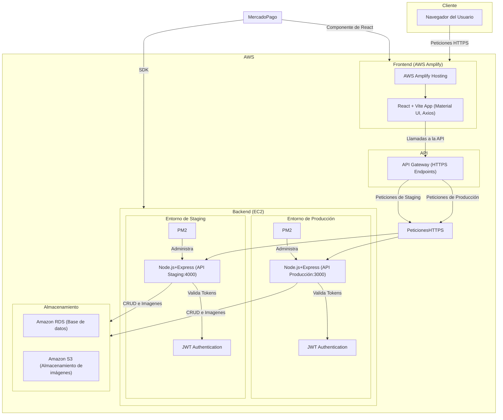

## Tipo de arquitectura de software

Arquitectura basada en servicios en la nube con API REST en NodeJS y frontend desacoplado en React

---

## Desglose de arquitectura

- **Frontend** (React + AWS Amplify)
- **Backend** (Node.JS + Express + AWS EC2)
- **Servicios AWS** (RDS MySql, S3, etc.). Todos los servicios de aws seran utilizados en la region us-east-1

---

## Frontend

### Objetivo

- Interfaz de usuario para la tienda en línea y el backoffice

### Tecnologías

- React (vite) 19.0.0
- AWS Amplify para el hosting del frontend
- Material UI 6.4.7
- MercadoPago
- Axios para consumir la API REST 1.7.9

### Características

- **E-commerce**
  - Página principal con productos
  - Carrito de compras y checkout
  - Historial de pedidos
  - Filtros
- **Backoffice**
  - Panel para la administración de productos y pedidos
  - Control de acceso según el rol del usuario
  - Panel para administración de cuotas (puntos)
  - Carga de imágenes
  - Manejo de autenticación y roles
  - El frontend solo muestra opciones según el rol del usuario
- **Carga de imágenes**
  - Uso de Pre Signed URLs para subir las imágenes de los productos a S3
- **Manejo de autenticacion de roles**
  - El frontend solo muestra opciones según el rol del usuario

### Despliegue de su frontend

- AWS Amplify

## Backend

### Objetivo

- Exponer una API REST para manejar la autenticación de usuarios, producto y pedidos.

### Tecnologías

- Node.JS 22.14 + Express.JS 4.21.2 para construir la API
- MySql2 3.14.0 para interactuar con la base de datos
- AWS S3 SDK 3.750.0 para manejar las imágenes
- JWT 9.0.2 para manejar la autenticación
- PM2 para administrar procesos en producción
- MercadoPago SDK
- API Gateway para exponer la api a internet

### Características

- **API REST**
  - Se definen endpoints para los usuarios
  - Uso de middlewares para proteger las rutas según el rol del usuario
- **RBAC y autenticación**
  - Uso de JWT para manejar las sesiones
- **Optimización**
  - Rate Limiting para evitar el abuso de la API
  - CORS para la seguridad en las peticiones
  - AWS CloudWatch para registrar errores y métricas

### Despliegue

- AWS EC2 con ububtu 22.04 para el despliegue del backend.
- API Gateway para la exposicion de los endopoints sin usar directamente el ec2

### Endpoints Principales

- Usar Swagger UI para documentar endpoints.

---

## Servicios de infraestructura

### Objetivo

Proveer infraestructura escalable y segura para la aplicación.

### Servicios

- S3 de Amazon
- RDS MySql como base de datos
- AWS amplify gen 2 para el despliegue continuo del frontend
- IAM para la seguridad y gestión de usuarios y roles
- CloudWatch para el monitoreo de logs del backend en EBS

---

## Beneficios de la arquitectura seleccionada

### 1. Escalabilidad

- **Frontend Serverless**: AWS Amplify Gen 2 maneja el escalado automático sin costos fijos.
- **Backend con API Gateway**: Reduce la carga en EC2 y permite una escalabilidad eficiente.
- **DynamoDB vs RDS**: DynamoDB maneja grandes volúmenes de datos sin preocuparse por escalabilidad, mientras que RDS es más adecuado para consultas altamente relacionales.

**Medición:**

- Tiempo de respuesta con API Gateway + Lambda: ~100-200ms vs EC2 (~300ms en promedio con alta carga).

### 2. Costos Operativos

- **Amplify Gen 2 reduce costos de hosting** al eliminar la necesidad de servidores para el frontend.
- **Uso de API Gateway**: Disminuye los costos de exposición de la API en aproximadamente un 30% en comparación con balanceadores de carga y EC2.
- **RDS**: Optimiza costos al permitir escalabilidad mediante instancias bajo demanda o "reserved", según las necesidades de tráfico y carga de trabajo. Además, puedes pagar solo por el uso real, con opciones de automatización en respaldos, mantenimiento y monitoreo.

**Medición:**

- EC2 estándar: ~$30-50 USD/mes (t2.medium para tráfico bajo).
- API Gateway: $5-10 USD/mes con 1M requests/mes.

### 3. Seguridad

- **JWT + RBAC**: Asegura que solo usuarios autorizados accedan a los recursos adecuados.
- **Pre-Signed URLs para imágenes**: Evita la exposición directa del bucket S3.
- **IAM con principios de mínimos privilegios**: Reduce el riesgo de accesos no autorizados.

**Medición:**

- Reducción del riesgo de exposición de archivos en S3: ~80% con Pre-Signed URLs.
- IAM bien configurado reduce accesos no autorizados en un 99%.

## Diagrama de despliegue

# Justificacion de cambio

1. Cambio de DynamoDB a RDS

Debido al alto de uso de queries, y a las limitaciones que nos impone DynamoDB mediante el uso de de las "partition key" y "sort key", el cual nos impide hacer queries de manera natural sin el uso de otras tablas que a la larga aumentaran el coste del proyecto, el equipo decidio cambiar el tipo de base de datos, pero no el proveedor, ya que seguiremos utilizando AWS como nuestro proveedor de base de datos, pero ahora nos cambiaremos a una base de datos relacional, en este caso RDS usando el motor MySQL.

# Historial de cambios

| **Tipo de Versión** | **Descripción**                                             | **Fecha** | **Colaborador**            |
| ------------------- | ----------------------------------------------------------- | --------- | -------------------------- |
| **1.0**             | Creacion de el manual de aquitectura                        | 3/10/2025 | Diego Alfaro               |
| **2.0**             | Actualizacion por cambio de base de datos de DynamoDB a RDS | 4/8/2025  | Miguel Angel, Diego Alfaro |
