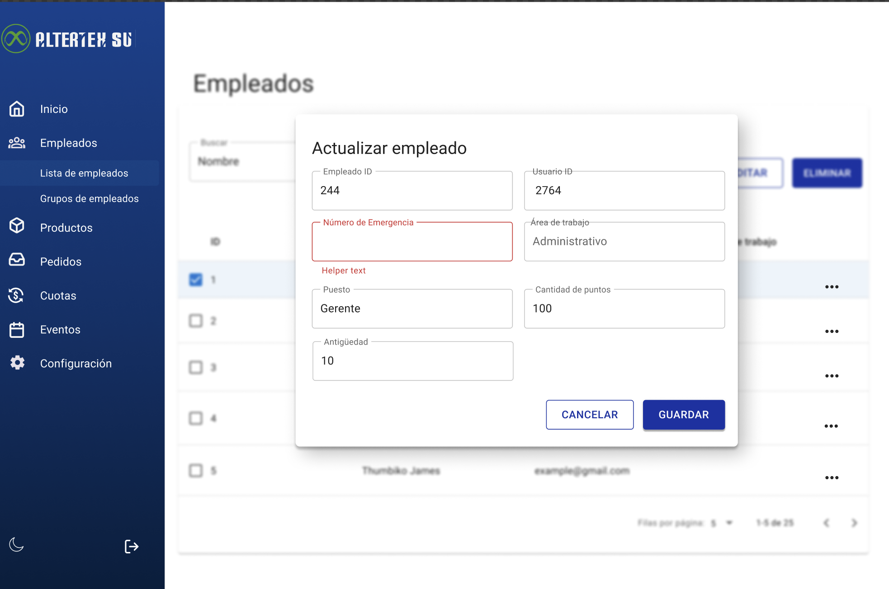

# RF19: Super Administrador Actualiza Empleado

---

## Historia de Usuario

Como administrador, quiero poder modificar la información de un empleado para mantener sus datos actualizados y asegurar la correcta gestión de sus permisos y asignaciones.

## **Criterios de Aceptación:**

1. El Super Administrador debe poder modificar los datos de un empleado registrado.
2. Se deben permitir cambios en los datos pertinentes al empleado:
   - Número de emergencia
   - Área de trabajo
   - Posición
   - Cantidad de puntos
   - Fecha de ingreso (o antigüedad)
3. Si la actualización es exitosa, los cambios deben reflejarse de inmediato en la lista de empleados.
4. Si hay un error, el sistema debe mostrar un mensaje indicando el problema.

---

## **Diagrama de Secuencia**

> _Descripción_: Según lo establecido en nuestras definiciones de "Done" y "Ready", esta historia de usuario no requiere de un diagrama de secuencia.

---

## **Mockup**

> _Descripción_: El mockup representa la interfaz donde el Super Administrador puede modificar los datos de un empleado antes de guardarlos.

## **Pruebas Unitarias**

_<u>[Enlace a pruebas RF19 Actualiza Empleado](https://docs.google.com/spreadsheets/d/1NLGwGrGA5PVOEzLaqxa8Ts1D_Ng3QzzqNKWJYUzxD-M/edit?gid=1081692928#gid=1081692928)</u>_

### Historial de cambios

| **Tipo de Versión** | **Descripción**                                 | **Fecha** | **Colaborador**               |
| ------------------- | ----------------------------------------------- | --------- | ----------------------------- |
| **1.0**             | Creación del documento                          | 06/3/2025 | Angélica Rios Cuentas         |
| **1.1**             | Actualización de la documentación del requisito | 12/5/2025 | Carlos Iván Fonseca Mondragón |
