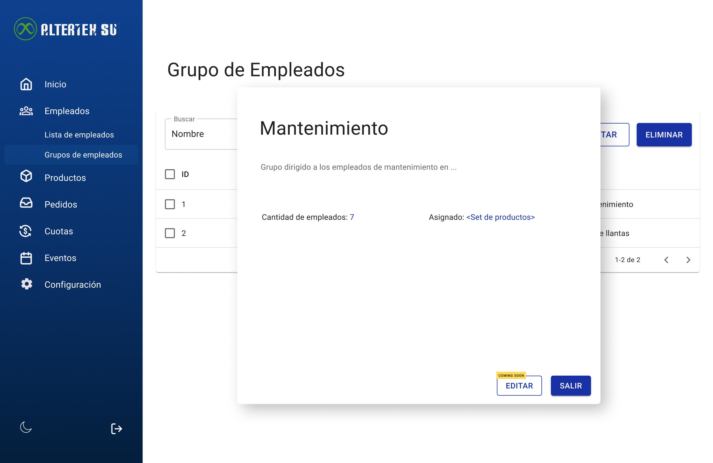

# RF23: Super Administrador Lee Grupo de Empleados

**Última actualización:** 06 de abril de 2025

---

## Historia de Usuario

Como administrador, quiero poder visualizar la información de un grupo de empleados para consultar sus miembros y configuraciones asignadas.

## **Criterios de Aceptación:**

1. El Super Administrador debe poder ver la información detallada de un grupo de empleados.
2. La información debe incluir:
   - Nombre del grupo
   - Descripción del grupo
   - Cantidad de empleados asignados
   - Lista de empleados asignados
   - Set de productos asignado
3. Si el grupo no existe o no se puede encontrar, el sistema debe mostrar un mensaje de error.
4. Si aún no tiene un set de productos asignado, se debe de mostrar un campo de información que indique su ausencia.
5. Si no hay empleados asignados al grupo, la lista de empleados debe de aparecer vacía.

---

## **Diagrama de Secuencia**

> _Descripción_: El diagrama de secuencia muestra el proceso mediante el cual el Super Administrador consulta la información de un grupo de empleados en específico.

```mermaid

sequenceDiagram
participant Usuario
participant Frontend
participant Api_gateway
participant Backend
participant rutaGrupoEmpleados
participant controladorGrupoEmpleados
participant repositorioGrupoEmpleados
participant RDS

    Usuario -->> Frontend: Selecciona leer grupo de empleados
    Frontend -->> Api_gateway: Envia peticion POST
    Api_gateway -->> Backend: Recibir peticion POST
    Backend -->> rutaGrupoEmpleados: llama a la ruta /api/grupo-empleados

    rutaGrupoEmpleados -->> rutaGrupoEmpleados: Valida el CSRF token

    alt CSRF token inválido
        rutaGrupoEmpleados -->> Backend: Retorna JSON {"message": "Petición sin autorización"}, status 400
        Backend -->> Api_gateway: JSON {"message": "Petición sin autorización"}, status 400
        Api_gateway -->> Frontend: JSON {"message": "Petición sin autorización"}, status 400
        Frontend -->> Usuario: Muestra mensaje de error: "No se pudo realizar la peticion"
    end

    rutaGrupoEmpleados -->> rutaGrupoEmpleados: Revisa que la api key fue enviada
    rutaGrupoEmpleados -->> rutaGrupoEmpleados: Valida la API key
    alt API key inválida
        rutaGrupoEmpleados -->> Backend: Retorna JSON {"message": "API key invalida"}, status 400
        Backend -->> Api_gateway: Retorna JSON {"message": "API key invalida"}, status 400
        Api_gateway -->> Frontend: Retorna JSON {"message": "API key invalida"}, status 400
        Frontend -->> Usuario: Muestra mensaje de error: "API key invalida"
    else API key válida
        rutaGrupoEmpleados -->> controladorGrupoEmpleados: Envia los datos al controlador
        controladorGrupoEmpleados -->> controladorGrupoEmpleados: Revisar que el grupo de empleados exista

        alt Grupo de Empleados no Encontrado
            controladorGrupoEmpleados -->> rutaGrupoEmpleados: Retorna JSON {"message": "No existe el grupo de empleados"}, status 400
            rutaGrupoEmpleados -->> Backend: Retorna JSON {"message": "No existe el grupo de empleados"}, status 400
            Backend -->> Api_gateway: Retorna JSON {"message": "No existe el grupo de empleados"}, status 400
            Api_gateway -->> Frontend: Retorna JSON {"message": "No existe el grupo de empleados"}, status 400
            Frontend -->> Usuario: Muestra mensaje de error: "No existe el grupo de empleados"
        else Grupo de Empleados Encontrado
            controladorGrupoEmpleados -->> repositorioGrupoEmpleados: Envia los datos al repositorio
            repositorioGrupoEmpleados -->> RDS: Usa la funcion obtenerDatos para recibir los datos
            RDS -->> repositorioGrupoEmpleados: Envia los datos recopilados
            repositorioGrupoEmpleados -->> controladorGrupoEmpleados: Envia los datos obtenidos de la base de datos
            controladorGrupoEmpleados -->> rutaGrupoEmpleados: Retorna datos del grupo de empleados y un mensaje de exito con el status 200
            rutaGrupoEmpleados -->> Backend: Retorna datos del grupo de empleados y un mensaje de exito con el status 200
            Backend -->> Api_gateway: Retorna datos del grupo de empleados y un mensaje de exito con el status 200
            Api_gateway -->> Frontend: Retorna datos del grupo de empleados y un mensaje de exito con el status 200
            Frontend -->> Usuario: Mensaje de exito y renderiza la información del grupo de empleados
        end
    end

```

---

## **Mockup**

> _Descripción_: El mockup muestra la interfaz donde el Super Administrador puede ver la información detallada de un grupo de empleados como su nombre, descripción, cantidad de empleados y set de productos asignados.

