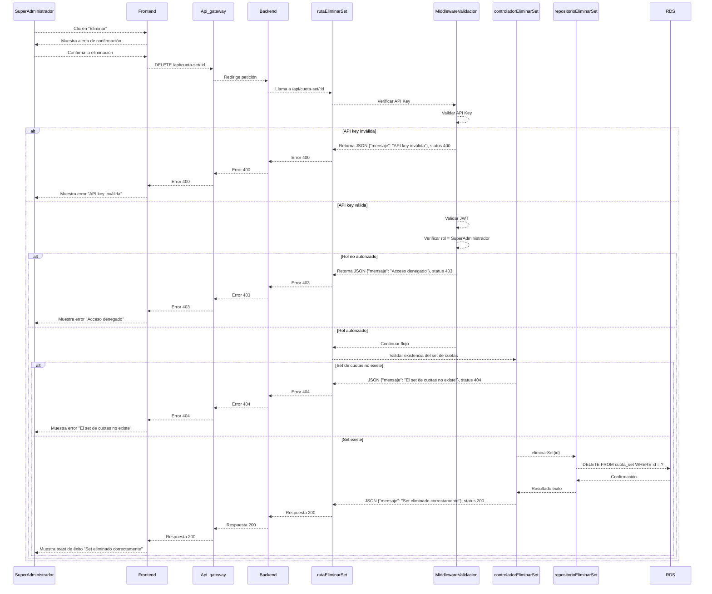

# RF35: Super Administrador Elimina Set de Cuotas

**Última actualización:** 06 de marzo de 2025

---

## Historia de Usuario

Como administrador, quiero eliminar una set de cuotas que ya no es necesaria, asegurando que los empleados no puedan utilizarla para adquirir uniformes.

## **Criterios de Aceptación:**

1. El Super Administrador debe poder eliminar un set de cuotas existente.
2. El sistema debe confirmar que el set de cuotas ha sido eliminado correctamente.
3. Si el set de cuotas no existe, el sistema debe mostrar un mensaje indicando que no se puede eliminar.
4. La eliminación debe reflejarse de inmediato en la lista de sets de cuotas.

---

## **Diagrama de Secuencia**

> _Descripción_: El diagrama de secuencia muestra el proceso mediante el cual el Super Administrador elimina un set de cuotas y cómo el sistema confirma la eliminación.

---

## **Mockup**

> _Descripción_: El mockup muestra la interfaz donde el Super Administrador puede eliminar un set de cuotas.

