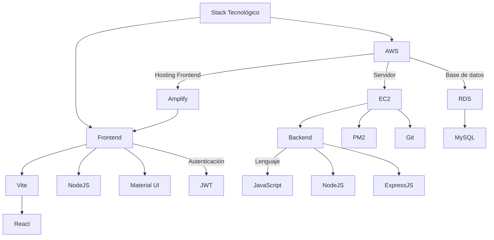

# Diagrama Stack Tecnológico TracTech

---
## Historial de cambios

| **Tipo de versión** | **Descripción**                                  | **Fecha**  | **Colaborador**    |
|---------------------|--------------------------------------------------|------------|--------------------|
| **1.0**             | Primera versión de diagrama de stack tecnológico | 05/30/2025 | Diego Alfaro Pinto |