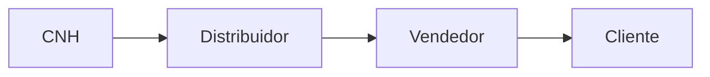

# Procesos del Socio Formador CNH

## Estructura de comunicación

```mermaid
graph LR;
    CNH-->Distribuidor;
    Distribuidor-->Vendedor;
    Vendedor-->Cliente;
```
## Generación de reportes plataforma nacional

```mermaid
graph LR;
    Quitan_los_vínculos --> Descargan_excel;
    Descargan_excel --> Se_eliminan_columnas_de_adc_batería_comentarios_y_gps;
    Se_eliminan_columnas_de_adc_batería_comentarios_y_gps --> Aplican_un_diseño;
    Aplican_un_diseño --> Agregan_columnas_de_actividad_y_ubicación;
    Agregan_columnas_de_actividad_y_ubicación --> Aplican_formato_condicional_para_columna_status;
```

## Generación de alertas CNH