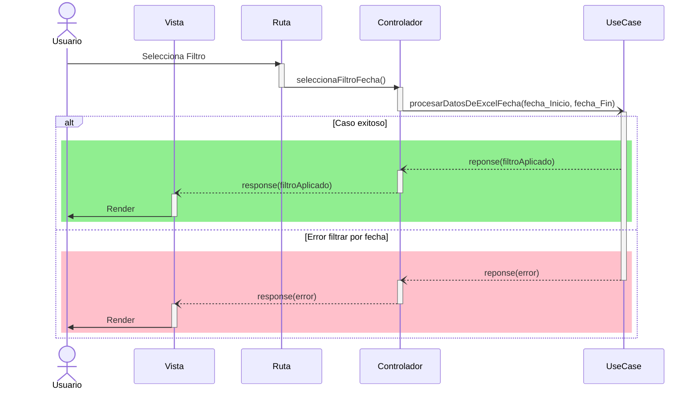

# RF16: Usuario selecciona filtros por fecha.

**Última actualización:** 31 de marzo de 2025

### Historia de Usuario

Yo como usuario, quiero aplicar filtros por fecha a los datos de análisis para visualizar únicamente la información relevante dentro de un rango de tiempo específico.

  **Criterios de Aceptación:**
  - El usuario debe poder seleccionar un rango de fechas dentro de los filtros disponibles.
  - La aplicación del filtro debe reflejar los cambios en tiempo real en la visualización de los datos.
  - Si no se selecciona un filtro de fecha, se debe mostrar toda la información sin restricciones.
  - El usuario debe poder restablecer los filtros y visualizar nuevamente todos los datos.

---

### Diagrama de Secuencia

> *Descripción*: El diagrama de secuencia muestra cómo el usuario aplica los filtros y el sistema responde filtrando los datos

---

### Mockup

![Mockup]

> *Descripción*: El mockup representa la interfaz del sistema donde al sistema se le están aplicando los filtros seleccionados.

---

### Pruebas Unitarias 
| ID Prueba | Descripción | Resultado Esperado |
|-----------|-------------|--------------------|
|PU-RF16-01|Aplicar un solo filtro.|Los datos mostrados reflejan el filtro aplicado|
|PU-RF16-02|Aplicar multiples filtros.|Se combina los filtros correctamente y los datos se actualizan.|
|PU-RF16-03|Eliminar filtros aplicados.|La información vuelve a mostrarse sin los filtros aplicados previamente.|

## Historial de Cambios

| Autor | Descripción del cambio | Versión |
| ------------------------- | ------------------------- | ------- |
| Pablo Hazael Hurtado Mireles | Se redifinió la historia de usuario, se añadio el Diagrama de Secuencia, se añadieron Criterios de Aceptación | 1.1 |