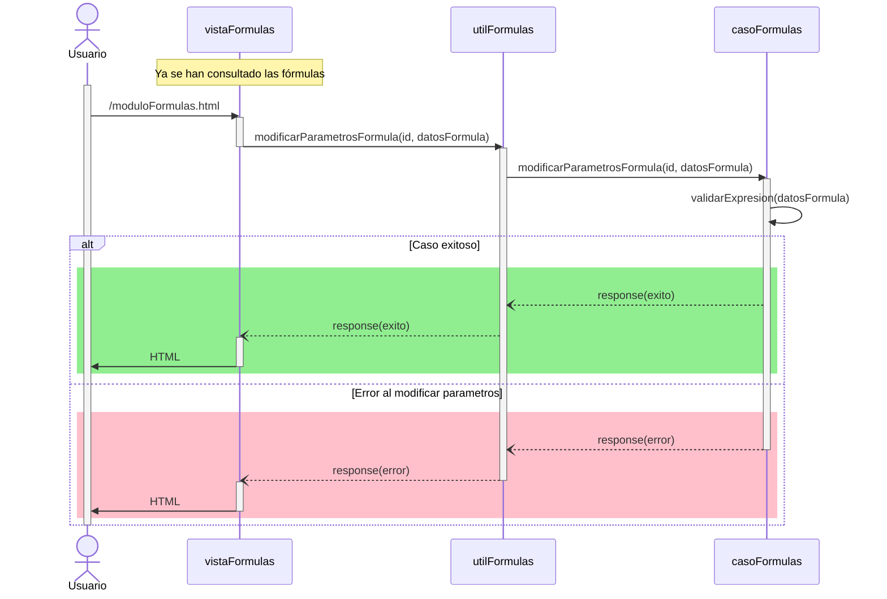

# RF72: Usuario selecciona parámetros de fórmula.

### Historia de Usuario

Yo como usuario quiero seleccionar los parámetros de la fórmula que voy a aplicar para mis gráficas 

  **Precondiciones:**
  - Se hizo la consulta a base de datos con las fórmulas
  - Las formulas se muestran en un menú desplegable

  **Criterios de Aceptación:**
  - Los parámetros de la fórmula se modifican correctamente
  
---

### Diagrama de Secuencia

---

### Mockup

![Mockup]

> *Descripción*: El mockup representa la interfaz del sistema donde el usuario puede cerrar sesión. Muestra los campos requeridos y los botones de acción disponibles.

---

### Pruebas Unitarias 
| ID Prueba | Descripción | Resultado Esperado |
|-----------|-------------|--------------------|
|PU-RF72-01 | Se seleccionan los parámetros de la fórmula | Sistema toma los parametros de la fórmula |
|PU-RF72-02 | Parámetros con entrada vacía | Sistema rechaza operación y muestra error de validación |